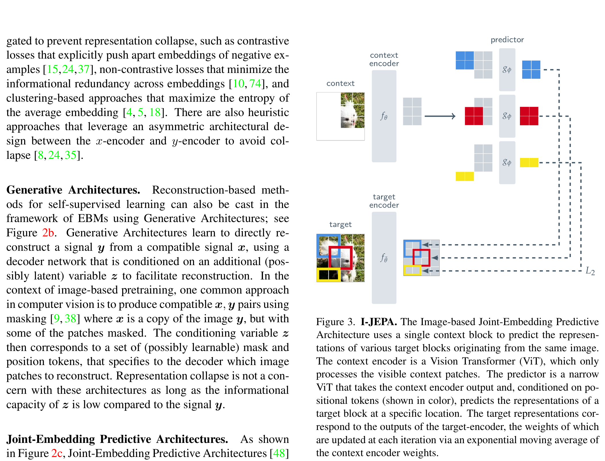
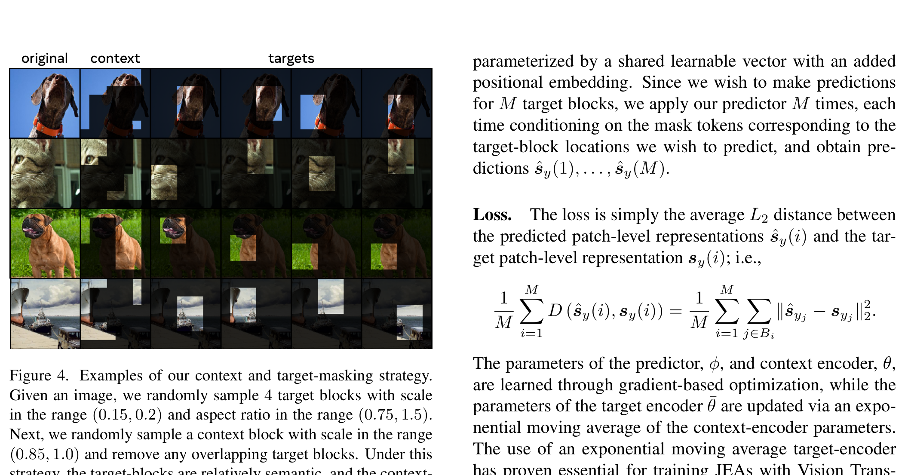

# Arquitectura I-JEPA (Image-based Joint-Embedding Predictive Architecture)

**I-JEPA** es la arquitectura fundacional para aprendizaje auto-supervisado (SSL) en imágenes estáticas basada en el paradigma de **Joint-Embedding Predictive Architecture** introducido por Yann LeCun. Su principio central es predecir representaciones abstractas de parches objetivo en lugar de reconstruir directamente los píxeles (a diferencia de los Masked Autoencoders, MAE) o depender de aumentos de datos invariantes manuales (como SimCLR o DINO).

---

## 1. Diagrama de la Arquitectura

### Estrategia de Enmascaramiento Multi-Bloque

---

## 2. Componentes Principales del Sistema

I-JEPA consta de tres componentes neuronales y una estrategia de enmascaramiento espacial:

### A. Context Encoder ($E_\theta$)
- **Backbone**: Vision Transformer (ViT-Base, ViT-Large o ViT-Huge) con tamaño de parche $16 \times 16$.
- **Entrada**: Únicamente los parches visibles del bloque de contexto $x_C$.
- **Salida**: Una secuencia de representaciones de contexto $s_C = \{s_{c_1}, s_{c_2}, \dots, s_{c_M}\}$ donde $M$ es el número de tokens visibles.
- **Optimización**: Se actualiza mediante descenso de gradiente directo $\nabla_\theta \mathcal{L}$.

### B. Target Encoder ($E_{\bar{\theta}}$)
- **Backbone**: Idéntico en estructura a $E_\theta$.
- **Entrada**: Todos los parches de la imagen completa o parches del bloque objetivo $x_T$.
- **Salida**: Representaciones latentes de los bloques objetivo $s_T = \{s_{t_1}, s_{t_2}, \dots, s_{t_K}\}$.
- **Actualización**: Media móvil exponencial (EMA) de los pesos del Context Encoder:
  $$\bar{\theta} \leftarrow \tau \bar{\theta} + (1 - \tau) \theta$$
  con una tasa de momento $\tau$ que escala de $0.996$ a $1.0$ durante el entrenamiento. Los gradientes no fluyen a través de $E_{\bar{\theta}}$ ($\text{stop-gradient}$).

### C. Predictor ($P_\phi$)
- **Backbone**: Transformer ligero de menor profundidad (típicamente 6 a 12 capas) y dimensión más pequeña.
- **Entradas**:
  1. Las representaciones del contexto $s_C$.
  2. Tokens de máscara aprendibles (mask tokens) condicionados con **Position Embeddings** que codifican la posición espacial exacta de los parches objetivo $p_T$.
- **Salida**: Predicciones latentes $\hat{s}_T = P_\phi(s_C, p_T)$.
- **Optimización**: Actualizado con descenso de gradiente directo $\nabla_\phi \mathcal{L}$.

---

## 3. Estrategia de Enmascaramiento Multi-Block

Para evitar soluciones triviales (atajos espaciales por correlación de bordes inmediatos) y forzar la abstracción semántica:
1. **Target Blocks ($y_1, y_2, y_3, y_4$)**: Se muestrean aleatoriamente 4 bloques objetivo con escala espacial relativa en el rango $[0.15, 0.2]$ del área de la imagen y aspect ratio en $[0.75, 1.5]$.
2. **Context Block ($x_C$)**: Se muestrea un único bloque de contexto grande con escala espacial relativa en el rango $[0.85, 1.0]$. Se eliminan del contexto todos los parches que se solapen con cualquiera de los bloques target.

---

## 4. Función de Pérdida y Regularización

La función de coste optimiza la distancia $L_2$ o $L_1$ en el espacio de embedding normalizado:

$$\mathcal{L}(\theta, \phi) = \frac{1}{K} \sum_{k=1}^K \mathcal{D}\left( \hat{s}_{t_k}, s_{t_k} \right) = \frac{1}{K} \sum_{k=1}^K \frac{1}{|B_k|} \sum_{j \in B_k} \| \hat{s}_{t_{k,j}} - s_{t_{k,j}} \|_2^2$$

donde $B_k$ es el conjunto de parches pertenecientes al $k$-ésimo bloque objetivo.

---

## 5. Referencias Cruzadas
- **Paper**: [[2023_I-JEPA]]
- **Entidad**: [[I-JEPA]]
- **Evolución**: [[2025_V-JEPA2]], [[2026_V-JEPA2.1]], [[2026_TC-JEPA]]
