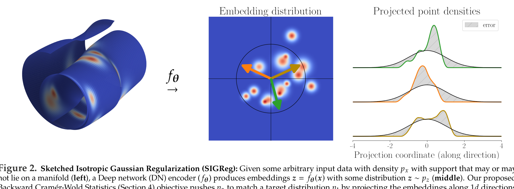
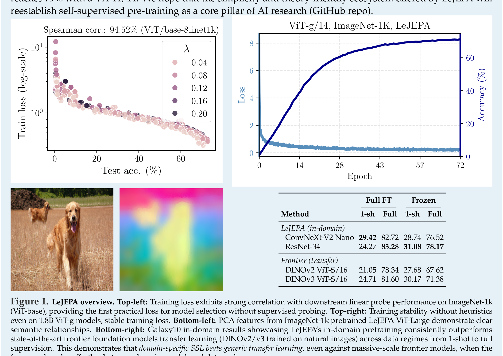

# LeJEPA: Arquitectura y Pipeline


*Figura 1: Esquema de Sketched Isotropic Gaussian Regularization (SIGReg) en LeJEPA. Los embeddings $z = f_\theta(x)$ son proyectados sobre direcciones 1D aleatorias y comparados contra la distribución Gaussiana estándar mediante pruebas de bondad de ajuste basadas en funciones características (Epps-Pulley).*


*Figura 2: Propiedades empíricas de LeJEPA. (Arriba-izq) Fuerte correlación de la pérdida de entrenamiento con la precisión de evaluación lineal downstream. (Arriba-der) Estabilidad de entrenamiento en modelos masivos de 1.8B parámetros (ViT-g). (Abajo) Rendimiento in-domain en Galaxy10 superando a modelos frontera DINOv2/v3.*

## Pipeline de Preentrenamiento

El pipeline de [[LeJEPA]] se caracteriza por su formulación minimalista y la ausencia total de mecanismos asimétricos para prevenir el colapso:

```
                  ┌───────────────┐
  x_global (V_g) ─┤ Encoder f_θ   ├─► g_emb ─► Centro μ_n ──┐ (Invariance MSE)
                  └───────────────┘                         ▼
                                                        L_pred
                  ┌───────────────┐                         ▲
  x_local (V_l)  ─┤ Encoder f_θ   ├─► a_emb ────────────────┘
                  └───────────────┘       │
                                          ▼
                                     SIGReg(a_emb) ──► Restricción a N(0, I_K)
```

### 1. Construcción de Vistas (Multi-Crop Framework)
Dado un dato de entrada $x$ (imagen o señal):
- Se generan $V_g$ **vistas globales** de mayor resolución (e.g. $224 \times 224$), típicamente $V_g = 2$.
- Se generan $V_l$ **vistas locales** con recortes espaciales agresivos (e.g. $96 \times 96$) y aumentos fotométricos, típicamente $V_l = 6$ u $8$ (total de vistas $V = V_g + V_l = 8$ a $10$).

### 2. Red Encoder Unificada ($f_\theta$)
- Todas las vistas se pasan a través del **mismo encoder** $f_\theta$ sin ramas siamesas congeladas ni *teacher networks* con EMA.
- Es agnóstico a la arquitectura: funciona de forma idéntica en Vision Transformers (ViT), ConvNeXt, ResNet, MaxViT, Swin Transformers o LeViT.
- No requiere *register tokens* para estabilizar la atención.

### 3. Proyector Ligero y Readout
- En modelos ViT, se utiliza la representación del token `[cls]` o un promedio global de tokens.
- Un proyector MLP de 2 capas mapea la representación a un espacio de embedding $z \in \mathbb{R}^K$ (donde $K \in [256, 2048]$).
- El proyector se descarta al finalizar el preentrenamiento; las evaluaciones *downstream* operan directamente sobre las representaciones del encoder.

### 4. Objetivo Conjunto de Optimización
La pérdida se calcula como una combinación lineal ponderada por un único hiperparámetro $\lambda \in [0, 1]$ (por defecto $\lambda = 0.05$):
1. **Prediction / Invariance Loss ([[Invariance_Loss]], [[LeJEPA_Loss]])**:
   Calcula la distancia $\ell_2^2$ entre las representaciones de todas las vistas $z_{n,v}$ y el centroide de las vistas globales $\mu_n = \frac{1}{V_g}\sum_{v=1}^{V_g} z_{n,v}$:
   $$ \mathcal{L}_{\text{pred}} = \frac{1}{V} \sum_{v'=1}^V \|\mu_n - z_{n,v'}\|_2^2 $$
2. **Regularización SIGReg ([[SIGReg]])**:
   Se muestrean $M$ vectores unitarios $a_m \in \mathbb{S}^{K-1}$ en cada paso de optimización (mediante un generador sincronizado entre GPUs). Se calcula la estadística de Epps-Pulley a través de la función característica empírica en una cuadrícula de cuadratura trapezoidal (típicamente 17 puntos en $[-5, 5]$).

## Comparativa Estructural con otras Familias SSL

| Componente / Propiedad | I-JEPA / V-JEPA | BYOL / DINO / DINOv2 | VICReg / Barlow Twins | **LeJEPA** |
| :--- | :--- | :--- | :--- | :--- |
| **Mecanismo Anti-Colapso** | Predictor + EMA Target + Masking | Teacher-Student EMA + Centering | Covarianza / Varianza ($\ell_2$) | **SIGReg (Epps-Pulley $\mathcal{N}(0, I)$)** |
| **Garantía Teórica** | Heurística | Heurística | Solo 2º orden | **Probable (Cramér-Wold + ISB Opt)** |
| **Redes Entrenadas** | Encoder + Predictor + EMA | Student + EMA Teacher | 1 Encoder | **1 Encoder (+ pequeño proyector)** |
| **Stop-Gradient** | Sí (en target) | Sí (en teacher) | No | **No** |
| **Dependencia de Batch Size** | Moderada | Alta (DINO) | Muy Alta ($B > 2048$) | **Baja ($B \ge 128$)** |
| **Hiperparámetros Clave** | Múltiples (schedulers, masking) | Múltiples (temp, momentum) | 3 pesos ($\lambda, \mu, \nu$) | **1 solo ($\lambda = 0.05$)** |
| **Correlación Pérdida-Downstream**| Muy baja | Muy baja | Baja | **Muy Alta ($\rho_s \approx 94\% - 99\%$)** |

## Mecanismo de Inferencia y Probing
- Para downstream tasks (clasificación, detección, segmentación), se congela el encoder $f_\theta$.
- Se entrena una sonda lineal (*linear probing*) o una sonda atenta (*attentive probing*) directamente sobre los features del encoder.
- Emerge segmentación y agrupación semántica no supervisada (*Emergent Object Segmentation*) mediante el umbralizado de mapas de atención y PCA de la última capa sin etiquetas de supervisión.
