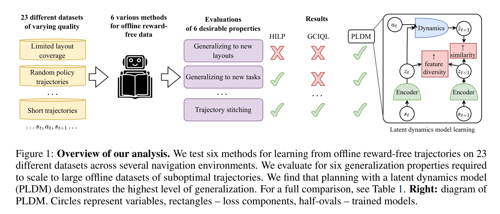
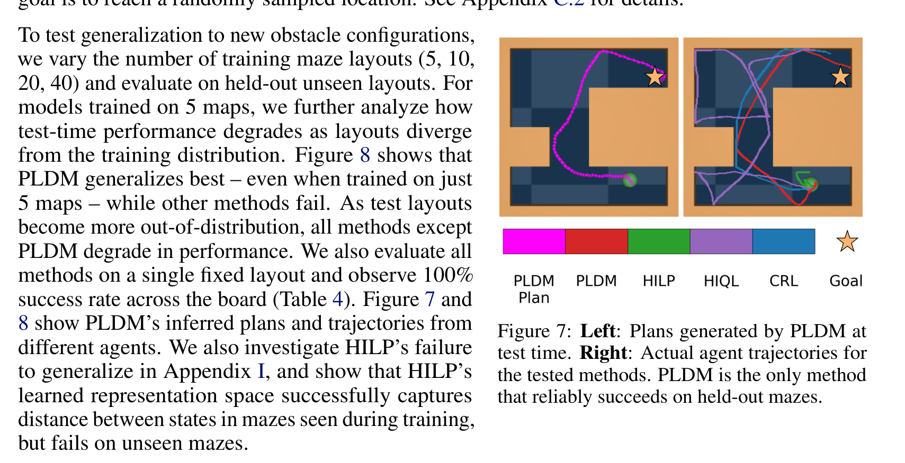

# Arquitectura PLDM (Planning with Latent Dynamics Models)

**PLDM** es una arquitectura y metodología de modelo de mundo latente diseñada para aprender dinámicas a partir de datos offline sin recompensas (*reward-free offline data*). Aborda las limitaciones de generalización fuera de distribución (OOD) presentes en métodos basados en funciones de valor (GCIQL) o representaciones de distancia (HILP), demostrando que la composición de trayectorias y la navegación en nuevos entornos se logra óptimamente mediante planificación basada en modelos en el espacio latente.

---

## 1. Diagrama del Sistema y Evaluación

### Planes Generados en Tiempo de Inferencia

---

## 2. Componentes de la Arquitectura

PLDM se compone de dos módulos principales desacoplados o entrenados de extremo a extremo:

### A. Encoder de Observaciones ($E_\theta$)
- **Arquitectura**: Red Convolucional (CNN) o MLP profundo según la modalidad (píxeles o estados de baja dimensión).
- **Mapeo**: Transforma la observación $o_t \in \mathcal{O}$ en un vector de estado latente compacto $z_t = E_\theta(o_t) \in \mathbb{R}^d$.
- **Objetivo**: Proporcionar un espacio geométricamente estructurado donde la distancia entre estados refleje la alcanzabilidad temporal.

### B. Modelo de Dinámica Predictiva / Predictor ($T_\phi$)
- **Arquitectura**: MLP residual o Transformer autoregresivo.
- **Entrada**: Estado latente actual $z_t$ y acción $a_t \in \mathcal{A}$.
- **Salida**: Predicción del siguiente estado latente $\hat{z}_{t+1} = T_\phi(z_t, a_t)$.
- **Rollout Recursivo**: Para un horizonte $H$, genera la secuencia $\{\hat{z}_{t+1}, \dots, \hat{z}_{t+H}\}$ aplicando composicionalmente $T_\phi$.

---

## 3. Entrenamiento y Pérdidas

El modelo optimiza la consistencia predictiva unipasos y multipasos en el espacio latente:

$$\mathcal{L}_{\text{PLDM}}(\theta, \phi) = \mathbb{E}_{(o_t, a_t, o_{t+1}) \sim \mathcal{D}} \left[ \| E_\theta(o_{t+1}) - T_\phi(E_\theta(o_t), a_t) \|_2^2 \right] + \lambda_{\text{reg}} \mathcal{R}(E_\theta)$$

donde $\mathcal{R}(E_\theta)$ previene el colapso de representación mediante regularización de varianza/covarianza o normalización estricta.

---

## 4. Mecanismo de Planificación Latente (Latent Planning)

Dado un estado inicial $o_0$ y un estado objetivo (goal) $o_g$, la planificación se formula como un problema de optimización sobre secuencias de acciones $a_{0:H-1}$:

$$a_{0:H-1}^* = \arg\min_{a_{0:H-1}} \| \hat{z}_H(a_{0:H-1}) - z_g \|_2^2 + \gamma \sum_{t=0}^{H-1} \| a_t \|_2^2$$

donde $\hat{z}_0 = E_\theta(o_0)$, $z_g = E_\theta(o_g)$ y $\hat{z}_{t+1} = T_\phi(\hat{z}_t, a_t)$.
- **Optimizador**: Cross-Entropy Method (CEM) o Model Predictive Path Integral (MPPI) en tiempo de ejecución.
- **Bucle Cerrado**: Se ejecuta la primera acción $a_0^*$, se observa $o_1$ y se replanifica recursivamente.

---

## 5. Referencias Cruzadas
- **Paper**: [[2025_PLDM]]
- **Entidad**: [[PLDM]]
- **Conceptos**: [[LeWorldModel]], [[AdaJEPA]], [[EB-JEPA]]
