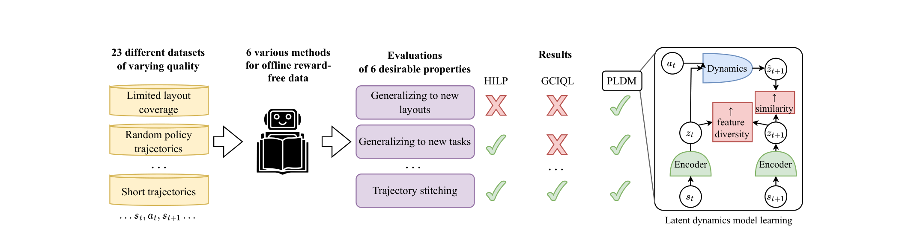
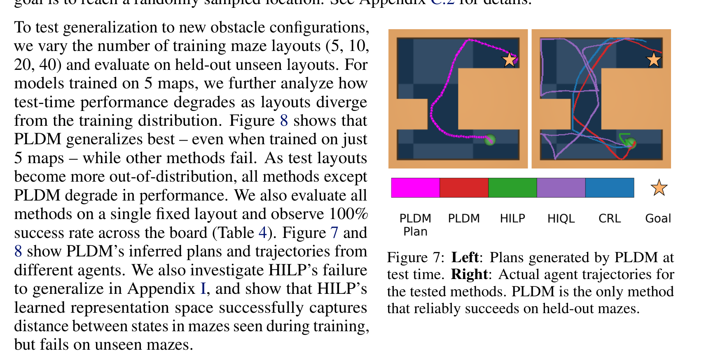

# Arquitectura PLDM (Planning with Latent Dynamics Models)

**PLDM** es una arquitectura y metodología de modelo de mundo latente diseñada para aprender dinámicas a partir de datos offline sin recompensas (*reward-free offline data*). Aborda las limitaciones de generalización fuera de distribución (OOD) presentes en métodos basados en funciones de valor (GCIQL) o representaciones de distancia (HILP), demostrando que la composición de trayectorias y la navegación en nuevos entornos se logra óptimamente mediante planificación basada en modelos en el espacio latente.

---

## 1. Diagrama del Sistema y Evaluación

### Planes Generados en Tiempo de Inferencia

---

## 2. Componentes de la Arquitectura

PLDM se compone de dos módulos principales desacoplados o entrenados de extremo a extremo:

### A. Encoder de Observaciones ($E_\theta$)
- **Arquitectura**: Red Convolucional (CNN) o MLP profundo según la modalidad (píxeles o estados de baja dimensión).
- **Mapeo**: Transforma la observación $o_t \in \mathcal{O}$ en un vector de estado latente compacto $z_t = E_\theta(o_t) \in \mathbb{R}^d$.
- **Objetivo**: Proporcionar un espacio geométricamente estructurado donde la distancia entre estados refleje la alcanzabilidad temporal.

### B. Modelo de Dinámica Predictiva / Predictor ($T_\phi$)
- **Arquitectura**: MLP residual o Transformer autoregresivo.
- **Entrada**: Estado latente actual $z_t$ y acción $a_t \in \mathcal{A}$.
- **Salida**: Predicción del siguiente estado latente $\hat{z}_{t+1} = T_\phi(z_t, a_t)$.
- **Rollout Recursivo**: Para un horizonte $H$, genera la secuencia $\{\hat{z}_{t+1}, \dots, \hat{z}_{t+H}\}$ aplicando composicionalmente $T_\phi$.

---

## 3. Entrenamiento y Pérdidas

El modelo optimiza la consistencia predictiva **multi-paso**: el predictor se desenrolla $H$ pasos desde $\hat z_0 = h_\theta(s_0)$, con un ensemble de $K$ predictores. Objetivo completo (PLDM Eq. 3 y App. D.1.1, pp. 19–20):

$$\mathcal{L}_{\text{JEPA}} = \mathcal{L}_{\text{sim}} + \alpha\,\mathcal{L}_{\text{var}} + \beta\,\mathcal{L}_{\text{cov}} + \delta\,\mathcal{L}_{\text{time-sim}} + \omega\,\mathcal{L}_{\text{IDM}}$$

$$\mathcal{L}_{\text{sim}}=\sum_{k=1}^{K}\sum_{t=0}^{H}\frac1N\sum_{b}\|\hat Z^k_{t,b}-Z_{t,b}\|_2^2,\qquad
\mathcal{L}_{\text{var}}=\frac{1}{HD}\sum_{t}\sum_{j}\max\!\big(0,\gamma-\sqrt{\mathrm{Var}(Z_{t,:,j})+\epsilon}\big)$$

$$\mathcal{L}_{\text{cov}}=\frac1H\sum_t\frac1D\sum_{i\neq j}[C(Z_t)]^2_{i,j},\quad
\mathcal{L}_{\text{time-sim}}=\sum_{t}\frac1N\sum_b\|Z_{t,b}-Z_{t+1,b}\|_2^2,\quad
\mathcal{L}_{\text{IDM}}=\sum_t\frac1N\sum_b\|a_{t,b}-\mathrm{MLP}(Z_{t,b},Z_{t+1,b})\|_2^2$$

> [!warning] Ambigüedad en el paper
> El texto dice aplicar la varianza "across the time dimension", pero la fórmula calcula $\mathrm{Var}(Z_{t,:,j})$, que es la varianza **sobre el batch** en cada $t$ promediada en $t$. En Two-Rooms, $\omega = 0$ (IDM desactivado, Tab. 13). Son 7 términos de pérdida frente al único $\lambda$ de LeWM.

donde $\mathcal{R}(E_\theta)$ previene el colapso de representación mediante regularización de varianza/covarianza o normalización estricta.

---

## 4. Mecanismo de Planificación Latente (Latent Planning)

Dado un estado inicial $o_0$ y un estado objetivo (goal) $o_g$, la planificación se formula como un problema de optimización sobre secuencias de acciones $a_{0:H-1}$:

$$a_{0:H-1}^* = \arg\min_{a_{0:H-1}} \| \hat{z}_H(a_{0:H-1}) - z_g \|_2^2 + \gamma \sum_{t=0}^{H-1} \| a_t \|_2^2$$

donde $\hat{z}_0 = E_\theta(o_0)$, $z_g = E_\theta(o_g)$ y $\hat{z}_{t+1} = T_\phi(\hat{z}_t, a_t)$.
- **Optimizador**: **MPPI** en todos los experimentos ("We use MPPI in all our experiments with planning", p. 5). En Two-Rooms: 500 muestras, $\sigma=5$, $\lambda=0.005$.
- **Coste real del paper** (Eqs. 5–7): $a^\ast=\arg\min_a\{C_{\text{goal}}+\beta C_{\text{unc}}\}$, con $C_{\text{goal}}=\frac1K\sum_k\sum_{t=0}^{H}\|h_\theta(s_g)-f^k_\theta(\hat z^k_t,a_t)\|$ (norma **sin cuadrado**, sumada sobre todos los pasos) y $C_{\text{unc}}=\sum_t\gamma^t\sum_j\mathrm{Var}_k(\cdot)$, que es la varianza del ensemble ($K=5$, $\beta=10^{-4}$, $\gamma=0.9$). La fórmula de arriba es una simplificación y no es la del paper.
- **Bucle Cerrado**: Se ejecuta la primera acción $a_0^*$, se observa $o_1$ y se replanifica recursivamente.

---

## 5. Referencias Cruzadas
- **Paper**: [[2025_PLDM]]
- **Entidad**: [[PLDM]]
- **Conceptos**: [[LeWorldModel]], [[AdaJEPA]], [[EB-JEPA]]
