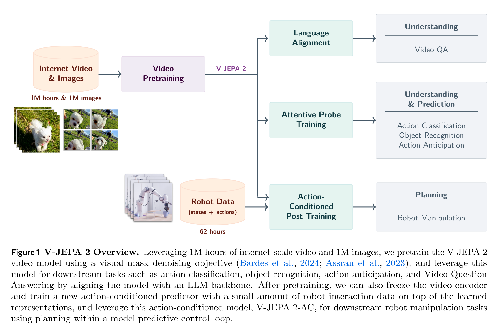
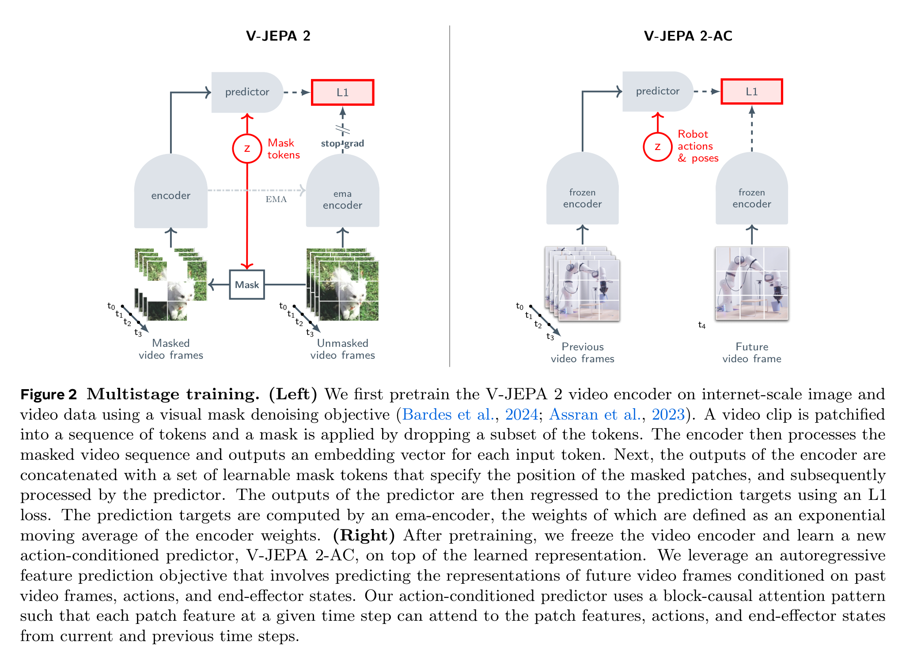
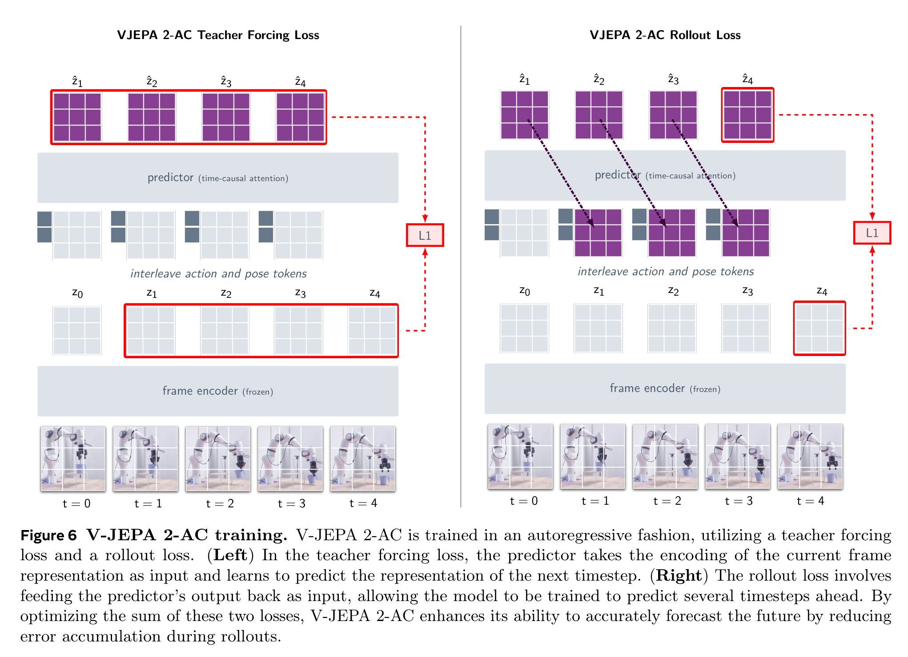
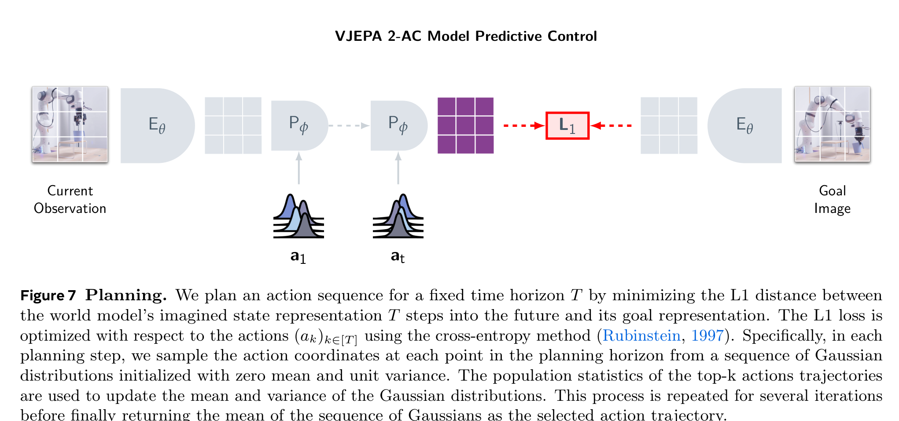

# Arquitectura V-JEPA 2 y V-JEPA 2-AC

**V-JEPA 2** es una arquitectura a escala masiva de modelos de video auto-supervisados (preentrenada con 1M de horas de video y 1M de imágenes) capaz de realizar comprensión visual de alto nivel, predicción temporal y planificación física en robótica a través de su extensión **V-JEPA 2-AC (Action-Conditioned)**.

---

## 1. Diagramas de la Arquitectura

### Visión General del Sistema

### Entrenamiento Multietapa (Multistage Training)

### Entrenamiento Condicionado por Acción (V-JEPA 2-AC)

### Planificación Latente para Robótica

---

## 2. Componentes Principales

### A. Video Encoder ($E_\theta$)
- **Backbone**: Vision Transformer 3D escalado a arquitecturas ViT-Large (ViT-L/16, 300M params) y ViT-Giant (ViT-g/16, 1B params).
- **Tokenización Espaciotemporal**: Parches de video $2 \times 16 \times 16$ (2 frames temporales, $16 \times 16$ píxeles).
- **Procesamiento**: Solo opera sobre tokens visibles no enmascarados, optimizando drásticamente la memoria y FLOPS.

### B. Mask Denoising Predictor ($P_\phi$)
- **Backbone**: Transformer de 12 capas.
- **Entrada**: Tokens de contexto codificados + mask tokens con embeddings de posición 3D espaciotemporales.
- **Objetivo**: Predecir las representaciones del Target Encoder en los bloques de video enmascarados.

### C. Action-Conditioned Predictor ($P_{\text{AC}}$)
- **Función**: Convierte el modelo de video en un **Modelo de Mundo Latente** para robótica.
- **Mecanismo**: Inyecta vectores de acción continua $a_t \in \mathbb{R}^A$ mediante concatenación o modulación por capas (cross-attention) a través de los pasos temporales.
- **Pérdida Mixta**: Combina una pérdida de *teacher forcing* unipaso y una pérdida autoregresiva de *rollout* sobre secuencias de horizonte $T$.

---

## 3. Planificación y Control en Robótica (MPC)

Para una tarea definida por una imagen objetivo $o_g$, el planificador optimiza la trayectoria de acciones en el espacio latente:

$$\min_{a_{1:T}} \left\| P_{\text{AC}}\left( E_\theta(o_t), a_{1:T} \right) - E_{\bar{\theta}}(o_g) \right\|_1$$

- **Paisaje de Energía Convexa**: El espacio latente de V-JEPA 2 exhibe gradientes suaves respecto a los desplazamientos cartesianos $(\Delta x, \Delta y, \Delta z)$ del efector final, permitiendo optimización en tiempo real sin muestreo por fuerza bruta.

---

## 4. Referencias Cruzadas
- **Paper**: [[2025_V-JEPA2]]
- **Entidad**: [[V-JEPA2]]
- **Evolución**: [[2026_V-JEPA2.1]], [[2026_AdaJEPA]]
