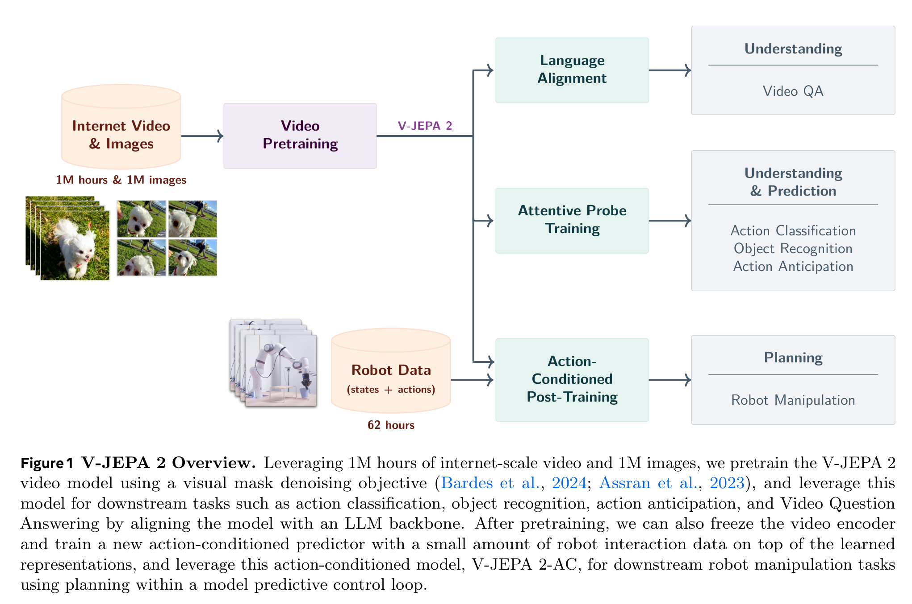
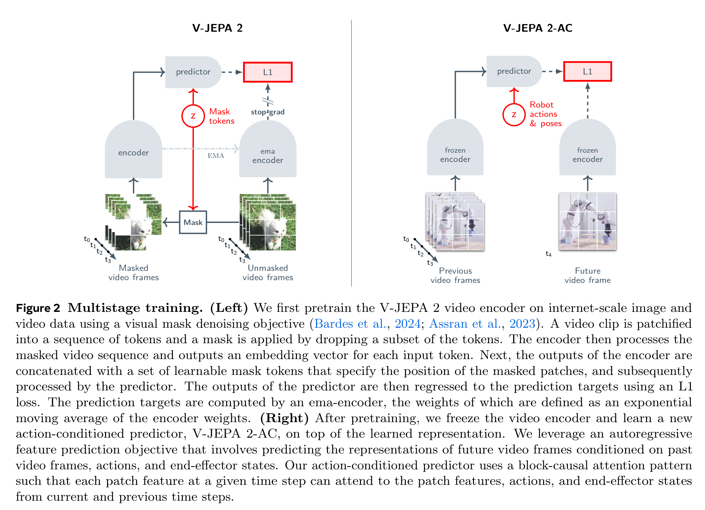
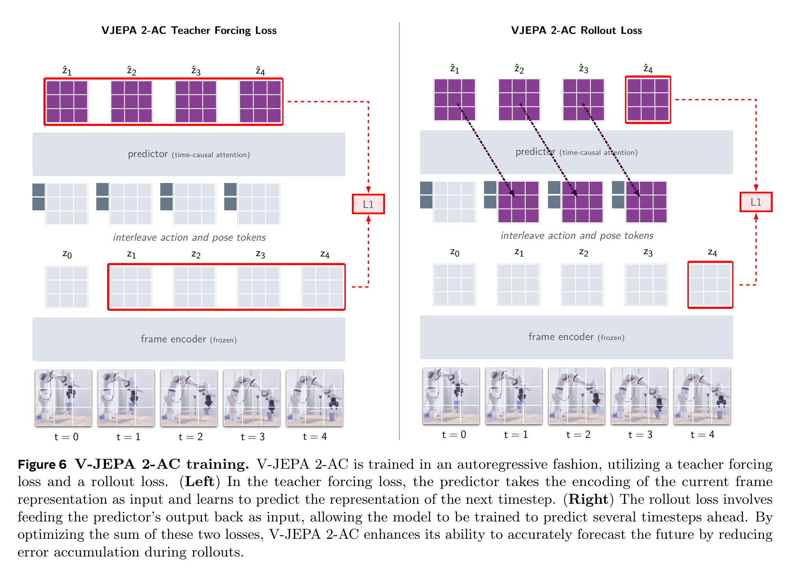
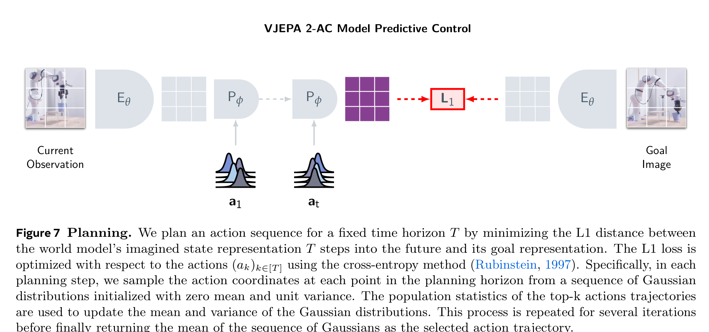

# Arquitectura V-JEPA 2 y V-JEPA 2-AC

**V-JEPA 2** es una arquitectura a escala masiva de modelos de video auto-supervisados (preentrenada con 1M de horas de video y 1M de imágenes) capaz de realizar comprensión visual de alto nivel, predicción temporal y planificación física en robótica a través de su extensión **V-JEPA 2-AC (Action-Conditioned)**.

---

## 1. Diagramas de la Arquitectura

### Visión General del Sistema

### Entrenamiento Multietapa (Multistage Training)

### Entrenamiento Condicionado por Acción (V-JEPA 2-AC)

### Planificación Latente para Robótica

---

## 2. Componentes Principales

### A. Video Encoder ($E_\theta$)
- **Backbone**: Vision Transformer 3D escalado a arquitecturas ViT-Large (ViT-L/16, 300M params) y ViT-Giant (ViT-g/16, 1B params).
- **Tokenización Espaciotemporal**: Parches de video $2 \times 16 \times 16$ (2 frames temporales, $16 \times 16$ píxeles).
- **Procesamiento**: Solo opera sobre tokens visibles no enmascarados, optimizando drásticamente la memoria y FLOPS.

### B. Mask Denoising Predictor ($P_\phi$)
- **Backbone**: Transformer de 12 capas.
- **Entrada**: Tokens de contexto codificados + mask tokens con embeddings de posición 3D espaciotemporales.
- **Objetivo**: Predecir las representaciones del Target Encoder en los bloques de video enmascarados.

### C. Action-Conditioned Predictor ($P_{\text{AC}}$)
- **Función**: Convierte el modelo de video en un **Modelo de Mundo Latente** para robótica.
- **Mecanismo**: Transformer **block-causal** (~300M, 24 capas) sobre el encoder V-JEPA 2 **congelado**. Las acciones $a_k\in\mathbb{R}^7$ (Δ del efector final: 3 posición + 3 Euler extrínsecos + 1 pinza), el estado propioceptivo $s_k$ y las features de parche entran como tokens **intercalados**. Cada uno pasa por su propia transformación afín aprendible; **no** se usa cross-attention (p. 10).
- **Datos**: menos de 62 h de **DROID** sin etiquetar (~23k trayectorias, con éxitos y fallos), clips de 4 s a 4 fps y 256², con una sola cámara exocéntrica (p. 9, 37).
- **Pérdida Mixta**: *teacher forcing* $L_1$ con $T=15$ más *rollout* $L_1$ con $T=2$ (Eqs. 2–4, p. 9).

---

## 3. Planificación y Control en Robótica (MPC)

Para una tarea definida por una imagen objetivo $o_g$, el planificador optimiza la trayectoria de acciones en el espacio latente:

$$\min_{a_{1:T}} \left\| P_{\text{AC}}\left( E_\theta(o_t), a_{1:T} \right) - E_{\bar{\theta}}(o_g) \right\|_1$$

- **Optimizador**: **CEM** (800 muestras, 10 iteraciones, top-10, horizonte 1). Solo se ejecuta la primera acción, con receding horizon. Tarda 16 s por acción en una RTX 4090, frente a 4 min de Cosmos (Tab. 3; App. B.2).
- **Paisaje de energía**: el paper lo describe como *"relatively smooth and locally convex"* respecto a los desplazamientos cartesianos del efector final (p. 13). Es una observación cualitativa; la planificación **sí** usa muestreo (CEM) y no optimización por gradiente.
- **Objetivos**: solo imagen. La especificación de objetivos en lenguaje natural queda como trabajo futuro (p. 15).

---

## 4. Referencias Cruzadas
- **Paper**: [[2025_V-JEPA2]]
- **Entidad**: [[V-JEPA2]]
- **Evolución**: [[2026_V-JEPA2.1]], [[2026_AdaJEPA]]
