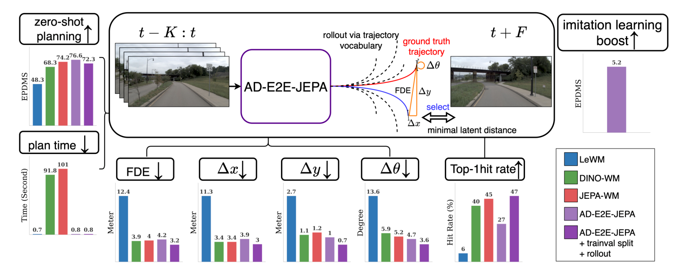
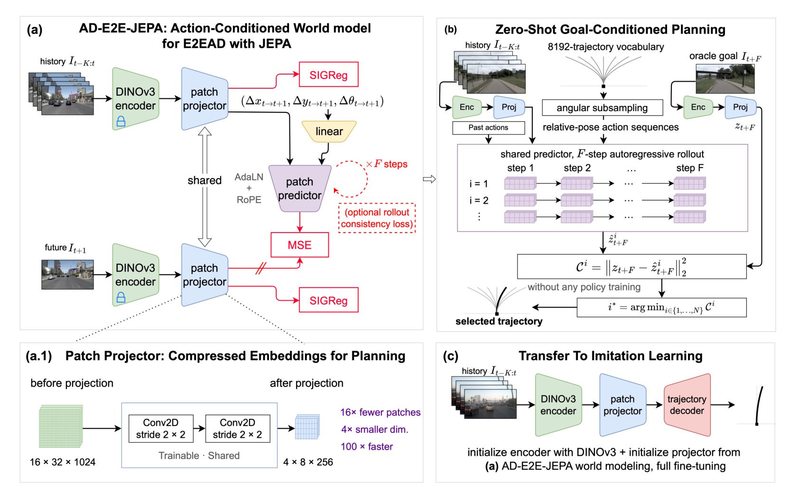
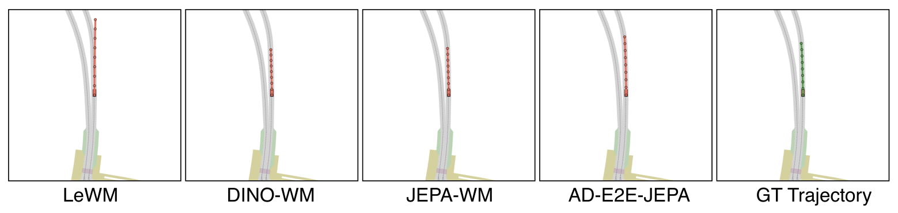
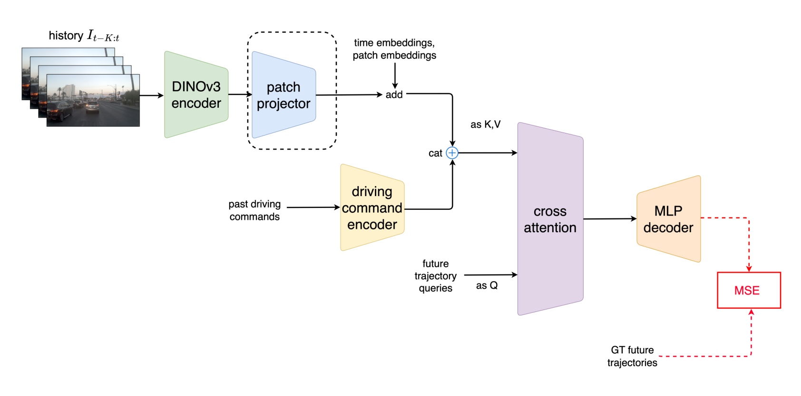

# Arquitectura AD-E2E-JEPA

World model JEPA acción-condicionado de [[wiki/papers/2026_AD-E2E-JEPA|AD-E2E-JEPA]] (arXiv 2026). Parte de la mejor configuración de [[JEPA-WM]] (DINOv3 ViT-L congelado + predictor AdaLN/RoPE) y le añade un **patch projector** entrenable y compartido que comprime el latente antes del predictor. Como ese proyector se entrena, hacen falta stop-gradient y [[SIGReg]] para evitar el colapso.

---

## 1. Diagramas

### Visión general y resultados
Historia $t-K:t$ → AD-E2E-JEPA → rollout sobre el vocabulario de trayectorias → selección por mínima distancia latente al frame $t+F$. Los paneles muestran EPDMS, tiempo, FDE, $\Delta x$, $\Delta y$, $\Delta\theta$ y hit rate top-1 de LeWM, DINO-WM, JEPA-WM y AD-E2E-JEPA en las 100 escenas (Fig. 1).

### Arquitectura: entrenamiento, planificación y transferencia
(a) World model: DINOv3 congelado, patch projector compartido, predictor AdaLN + RoPE, MSE contra el target con stop-gradient (la doble barra), SIGReg en las dos ramas y pérdida de rollout opcional ×$F$. (a.1) Proyector: Conv2D stride $2\times2$ ×2, $16\times32\times1024\to4\times8\times256$. (b) Planificación zero-shot sobre un vocabulario de 8192 trayectorias con submuestreo angular. (c) Transferencia a imitation learning (Fig. 2).

### Comparación cualitativa de la planificación
Trayectoria elegida por cada world model frente a la real (verde). LeWM se desvía; DINO-WM, JEPA-WM y AD-E2E-JEPA se ajustan a la real (Fig. 3).

### Modelo de imitation learning downstream
DINOv3 + proyector preentrenado, embeddings temporales y de parche, comando de conducción concatenado, queries de trayectoria con cross-attention, decoder MLP y MSE contra la trayectoria real (Fig. 4, App. A.5).

---

## 2. Componentes y shapes

| Componente | Definición | Shape / detalle | Fuente |
|---|---|---|---|
| Observación | $I_j$, cámara frontal | $3\times256\times512$; $K+1=4$ frames de historia (2 s a 2 Hz) | §3.1, §4.2, App. A.5 |
| Pose / acción | $P_j=[x_j,y_j,\theta_j]^\top$; $a_t=\mathrm{Relative}(P_t,P_{t+1})=[\Delta x,\Delta y,\Delta\theta]^\top$ | $\mathbb R^3$, relativas a $P_t=0$ | Eq. 1–3 |
| Encoder $\mathrm{Enc}$ | DINOv3 ViT-L, **congelado** | $s_j\in\mathbb R^{16\times32\times1024}$ | Eq. 4; Fig. 2 |
| Patch projector $\mathrm{Proj}$ | 2 × Conv2D stride $2\times2$, entrenable, **compartido** contexto/target | $z_j\in\mathbb R^{4\times8\times256}$ (16× menos parches, 4× menos dimensión) | Eq. 7; Fig. 2 a.1 |
| Encoder de acción $E_a$ | capa lineal | — | §3.2.1 |
| Predictor $\mathrm{Pred}'$ | transformer de parches, AdaLN (acción) + RoPE | predice la ventana desplazada un paso: $\hat z_{t-K+1:t+1}$ | Eq. 8 |

> [!question] No verificado
> El PDF no da la profundidad ni el ancho del predictor, ni el kernel de las convoluciones, ni si hay activación entre ellas. Se remite a JEPA-WM (Terver et al., 2025), que no está ingerido.

## 3. Pérdidas

**Un paso** (Eq. 9–11), forma **aditiva**:

$$\mathcal L=\mathrm{MSE}\big(\hat z_{t-K+1:t+1},\,\mathrm{sg}(z_{t-K+1:t+1})\big)+\lambda\,\mathcal L^{t-K:t+1}_{\text{SIGReg}},\qquad \lambda=0.09$$

- SIGReg **parche a parche**: un test de Epps–Pulley por cada posición espacio-temporal ($N=K+2=5$ frames × $H'W'=32$), sobre el batch, con $M=1024$ direcciones en $\mathbb S^{255}$ y 17 nodos en $[0,3]$ (Eq. 10; App. A.1). Detalle: [[SIGReg]].
- Se aplica a los embeddings **proyectados** de todos los frames de la ventana, tanto de contexto como de target (Fig. 2a).

**Con rollout** (Eq. 12): $\mathcal L_{\text{multi}}=\frac{\mathcal L_{\text{TF}}+\sum_{k=2}^F\mathcal L_k}{F}+\lambda\,\mathcal L^{t-K:t+F}_{\text{SIGReg}}$, con TBPTT. Detalle: [[Teacher_Forcing_Rollout_Loss]].

**Anti-colapso:** combinación de tres mecanismos. (i) El encoder está congelado, así que el colapso solo puede ocurrir en el proyector. (ii) Stop-gradient en el target proyectado, sin EMA. (iii) SIGReg. El paper motiva SIGReg diciendo que el proyector podría mapear embeddings DINOv3 distintos a vectores casi constantes (§3.2.2), pero **no lo demuestra con una ablación**.

## 4. Entrenamiento (Tab. 1; §4.2)

| Hiperparámetro | Valor |
|---|---|
| Optimizador | AdamW, 30 épocas, 1 época de warmup + coseno |
| lr | $10^{-4}$ (navtrain), escalado con $\sqrt{\text{batch}}$ en trainval: $2\times10^{-4}$ (batch 512), $1.4\times10^{-4}$ (batch 256) |
| Batch | 128 (navtrain), 512 / 256 (trainval sin / con rollout) |
| $\lambda$ SIGReg | 0.09; 0.025 en trainval sin rollout |
| Coste | navtrain: 20 h en 1×A100 (DINO-WM: 4×11 h; JEPA-WM: 4×13 h) |
| Datos | navtrain 10 h; trainval 70 h; 2 Hz |

## 5. Inferencia / planificación (§3.3.1; App. A.3)

1. Codificar y proyectar la historia $z_{t-K:t}$ y el frame objetivo $z_{t+F}$ (**oráculo**: frame real a $F=8$ pasos = 4 s).
2. Tomar el vocabulario de 8192 trayectorias (VADv2), ordenarlo por coordenada angular y submuestrear uniformemente $|\mathcal V_{\text{sampled}}|$ candidatas (256 por defecto).
3. Convertir cada trayectoria en acciones relativas y hacer el rollout autorregresivo de $F$ pasos de **todas** las candidatas en paralelo en una A100 80 GB.
4. Coste terminal $C_i=\|z_{t+F}-\hat z^{\,i}_{t+F}\|_2^2$; $i^*=\arg\min_i C_i$.

0.8 s por escena con 256 candidatas, 18.2 s con 8192 (Tab. 2). No hay CEM, MPPI ni GD: los autores descartan CEM por su coste iterativo (§3.3.1).

> [!important] Qué cambia respecto a JEPA-WM / DINO-WM
> Los dos baselines predicen sobre los $512$ parches de dimensión $1024$ de DINOv3, y su target está congelado, así que no necesitan anti-colapso. AD-E2E-JEPA predice sobre $32$ parches de dimensión $256$: el número de valores por frame baja de $524\,288$ a $8\,192$ (64×). El precio es que el target se aprende, y por eso necesita SG + SIGReg. Es la misma idea que el proyector de [[Temporal_Straightening]], pero con reducción espacial y con SIGReg en lugar del regularizador de curvatura.

## 6. Transferencia a imitation learning (App. A.5)

Se descarta el predictor y se conservan DINOv3 + el proyector. Se añaden embeddings temporales y de posición de parche (compartidos entre frames), se concatena el comando de conducción codificado, y queries de trayectoria → cross-attention → MLP → MSE. Fine-tuning completo. Proyector preentrenado frente a aleatorio: EPDMS 85.4 frente a 80.2 (Tab. 3).

## Enlaces

- Paper: [[wiki/papers/2026_AD-E2E-JEPA|2026_AD-E2E-JEPA]] · Entidad: [[AD-E2E-JEPA]]
- Matemáticas: [[SIGReg]], [[Teacher_Forcing_Rollout_Loss]]
- Baselines: [[JEPA-WM]], [[DINO-WM]], [[LeWorldModel]]
- Proyector de origen: [[wiki/architecture/2026_Temporal_Straightening_Arch|arquitectura Temporal Straightening]]
