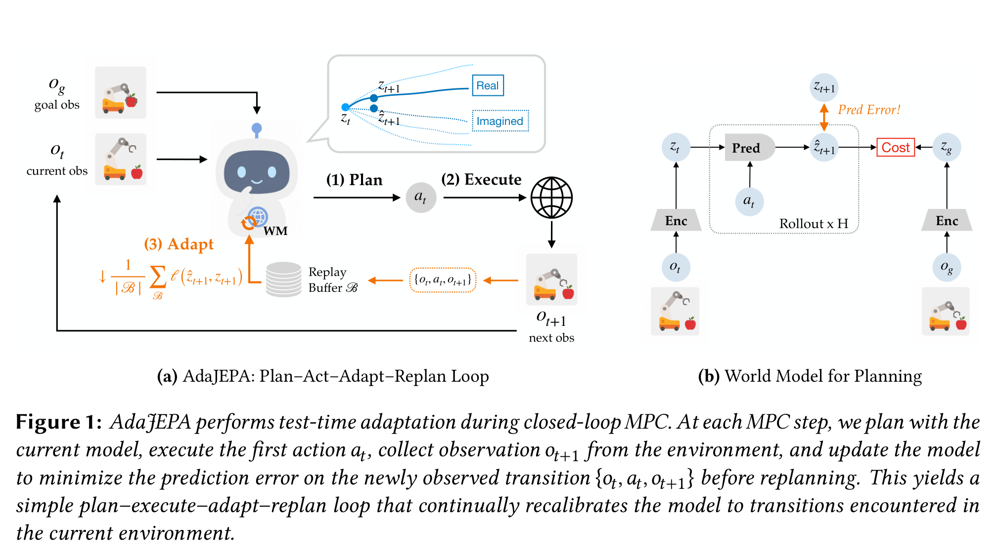

# Arquitectura AdaJEPA (Adaptive Latent World Model)

**AdaJEPA** es una arquitectura y marco algorítmico de **Test-Time Adaptation (TTA)** para Modelos de Mundo basados en JEPA que operan en bucle cerrado con **Control Predictivo por Modelo (MPC)**. Resuelve la degradación de rendimiento provocada por desplazamientos de distribución (*distribution shifts*, tales como variaciones de masa, fricción, geometrías de objetos o cambios visuales) actualizando los parámetros del modelo en tiempo de ejecución tras cada paso de interacción.

---

## 1. Diagrama de la Arquitectura en Bucle Cerrado



---

## 2. Flujo de Ejecución: Plan-Execute-Adapt-Replan

AdaJEPA acopla íntimamente el aprendizaje y la planificación en cuatro fases secuenciales por cada paso de control $t$:

```
1. Planificar   --> Optimizar trayectoria de acciones a_{t:t+H-1} minimizando || \hat{z}_{t+H} - z_g ||
2. Ejecutar     --> Aplicar primera acción a_t en el entorno real
3. Observar     --> Recibir nueva observación o_{t+1}
4. Adaptar      --> Dar paso de gradiente \theta_{t+1} \leftarrow \theta_t - \alpha \nabla_\theta \mathcal{L}_{\text{adapt}}
5. Replanificar --> Repetir con el modelo actualizado \theta_{t+1}
```

---

## 3. Formulación Matemática de la Adaptación

### Pérdida de Auto-Supervisión en Tiempo de Test ($\mathcal{L}_{\text{adapt}}$)
Al observar la transición real $(o_t, a_t, o_{t+1})$, el error de predicción en el espacio latente actúa como señal de supervisión inmediata:

$$\mathcal{L}_{\text{adapt}}(\theta) = \mathcal{D}\left( P_\theta(E(o_t), a_t), E(o_{t+1}) \right)$$

donde:
- $E$ es el encoder de observaciones (congelado o con adaptación de capas superficiales).
- $P_\theta$ es el predictor de dinámicas cuyas capas clave se actualizan mediante:

$$\theta_{t+1} = \theta_t - \eta \nabla_\theta \mathcal{L}_{\text{adapt}}(\theta_t)$$

---

## 4. Mecanismo de Replay Buffer Local

Para evitar el olvido catastrófico de la dinámica global durante la adaptación rápida a un régimen local, AdaJEPA mantiene una memoria episódica corta $\mathcal{B}_{\text{local}}$ con las últimas $K$ transiciones, combinando el gradiente instantáneo con un mini-batch histórico de la trayectoria actual.

---

## 5. Referencias Cruzadas
- **Paper**: [[2026_AdaJEPA]]
- **Entidad**: [[AdaJEPA]]
- **Relacionado**: [[2026_LeWorldModel]], [[2025_PLDM]], [[2026_SkyJEPA]]
