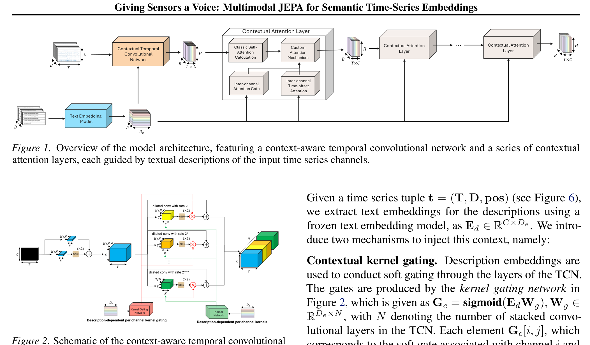
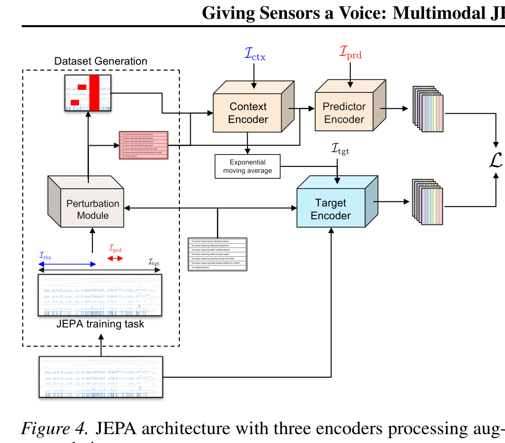

# Arquitectura CHARM (Giving Sensors a Voice)

**CHARM** es una arquitectura multimodal basada en JEPA diseñada para el aprendizaje auto-supervisado de representaciones en **series temporales multivariadas** heterogéneas, guiadas y condicionadas por **descripciones textuales de sensores**. Introduce Redes Convolucionales Temporales Conscientes del Contexto (**Context-Aware TCNs**) y compuertas dinámicas (*Gating mechanisms*) para modelar interacciones entre canales.

---

## 1. Diagramas de la Arquitectura

### Red Convolucional Temporal Consciente del Contexto (TCN)

### Arquitectura Multimodal JEPA de Tres Encoders

---

## 2. Módulos y Flujo de Información

### A. Context-Aware TCN con Gating Inter-Canal
- Procesa canales de series temporales de dimensión variable mediante convoluciones dilatadas causalmente estructuradas.
- **Mecanismo de Gating**: Modula la transferencia de información entre canales dependientes guiado por la similitud del embedding textual del sensor.

### B. Arquitectura de Tres Encoders
1. **Sensor Description Encoder ($E_{\text{text}}$)**: Transforma el texto de metadatos del sensor $D_i$ en un vector semántico $z_{\text{text}}^i$ (usando backbones como RoBERTa o BGE).
2. **Context Time-Series Encoder ($E_{\text{ctx}}$)**: Codifica la ventana observable del historial temporal $T_{\text{past}}$ condicionado por los embeddings de texto.
3. **Target Time-Series Encoder ($E_{\text{tgt}}$)**: Codifica los segmentos objetivo $T_{\text{future}}$ (actualizado vía EMA o stop-gradient).

### C. Predictor Multimodal ($P_\phi$)
- Predice los embeddings latentes del objetivo a partir del contexto temporal y los descriptores semánticos textuales.

---

## 3. Tareas de Entrenamiento JEPA

1. **Causal Prediction**: Predecir el estado latente futuro $z_{t+H}$ dado el pasado $z_{1:t}$.
2. **Smoothing / Imputation**: Predecir segmentos intermedios enmascarados dados los intervalos anterior y posterior.

---

## 4. Referencias Cruzadas
- **Paper**: [[2026_CHARM]]
- **Entidad**: [[CHARM]]
- **Relacionado**: [[2026_TC-JEPA]], [[2026_MJEPA]]
