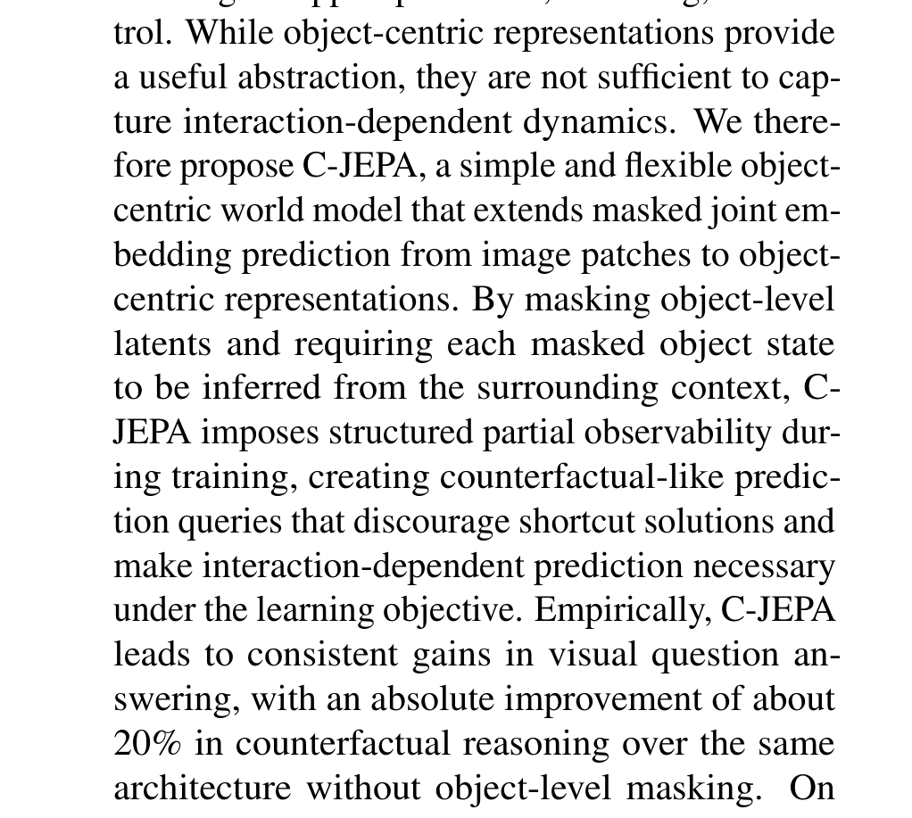
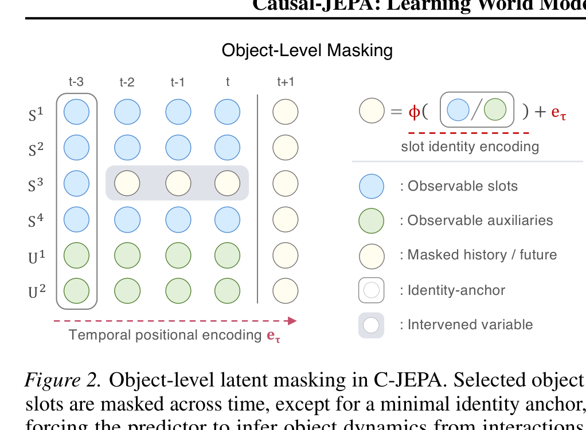
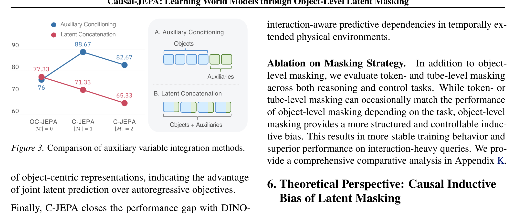

# Arquitectura Causal-JEPA (C-JEPA)

**Causal-JEPA (C-JEPA)** introduce el aprendizaje de modelos de mundo relacionales y causales integrando representaciones centradas en objetos (**Slot Attention**) con una estrategia de **Enmascaramiento Latente a Nivel de Objeto (Object-Level Latent Masking)**. Obliga al predictor Transformer a razonar explícitamente sobre las interrelaciones e intercambios causales entre entidades en lugar de explotar atajos espaciales globales.

---

## 1. Diagramas de la Arquitectura

### Pipeline de Entrenamiento de C-JEPA

### Enmascaramiento Latente a Nivel de Objeto

### Integración de Variables Auxiliares

---

## 2. Componentes del Sistema

### A. Object-Centric Encoder ($E_{\text{slot}}$)
- **Mecanismo**: Encoder visual congelado o preentrenado acoplado a un módulo de **Slot Attention** iterativo.
- **Representación**: Descompone cada frame $x_t$ en un conjunto de $K$ slots de objetos:
  $$S_t = \{s_t^1, s_t^2, \dots, s_t^K\}, \quad s_t^k \in \mathbb{R}^{d_{\text{slot}}}$$

### B. Predictor Causal Transformer ($P_\phi$)
- **Arquitectura**: Transformer autoregresivo con atención cruzada entre slots y mecanismos causales a lo largo del tiempo.
- **Entrada**: Secuencia temporal de slots históricos $S_{1:t}$ donde ciertos slots de objetos específicos han sido enmascarados con un token de máscara aprendible $m_{\text{slot}}$.
- **Variables Auxiliares / Acciones**: Se inyectan concatenadas a los slots o mediante modulación FiLM.

---

## 3. Estrategia de Enmascaramiento a Nivel de Objeto

A diferencia de I-JEPA o V-JEPA que enmascaran parches rectangulares arbitrarios en el espacio de píxeles:
1. **Selección de Objetos**: Se elige aleatoriamente un subconjunto de entidades/slots $O_{\text{mask}} \subset \{1, \dots, K\}$.
2. **Máscara Coherente**: Los slots seleccionados se ocultan a través de la ventana temporal o en el horizonte futuro.
3. **Tarea Predictiva**: El predictor debe inferir la evolución del objeto oculto basándose exclusivamente en el comportamiento y colisiones de los objetos contextuales observables.

---

## 4. Función de Pérdida

$$\mathcal{L}_{\text{C-JEPA}}(\phi) = \frac{1}{|O_{\text{mask}}|} \sum_{k \in O_{\text{mask}}} \sum_{t=t_{\text{target}}}^{T} \mathcal{D}\left( \hat{s}_t^k, s_t^k \right)$$

donde $s_t^k$ proviene del encoder centrado en objetos y $\hat{s}_t^k$ es la predicción del Transformer.

---

## 5. Referencias Cruzadas
- **Paper**: [[2026_Causal-JEPA]]
- **Entidad**: [[C-JEPA]]
- **Conceptos**: [[2023_I-JEPA]], [[2026_LeWorldModel]]
