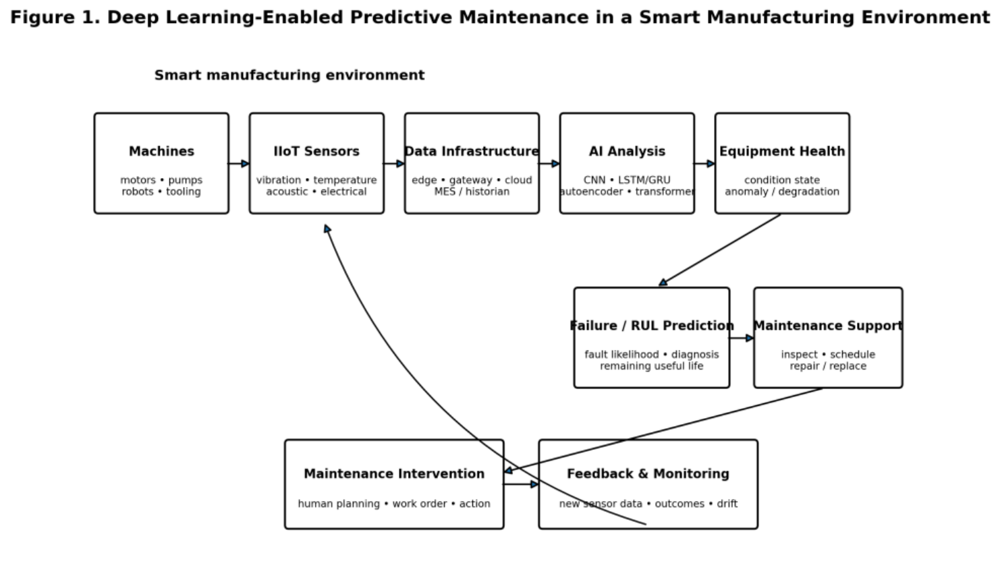
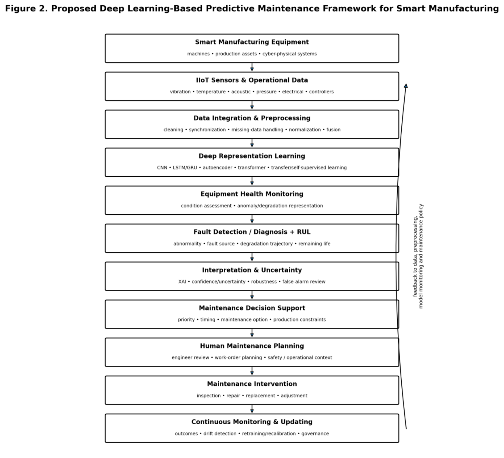

# Framework conceptual DL-PdM (Smart Manufacturing)

> [!warning] Procedencia
> Es un framework **conceptual y no validado** de un documento de procedencia dudosa. Ver el callout en [[wiki/papers/2026_DL_Predictive_Maintenance|la nota del paper]]. No es una arquitectura de red: es un pipeline de sistema.

## Flujo en el entorno de fabricación (Fig. 1)

Según el texto (§4.4, p. 4), el deep learning se sitúa **dentro** del flujo operativo y no como un clasificador aislado. Datos de sensores → infraestructura de datos → análisis IA → salud del equipo → predicción de fallo/RUL → soporte a mantenimiento → intervención → retroalimentación.

## Framework propuesto (Fig. 2, Tab. 3)

| # | Capa | Función | Salida | Reto principal |
|---|---|---|---|---|
| 1 | Equipment & sensing | Captar condición y contexto (vibración, temperatura, acústica, presión, eléctrica) | Flujos crudos | Ubicación y calibración de sensores; ciberseguridad |
| 2 | Data integration & preprocessing | Limpieza, sincronización, datos faltantes, normalización, fusión | Datos multivariantes listos para análisis | Missingness, ruido, frecuencias de muestreo heterogéneas |
| 3 | Deep representation learning | Features diagnósticas y pronósticas (CNN, LSTM/GRU, AE, Transformer, SSL) | Representación latente del equipo | Demanda de datos; opacidad |
| 4 | Health monitoring | Estimar la condición actual | Health state / evidencia de anomalía | Umbrales; dependencia del régimen |
| 5 | Fault / RUL prediction | Origen del fallo o vida remanente | Evidencia de fallo, RUL | Generalización e incertidumbre |
| 6 | Interpretation & uncertainty | Cualificar la predicción (SHAP, LIME, atribución, contrafactuales) | Drivers, confianza, límites | Fidelidad y estabilidad de las explicaciones |
| 7 | Decision support | Traducir predicciones a opciones de acción | Recomendación priorizada | Falsas alarmas; umbrales |
| 8–9 | Human planning & intervention | Autorizar y ejecutar (CMMS / órdenes de trabajo) | Inspección, reparación, sustitución | Automation bias |
| 10 | Continuous monitoring | Drift, feedback, reentrenamiento, retirada del modelo | Modelo y gobernanza actualizados | Concept drift; riesgo de modelo |

Fuente: Tab. 3 (p. 6) y Fig. 2 (p. 5). La figura separa *Maintenance Intervention* de *Human Maintenance Planning* (11 cajas); la tabla las agrupa en una sola fila.

## Lectura crítica desde la bóveda

- **La capa 3 es donde encajaría una JEPA.** Un encoder SSL de tipo [[CHARM]] preentrenado sobre flujos de sensores sin etiquetar, evaluado con probes de salud o RUL. El documento no lo propone: solo menciona SSL de forma genérica.
- **Las capas 5–6** (RUL con incertidumbre) conectan con las JEPA probabilísticas ([[VJEPA]]) y con el problema de identificabilidad del estado latente ([[Linear_Identifiability]]).
- **El bucle de feedback** (capa 10 → capas 1 y 2) es un bucle de adaptación continua. Conceptualmente es análogo a la TTA de [[AdaJEPA]], pero a escala de flota.
