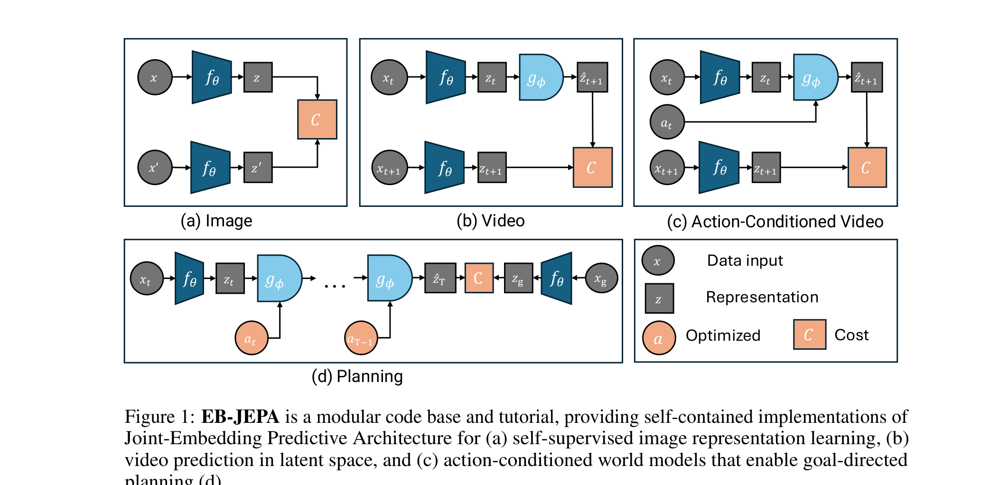

# Arquitectura EB-JEPA (Energy-Based JEPA)

**EB-JEPA** formaliza el marco de Joint-Embedding Predictive Architectures bajo la teoría de **Modelos Basados en Energía (EBMs)** de Yann LeCun, ofreciendo una implementación modular y unificada que abarca desde el aprendizaje de representaciones estáticas en imágenes hasta Modelos de Mundo en video y control condicionado por acciones con rollouts multietapa.

---

## 1. Diagrama del Framework Unificado



---

## 2. Las Tres Instanciaciones Unificadas

```
(a) Image JEPA (SSL):
    x_context ---> [ Encoder E ] ---> s_context 
                                         |
                                   [ Predictor P ] ---> \hat{s}_target  <-- Energy E(x,y) -->  s_target <--- [ EMA Encoder ] <--- x_target

(b) Video JEPA (World Model):
    v_{1:t}   ---> [ Video Enc E ] ---> s_{1:t} 
                                         |
                                   [ Rollout P ]  ---> \hat{s}_{t+1:t+H} <-- Energy -->  s_{t+1:t+H} <--- [ EMA Enc ] <--- v_{t+1:t+H}

(c) Action-Conditioned JEPA (Control):
    s_t, a_{t:t+H-1} -------------> [ AC-Predictor ] ---> \hat{s}_{t+H}   <-- Min Energy -->  s_{goal}
```

---

## 3. Formulación de Energía y Regularización

La función de energía entre una observación $x$ y una predicción $y$ se define como:

$$\mathcal{E}(x, y) = \| P(E(x)) - E(y) \|_2^2$$

Para evitar el colapso de energía constante ($\mathcal{E}(x,y) = 0, \forall x,y$), EB-JEPA implementa y compara dos mecanismos fundamentales de regularización no contrastiva:
1. **VICReg (Variance-Invariance-Covariance)**: Regularización sobre matrices de covarianza empíricas.
2. **SIGReg (Sketched-Isotropic-Gaussian)**: Proyecciones aleatorias hacia distribuciones gaussianas estándar.

---

## 4. Referencias Cruzadas
- **Paper**: [[2026_EB-JEPA]]
- **Entidad**: [[EB-JEPA]]
- **Matemáticas**: [[SIGReg]], [[LeWM_Loss]]
