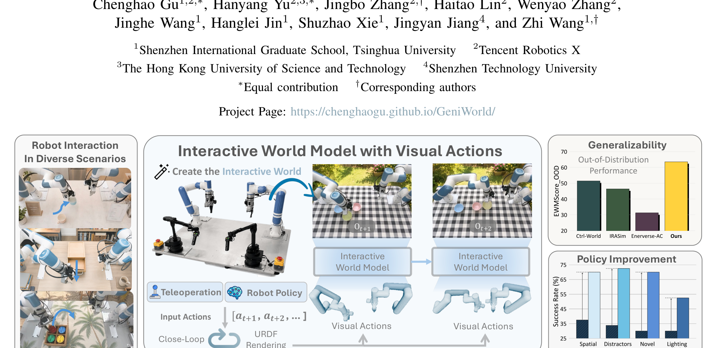
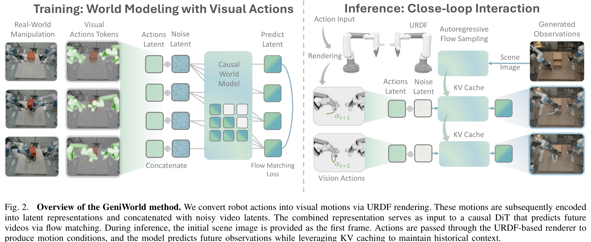
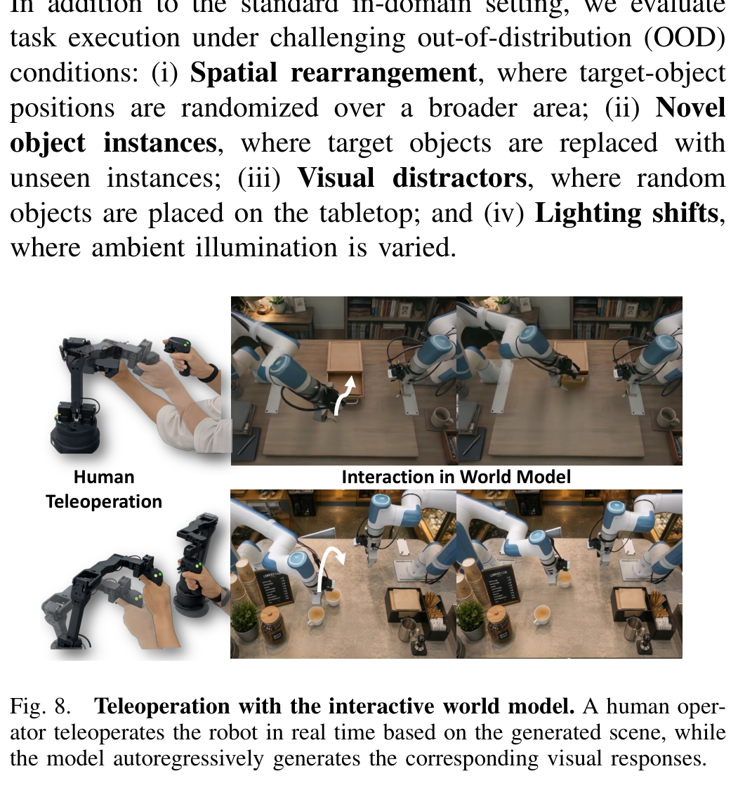

# Arquitectura GeniWorld

**GeniWorld** es una arquitectura de Modelo de Mundo interactivo autorregresivo basada en **Diffusion Transformers (DiT)** y **Flow Matching**, condicionada mediante **Acciones Visuales (*Visual Actions*)** renderizadas directamente desde el modelo cinemático URDF del manipulador robótico.

---

## 1. Diagramas de la Arquitectura

### Visión General del Sistema


### Pipeline de Entrenamiento e Inferencia


### Bucle de Teleoperación e Interacción en Tiempo Real


---

## 2. Desglose de Componentes

### A. Renderizador Cinemático de Acciones Visuales ($\mathcal{R}_{\text{URDF}}$)
- **Entrada**: Secuencia de acciones numéricas $a_{t+1:t+H} \in \mathbb{R}^{H \times d_a}$ (ej. ángulos articulares o poses cartesianas del efector final).
- **Proceso**: Cinemática directa (*forward kinematics*) sobre la descripción URDF del robot para calcular las poses 3D de cada eslabón y articulación.
- **Renderizado**: Proyección gráfica desde los parámetros intrínsecos/extrínsecos de la cámara hacia una secuencia visual densa $m_{t+1:t+H} \in \mathbb{R}^{H \times 3 \times H_0 \times W_0}$, aislando únicamente la estructura física del manipulador sin objetos ni fondos.

### B. Codificador Causal 3D VAE y Concatenación Espacial
- **Codificación**: Tanto el video de observación $o_{t+1:t+H}$ como la acción visual $m_{t+1:t+H}$ son procesados por el mismo codificador causal 3D VAE:
  $$ z_v = \mathcal{E}_{\text{3D-VAE}}(o_{t+1:t+H}) \in \mathbb{R}^{C \times L \times H' \times W'} $$
  $$ z_a = \mathcal{E}_{\text{3D-VAE}}(m_{t+1:t+H}) \in \mathbb{R}^{C \times L \times H' \times W'} $$
- **Fusión por Canales**: Se concatenan directamente en la dimensión de canales:
  $$ z = [z_v; z_a] \in \mathbb{R}^{2C \times L \times H' \times W'} $$
  donde $C = 48 \implies 2C = 96$.
- **Capa Patch Embedding**: Se expande la capa 3D convolutional patch embedding de 48 a 96 canales. Los primeros 48 canales heredan los pesos preentrenados del modelo base, y los 48 canales restantes se inicializan con Kaiming $\times 0.1$ para estabilizar los gradientes iniciales.

### C. Backbone Generativo Causal DiT (Wan2.2-TI2V-5B)
- **Estructura**: Transformer de difusión con atención espacio-temporal 3D.
- **Máscara Causal**: Implementa causal attention sobre los bloques temporales latentes, impidiendo que los fotogramas futuros filtren información a los estados pasados y garantizando dependencia estricta de la historia $z_{\le t}$ y la acción actual $z_{a, t+1}$.
- **Condicionamiento Multimodal**: Integra la instrucción textual de la tarea $c$ mediante mecanismos de modulación y cross-attention.

### D. Inferencia Autorregresiva y KV-Caching
- **Chunking Latente**: La generación procede por bloques de 3 fotogramas latentes por paso autorregresivo ($121$ fotogramas RGB $\to 31$ latentes).
- **KV-Cache**: Almacena las claves y valores de todos los tokens históricos generados previamente, permitiendo que el nuevo bloque latente ejecute auto-atención completa internamente y atención cruzada hacia el pasado sin recomputación cuadrática.
- **Tasa de Inferencia**: Con 5 pasos de muestreo ODE en Flow Matching y Classifier-Free Guidance ($\text{CFG}=3.0$), alcanza ~8 Hz en una sola GPU NVIDIA H20.

---

## 3. Comparativa de Representaciones de Acción

GeniWorld demuestra experimentalmente por qué las acciones visuales superan a las alternativas tradicionales:

```
[Acción Numérica] ────(AdaLN / Cross-Attn)───► Pérdida de anclaje 3D y acoplamiento espurio con el fondo.
[EE Trajectory]   ────(Proyección 2D/3D)────► Omite la geometría y oclusiones del brazo robótico.
[Skeleton / Joints] ──(Líneas / Puntos)─────► Pérdida de superficie de contacto (agarres flotantes).
[ControlNet-Style] ───(Ramas paralelas)─────► Alto coste de parámetros y degradación en generalización OOD.
[Visual Actions]  ────(Renderizado URDF)────► Anclaje espacial exacto, geometría 3D completa y zero-shot OOD.
```

---

## 4. Referencias Cruzadas
- **Paper**: [[2026_GeniWorld]]
- **Entidad**: [[GeniWorld]]
- **Matemáticas**: [[Visual_Action_Flow_Matching]]
- **Modelos Relacionados**: [[V-JEPA2]], [[LeWorldModel]], [[AdaJEPA]]
