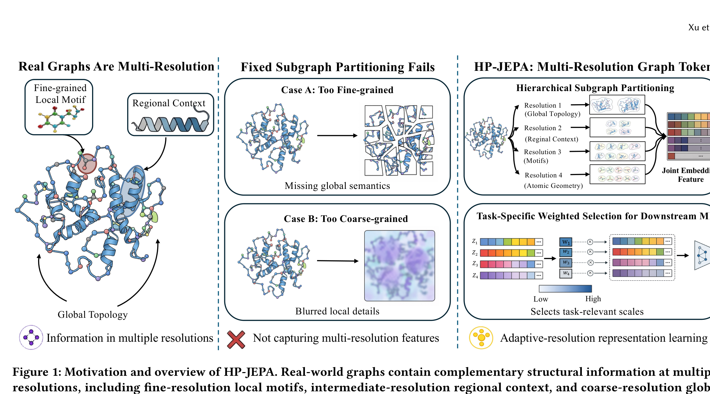
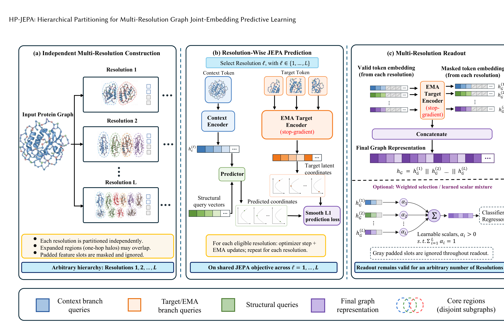

# Arquitectura HP-JEPA (Hierarchical Partitioning Graph JEPA)

**HP-JEPA** traslada el paradigma JEPA al dominio del aprendizaje auto-supervisado sobre **grafos complejos** (redes moleculares, biológicas y sociales). Resuelve la limitación de los métodos previos de enmascaramiento local mediante una técnica de **Particionamiento Jerárquico** que captura información estructural simultáneamente a múltiples resoluciones espaciales (motivos locales, comunidades intermedias y topología global).

---

## 1. Diagramas de la Arquitectura

### Motivación y Jerarquía Multirresolución

### Pipeline de Particionamiento y Predicción

---

## 2. Componentes del Sistema

### A. Banco de Particionamiento Jerárquico ($\mathcal{P}^{(\ell)}$)
- Un grafo $G = (V, E)$ se particiona independientemente en $L$ niveles de resolución $\ell \in \{1, \dots, L\}$.
- A resolución $\ell$, el grafo se divide en $K_\ell$ subgrafos o cúmulos disjuntos $P_1^{(\ell)}, \dots, P_{K_\ell}^{(\ell)}$.

### B. Core & Context Subgraph Encoders ($E_{\text{core}}, E_{\text{ctx}}$)
- **GNN Backbone**: Graph Isomorphism Networks (GIN) o Graph Attention Networks (GAT).
- **Core Region**: Subgrafo central cuyos nodos se codifican como target.
- **Context Region**: Nodos de frontera y subgrafos adyacentes a nivel jerárquico $\ell$.

### C. Multi-Resolution Hierarchical Predictor ($P_\phi$)
- Predice los embeddings de nivel de grafo del subgrafo core objetivo a resolución $\ell$ condicionado por las representaciones de contexto de resoluciones inferiores y superiores.

---

## 3. Función de Pérdida Multiescala

$$\mathcal{L}_{\text{HP-JEPA}} = \sum_{\ell=1}^L \omega_\ell \sum_{k=1}^{K_\ell} \left\| P_\phi\left( z_{\text{ctx}}^{(\ell, k)}, \text{pos}^{(\ell, k)} \right) - E_{\text{tgt}}\left( G_{\text{core}}^{(\ell, k)} \right) \right\|_2^2$$

donde $\omega_\ell$ es el factor de ponderación de la escala jerárquica $\ell$.

---

## 4. Referencias Cruzadas
- **Paper**: [[2026_HP-JEPA]]
- **Entidad**: [[HP-JEPA]]
- **Conceptos**: [[2023_I-JEPA]]
