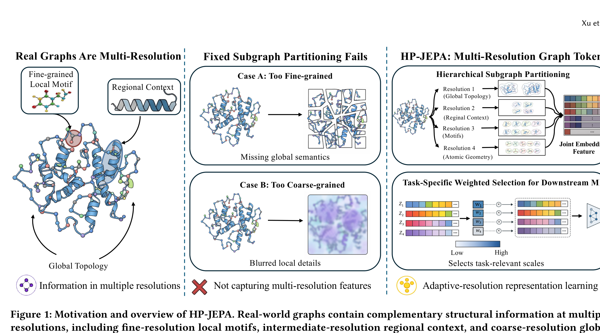
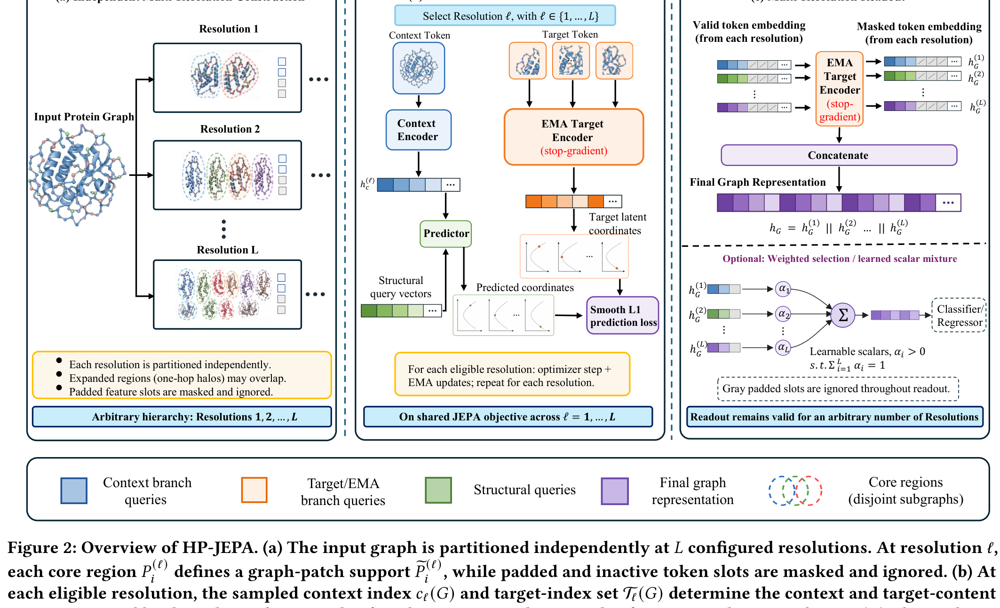

# Arquitectura HP-JEPA (Hierarchical Partitioning Graph JEPA)

**HP-JEPA** traslada el paradigma JEPA al dominio del aprendizaje auto-supervisado sobre **grafos complejos** (redes moleculares, biológicas y sociales). Resuelve la limitación de los métodos previos de enmascaramiento local mediante una técnica de **Particionamiento Jerárquico** que captura información estructural simultáneamente a múltiples resoluciones espaciales (motivos locales, comunidades intermedias y topología global).

---

## 1. Diagramas de la Arquitectura

### Motivación y Jerarquía Multirresolución

### Pipeline de Particionamiento y Predicción

---

## 2. Componentes del Sistema

### A. Banco de Particionamiento Jerárquico ($\mathcal{P}^{(\ell)}$)
- Un grafo $G = (V, E)$ se particiona independientemente en $L$ niveles de resolución $\ell \in \{1, \dots, L\}$.
- A resolución $\ell$, el grafo se divide en $K_\ell$ subgrafos o cúmulos disjuntos $P_1^{(\ell)}, \dots, P_{K_\ell}^{(\ell)}$.

### B. Core & Context Subgraph Encoders ($E_{\text{core}}, E_{\text{ctx}}$)
- **GNN Backbone**: Graph Isomorphism Networks (GIN) o Graph Attention Networks (GAT).
- **Core Region**: Subgrafo central cuyos nodos se codifican como target.
- **Context Region**: Nodos de frontera y subgrafos adyacentes a nivel jerárquico $\ell$.

### C. Multi-Resolution Hierarchical Predictor ($P_\phi$)
- Predice los embeddings de nivel de grafo del subgrafo core objetivo a resolución $\ell$ condicionado por las representaciones de contexto de resoluciones inferiores y superiores.

---

## 3. Función de Pérdida Multiescala

> [!important] Corrección (arbitraje con el PDF)
> La versión anterior de esta nota daba una $L_2^2$ sumada sobre escalas. El paper usa **Smooth-L1 contra un target en el hiperboloide de Lorentz 1-D** y **no suma** las pérdidas entre resoluciones: da un paso de optimizador por resolución (HP-JEPA p. 6).

**Target de Lorentz.** Para un embedding $u\in\mathbb R^d$ del target encoder EMA (con stop-gradient) se toma su media $m(u)=d^{-1}\mathbf 1_d^\top u$ y se mapea a

$$
\Phi(u)=\big[\cosh m(u),\ \sinh m(u)\big]^\top \in \mathbb R^2,\qquad \Phi(u)^\top J_L\,\Phi(u)=-1,\quad J_L=\mathrm{diag}(-1,1)
$$

Es decir, el target es un **escalar** (la media de features) embebido en la rama positiva del hiperboloide. No es el vector $d$-dimensional completo. El predictor $\hat y^{(\ell)}_t=q_\psi\big(s^{(\ell)}_{c_\ell}+p^{(\ell)}_t\big)\in\mathbb R^2$ se ajusta en coordenadas ambiente y **no** está restringido al hiperboloide.

**Pérdida por resolución $\ell$:**

$$
\mathcal{L}_\ell(G)=\frac{1}{M_\ell(G)}\sum_{t\in T_\ell(G)} \mathrm{SmoothL1}_\beta\big(\hat y^{(\ell)}_t,\ \mathrm{sg}(y^{(\ell)}_{t,\text{tgt}})\big),\qquad
\mathcal{L}_\ell(\mathcal B)=\sum_{G\in\mathcal B_\ell} w_{G,\ell}\,\mathcal L_\ell(G)
$$

Aquí la Smooth-L1 se promedia sobre las 2 coordenadas. Los pesos por tarea $\omega^{\text{task}}_\ell=(1-\lambda_{\text{unif}})\,\mathrm{softmax}(b^{\text{task}})_\ell+\lambda_{\text{unif}}/L$ **solo** intervienen en el *readout* downstream (§4.3), que usa el target encoder EMA congelado. No forman parte de la pérdida de preentrenamiento.

---

## 4. Referencias Cruzadas
- **Paper**: [[2026_HP-JEPA]]
- **Entidad**: [[HP-JEPA]]
- **Conceptos**: [[2023_I-JEPA]]
