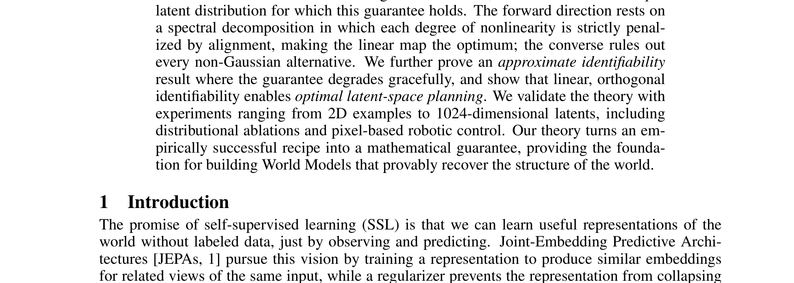
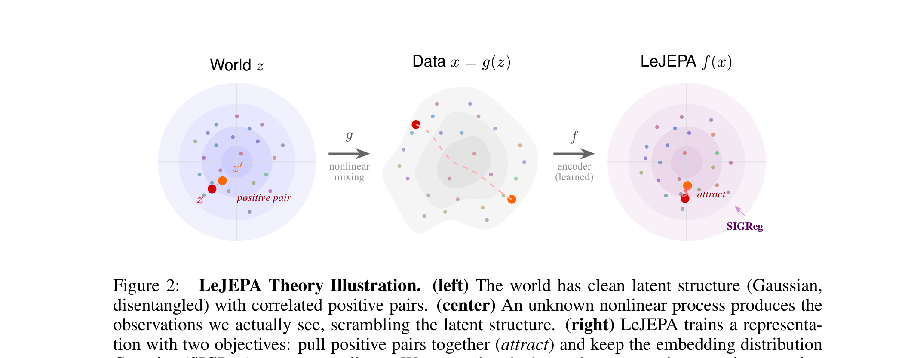

# Arquitectura y Fundamentos Teóricos de LeJEPA

El trabajo sobre **Identificabilidad Lineal en LeJEPA** (*When Does LeJEPA Learn a World Model?*) proporciona la demostración matemática formal y el diseño arquitectónico necesario para garantizar que un modelo JEPA no solo minimice una pérdida superficial, sino que **recupere exactamente la estructura de las variables latentes reales del mundo físico** ($z^*$) hasta una rotación ortogonal.

---

## 1. Diagramas Teóricos y Arquitectónicos

### Pipeline del Proceso Generativo y Recuperación

### Ilustración de la Teoría de Identificabilidad

---

## 2. Formulación del Problema y Teorema Central

### Proceso Físico Subyacente
- El mundo evoluciona con variables latentes no correlacionadas gaussianas $z \sim \mathcal{N}(0, I_d)$.
- Un proceso físico no lineal desconocido $g: \mathcal{Z} \to \mathcal{X}$ genera las observaciones sensoriales $x = g(z)$.

### Arquitectura de Recuperación
- El encoder $f_\theta: \mathcal{X} \to \mathbb{R}^d$ mapea observaciones a representaciones aprendidas $\hat{z} = f_\theta(x)$.
- **Teorema de Identificabilidad Lineal**: Si el objetivo JEPA combina alineación temporal (MSE) con regularización gaussiana isotrópica (SIGReg), entonces existe una matriz ortogonal $Q \in \mathcal{O}(d)$ tal que:
  $$\hat{z} = Q z$$
  lo que preserva distancias euclidianas, relaciones de causalidad y habilita la planificación con caminos rectos (*straight-line planning*).

---

## 3. Función de Pérdida Formal

$$\mathcal{L}(\theta) = \mathbb{E}_{(x, x^+)} \left[ \| f_\theta(x) - f_\theta(x^+) \|_2^2 \right] + \lambda \, \mathcal{R}_{\text{SIGReg}}(f_\theta(X))$$

---

## 4. Referencias Cruzadas
- **Paper**: [[2026_LeJEPA_Identifiability]]
- **Entidad**: [[Linear_Identifiability]]
- **Matemáticas**: [[SIGReg]], [[Linear_Identifiability]]
- **Modelos**: [[2026_LeWorldModel]], [[2026_EB-JEPA]]
