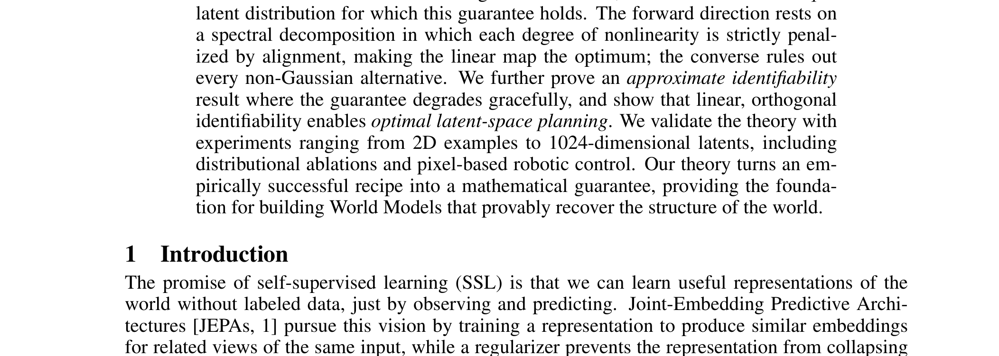
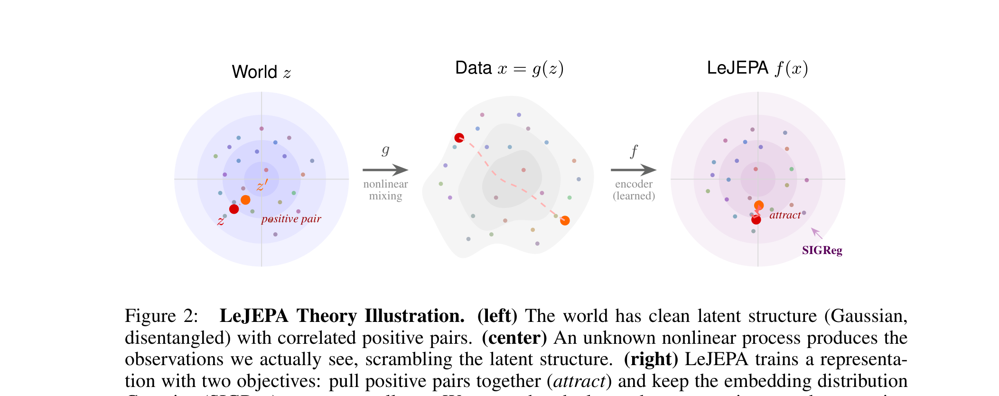

# Arquitectura y Fundamentos Teóricos de LeJEPA

El trabajo sobre **Identificabilidad Lineal en LeJEPA** (*When Does LeJEPA Learn a World Model?*) proporciona la demostración matemática formal y el diseño arquitectónico necesario para garantizar que un modelo JEPA no solo minimice una pérdida superficial, sino que **recupere exactamente la estructura de las variables latentes reales del mundo físico** ($z^*$) hasta una rotación ortogonal.

---

## 1. Diagramas Teóricos y Arquitectónicos

### Pipeline del Proceso Generativo y Recuperación

### Ilustración de la Teoría de Identificabilidad

---

## 2. Formulación del Problema y Teorema Central

### Proceso Físico Subyacente
- El mundo evoluciona con variables latentes Gaussianas **independientes** $z \sim \mathcal{N}(0, I_n)$.
- La evolución es **estacionaria con ruido aditivo**: una transición Ornstein–Uhlenbeck $z' = \rho z + \sqrt{1-\rho^2}\,\eta$, con $\eta \sim \mathcal{N}(0, I_n)$ (Eq. 1).
- Un proceso no lineal desconocido $g: \mathcal{Z} \to \mathcal{X}$ genera las observaciones $x = g(z)$.

### Arquitectura de Recuperación
- El encoder $f_\theta: \mathcal{X} \to \mathbb{R}^m$ mapea observaciones a representaciones $\hat{z} = f_\theta(x)$. El análisis se hace sobre $h = f \circ g$ y supone **$m = n$** (p. 4, p. 9).
- **Teorema 1 (identificabilidad lineal)**: bajo las hipótesis anteriores, el **óptimo global** del objetivo LeJEPA (alineación $L_2^2$ entre pares positivos más marginal $\mathcal{N}(0, I)$) cumple, para alguna matriz ortogonal $Q \in O(n)$:
  $$\hat{z} = Q z$$
- Al ser una isometría, preserva las distancias euclidianas. Si además el coste es invariante bajo $O(n)$ y la dinámica empujada es exacta, el plan óptimo en latente coincide con el del mundo real (Thm. 4; por ejemplo, la planificación en línea recta).

> [!important] Lo que el teorema no dice
> - **Causalidad**: no afirma que se preserven relaciones causales.
> - **Dinámica**: cubre el encoder, no la dinámica condicionada por acciones (App. D.2).
> - **Entrenamiento**: es un resultado de población, sin análisis de muestras finitas ni de la dinámica de entrenamiento (§7).
> - **Alcance**: fuera de latentes Gaussianos la identificabilidad lineal falla (Thm. 2). Con alineación y blanqueo imperfectos, el error se degrada de forma suave (Thm. 3).

---

## 3. Función de Pérdida Formal

$$\mathcal{L}(\theta) = \mathbb{E}_{(x, x^+)} \left[ \| f_\theta(x) - f_\theta(x^+) \|_2^2 \right] + \lambda \, \mathcal{R}_{\text{SIGReg}}(f_\theta(X))$$

---

## 4. Referencias Cruzadas
- **Paper**: [[2026_LeJEPA_Identifiability]]
- **Entidad**: [[Linear_Identifiability]]
- **Matemáticas**: [[SIGReg]], [[Linear_Identifiability]]
- **Modelos**: [[2026_LeWorldModel]], [[2026_EB-JEPA]]
