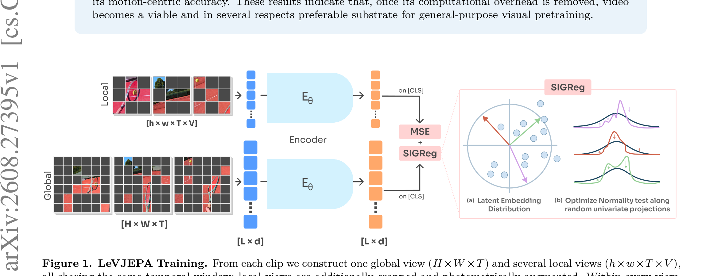

# LeVJEPA: Arquitectura y Pipeline

## Pipeline de Entrenamiento

El pipeline de entrenamiento de [[LeVJEPA]] simplifica drásticamente los métodos Joint-Embedding al prescindir de redes *target* y *predictores*.

1. **Construcción de Vistas**: De un clip de entrada, se construye una **vista global** ($H \times W \times T$) y varias **vistas locales** ($h \times w \times T \times V$). Todas comparten la misma ventana temporal, pero las vistas locales están recortadas espacialmente de forma agresiva y aumentadas fotométricamente.
2. **Token Dropping Uniforme**: Se aplica un *uniform random token dropping* muy agresivo (hasta el 95%) tanto en la vista global como en las locales. Solo los tokens retenidos pasan a la siguiente etapa. Esto reduce el número de tokens $L \times d$ de forma drástica.
3. **Encoder Compartido**: Ambas vistas (global y locales) pasan por el mismo encoder (generalmente un Video Transformer, ViT adaptado a video) con **block-causal attention**. Las representaciones de los parches se procesan bidireccionalmente dentro del mismo frame, y de forma causal hacia frames anteriores, ignorando los futuros.
4. **Readout a través del [cls] token**: Al final del paso por el encoder, el token de clase `[cls]` actúa como resumen a nivel del clip completo. Solo el embedding de este token se utiliza para calcular la función de pérdida. No hay supervisión a nivel de parche, lo cual diverge del clásico V-JEPA y masked autoencoders (como VideoMAE).
5. **Cálculo de la Pérdida**: 
   - Se minimiza el MSE ([[Invariance_Loss]]) forzando que el embedding `[cls]` de la vista local prediga el `[cls]` de la vista global. Los gradientes fluyen simétricamente a través de ambas ramas.
   - Para prevenir el colapso de la representación, se aplica [[SIGReg]] proyectando el batch de embeddings latentes a direcciones aleatorias, y constriñendo su distribución estadística hacia una Gaussiana Isotrópica, asegurando de manera probada la evasión de representaciones triviales.

## Eliminación de Componentes Clásicos
- **Sin Predictor**: Al no tener que reconstruir parches en el espacio de representación (como I-JEPA o V-JEPA), se descarta el Predictor.
- **Sin Target Encoder ni Stop-Gradient**: Al usar SIGReg, el modelo no colapsa aunque los gradientes fluyan simétricamente.
- **Sin Temporal Patch Aggregation**: El modelo no requiere agregar frames temporalmente a la entrada para procesar el movimiento, ya que su estrategia de tokenizado funciona puramente frame-by-frame. 
