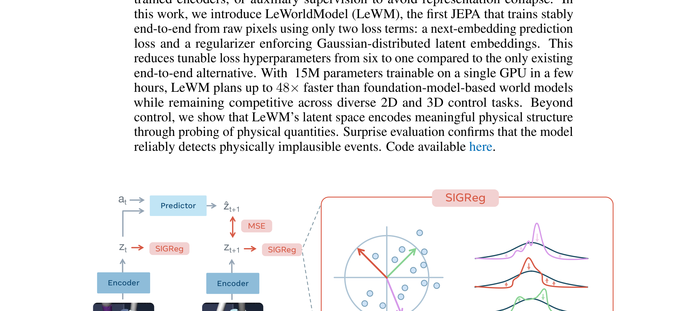
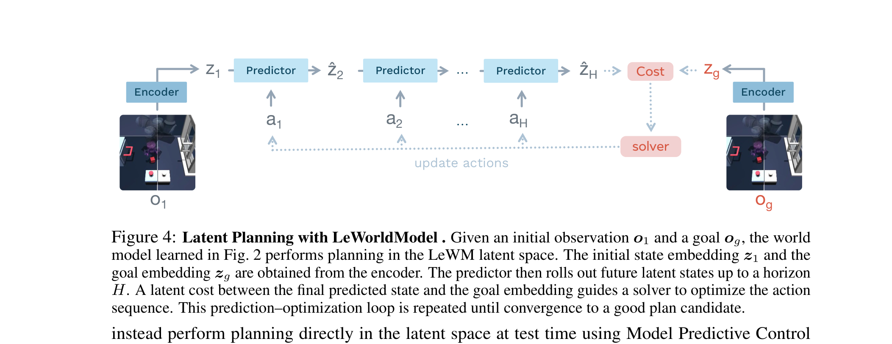

# Arquitectura LeWorldModel (LeWM)

**LeWorldModel (LeWM)** es una arquitectura minimalista y altamente eficiente de Modelo de Mundo entrenada **end-to-end desde píxeles** sin requerir encoders congelados preentrenados (como DINO) ni reconstrucción generativa de imágenes. Logra una estabilidad matemática total mediante la integración del regularizador **SIGReg**.

---

## 1. Diagramas de la Arquitectura

### Pipeline de Entrenamiento End-to-End

### Planificación en el Espacio Latente

---

## 2. Componentes Arquitectónicos

### A. Encoder Visual ($E_\theta$)
- **Estructura**: Red convolucional compacta de 4 a 6 capas residuales o ViT liviano.
- **Entrada**: Frames de video $o_t \in \mathbb{R}^{C \times H \times W}$.
- **Salida**: Vector latente de baja dimensionalidad $z_t = E_\theta(o_t) \in \mathbb{R}^{d_{\text{lat}}}$ (típicamente $d_{\text{lat}} \in [16, 64]$).
- **Eficiencia**: Reduce la representación a $\approx 200\times$ menos tokens que DINO-WM, posibilitando planificación en tiempo real.

### B. Predictor de Dinámicas ($P_\phi$)
- **Estructura**: MLP residual profundo o Bloque Transformer no causal.
- **Entrada**: Estado latente actual $z_t$ y vector de acción $a_t$.
- **Salida**: Estado latente futuro predicho $\hat{z}_{t+1} = P_\phi(z_t, a_t)$.

---

## 3. Función de Pérdida Unificada

$$\mathcal{L}_{\text{LeWM}}(\theta, \phi) = \frac{1}{T} \sum_{t=1}^T \| \hat{z}_t - z_t \|_2^2 + \lambda \, \mathcal{L}_{\text{SIGReg}}(z_{1:T})$$

donde $\mathcal{L}_{\text{SIGReg}}$ proyecta los embeddings latentes sobre vectores gaussianos aleatorios y penaliza desviaciones en media, varianza y kurtosis.

---

## 4. Algoritmo de Planificación Latente

Dada una observación meta $o_g \implies z_g = E_\theta(o_g)$ y la observación inicial $o_1 \implies z_1 = E_\theta(o_1)$:

$$a_{1:H}^* = \arg\min_{a_{1:H}} \left( \| \hat{z}_{H+1} - z_g \|_2^2 + \alpha \sum_{t=1}^H \| a_t \|_2^2 \right)$$

Optimizada con **Gradient Descent en el espacio de acciones** o **CEM**.

---

## 5. Referencias Cruzadas
- **Paper**: [[2026_LeWorldModel]]
- **Entidad**: [[LeWorldModel]]
- **Matemáticas**: [[LeWM_Loss]], [[SIGReg]]
