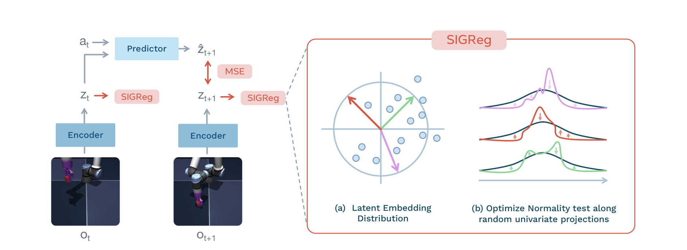
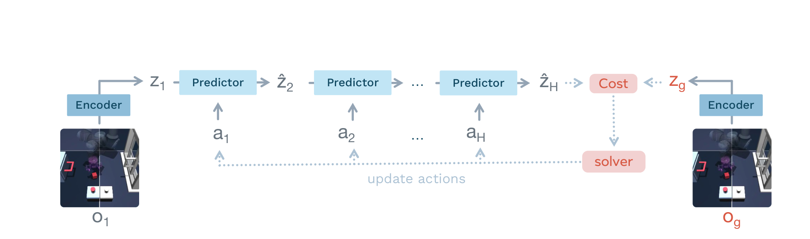

# Arquitectura LeWorldModel (LeWM)

**LeWorldModel (LeWM)** es una arquitectura minimalista y altamente eficiente de Modelo de Mundo entrenada **end-to-end desde píxeles** sin requerir encoders congelados preentrenados (como DINO) ni reconstrucción generativa de imágenes. Logra una estabilidad matemática total mediante la integración del regularizador **SIGReg**.

---

## 1. Diagramas de la Arquitectura

### Pipeline de Entrenamiento End-to-End

### Planificación en el Espacio Latente

---

## 2. Componentes Arquitectónicos

### A. Encoder Visual ($E_\theta$)
- **Estructura**: Red convolucional compacta de 4 a 6 capas residuales o ViT liviano.
- **Entrada**: Frames de video $o_t \in \mathbb{R}^{C \times H \times W}$.
- **Salida**: Vector latente de baja dimensionalidad $z_t = E_\theta(o_t) \in \mathbb{R}^{d_{\text{lat}}}$ con $d_{\text{lat}} = 192$: el token [CLS] de un **ViT-Tiny** (patch 14, 12 capas, 3 heads, ~5M parámetros) seguido de un projector MLP de 1 capa con BatchNorm (LeWM p. 4; p. 8). Por debajo de ~184 dimensiones el rendimiento cae (p. 24). En la ablación, ResNet-18 da 94.0 frente a 96.0 del ViT en Push-T (Tab. 8).
- **Eficiencia**: Reduce la representación a $\approx 200\times$ menos tokens que DINO-WM, posibilitando planificación en tiempo real.

### B. Predictor de Dinámicas ($P_\phi$)
- **Estructura**: Transformer de 6 capas, 16 heads y 10 % de dropout (~10M parámetros), con **máscara causal temporal** y predicción autorregresiva. Las acciones entran por **AdaLN inicializado a cero** (LeWM pp. 4–5). El App. D lo llama "ViT-S backbone", lo que no cuadra del todo con esas cifras (es una inconsistencia interna del paper).
- **Entrada**: Estado latente actual $z_t$ y vector de acción $a_t$.
- **Salida**: Estado latente futuro predicho $\hat{z}_{t+1} = P_\phi(z_t, a_t)$.

---

## 3. Función de Pérdida Unificada

$$\mathcal{L}_{\text{LeWM}}(\theta, \phi) = \frac{1}{T} \sum_{t=1}^T \| \hat{z}_t - z_t \|_2^2 + \lambda \, \mathcal{L}_{\text{SIGReg}}(z_{1:T})$$

donde $\mathcal{L}_{\text{SIGReg}}$ proyecta los embeddings sobre $M=1024$ direcciones aleatorias uniformes en la hiperesfera y aplica a cada proyección el test de **Epps–Pulley**. Es decir, compara la función característica empírica con $e^{-t^2/2}$ y no penaliza momentos. La cuadratura es trapezoidal en $[0.2, 4]$ (LeWM App. A, p. 13). El valor por defecto es $\lambda=0.1$ en forma aditiva, ajustable por bisección (p. 5). Ver [[SIGReg]].

---

## 4. Algoritmo de Planificación Latente

Dada una observación meta $o_g \implies z_g = E_\theta(o_g)$ y la observación inicial $o_1 \implies z_1 = E_\theta(o_1)$:

$$a_{1:H}^* = \arg\min_{a_{1:H}} \left( \| \hat{z}_{H+1} - z_g \|_2^2 + \alpha \sum_{t=1}^H \| a_t \|_2^2 \right)$$

Optimizada con **CEM** dentro de MPC. Se muestrean 300 secuencias, se eligen 30 élites y se hacen 30 iteraciones en PushT (10 en el resto). El horizonte es de 5 pasos latentes, que equivalen a 25 pasos de entorno por el frame-skip de 5 (App. B y D). En el paper el coste es solo terminal, $\|\hat z_H - z_g\|_2^2$ (p. 6); el término $\alpha\sum\|a_t\|^2$ de arriba es una generalización de la bóveda y **no** aparece en el PDF. La planificación completa tarda 0.98 s frente a 47 s de DINO-WM ("48×", Fig. 3).

---

## 5. Referencias Cruzadas
- **Paper**: [[2026_LeWorldModel]]
- **Entidad**: [[LeWorldModel]]
- **Matemáticas**: [[LeWM_Loss]], [[SIGReg]]
