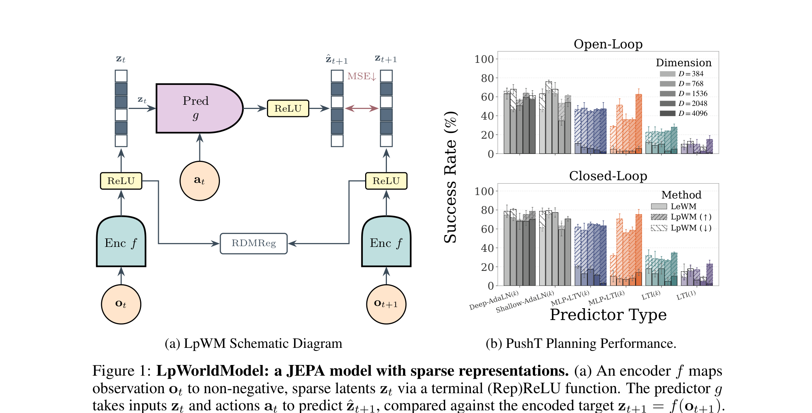
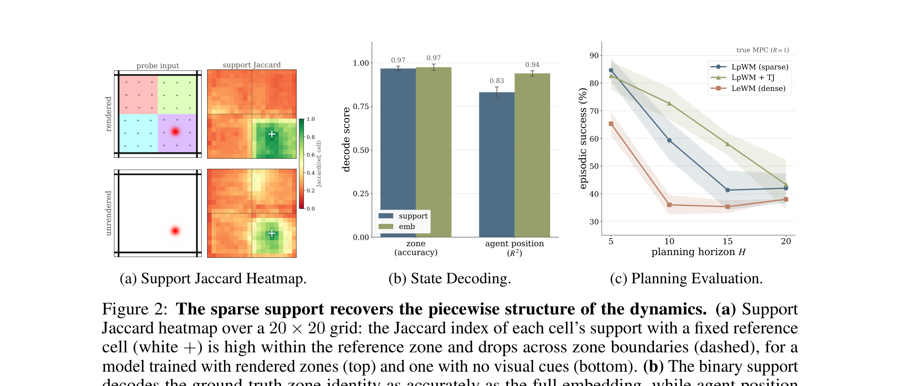
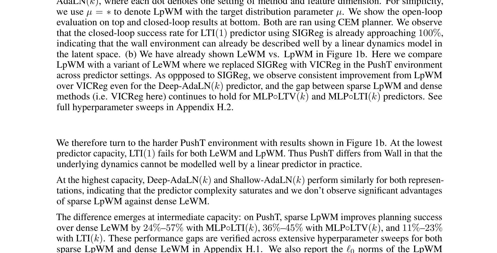

# Arquitectura LpWorldModel (LpWM)

La arquitectura **LpWM** es una variante de JEPA enfocada en forzar una geometría dispersa (*sparse*) en el espacio latente para simplificar el predictor dinámico condicionado por acción.

---

## 1. Diagramas de la Arquitectura

### Esquema y Rendimiento

*El diagrama muestra el flujo a través del codificador con RepReLU y la optimización mediante la función RDMReg. A la derecha, se observa cómo LpWM logra una mayor tasa de éxito de planificación en predictores de menor capacidad.*

### Factorización de Modos (Mode Factoring)

*El soporte binario del vector disperso actúa de manera natural como identificador del régimen físico/dinámico (ej. contacto o zonas en la cuadrícula).*

### Tolerancia a Baja Capacidad del Predictor

*La dispersión simplifica la dinámica latente: un modelo LTI o una red neuronal poco profunda puede capturar con eficacia la transición física.*

---

## 2. Componentes Clave de la Arquitectura

### A. RepReLU (Reparameterized ReLU)
- **Función**: Para producir dispersión exacta (ceros estrictos) en las salidas del encoder y predictor.
- **Formulación**: 
  $$ \text{RepReLU}(x) = \text{sg}(\text{ReLU}(x)) + \text{GeLU}(x) - \text{sg}(\text{GeLU}(x)) $$
  Donde $\text{sg}(\cdot)$ es la operación de *stop-gradient*.
- **Comportamiento**: En el *forward pass* actúa idénticamente a una función ReLU (produciendo ceros puros y activación positiva). En el *backward pass*, los gradientes fluyen a través de la aproximación continua GeLU, mitigando el efecto de gradiente nulo (dying ReLU) típico cuando una neurona se apaga completamente.

### B. Regularizador Anti-Colapso: RDMReg
- Sustituye a enfoques densos como [[SIGReg]] o VICReg.
- Mapea iterativamente las proyecciones marginales del tensor de características latentes para que coincidan (vía distancia 2-Wasserstein) con una distribución objetivo Gaussiana Generalizada Rectificada (RGG) caracterizada por sus parámetros de esparcidad $\mu=0, \sigma = \sqrt{1/2}, p=1$ (es decir, una distribución de Laplace Rectificada).

### C. Predictor Dinámico Simplificado
- Al inducir dispersión y activar subconjuntos ortogonales del espacio latente según el "régimen" del entorno, la complejidad funcional requerida para estimar $\hat{z}_{t+1}$ se reduce enormemente.
- La arquitectura permite reemplazar el predictor profundo **DiT (Deep-AdaLN)**, típicamente usado en modelos densos como [[LeWorldModel]], por estructuras como **MLP$\circ$LTV** o incluso **MLP$\circ$LTI** con millones de parámetros menos, pero manteniendo un éxito de planificación superior.

---

## 3. Planificación con MPC y CEM
Para tareas de control downstream, dado un estado $z_0$ y un objetivo $z_g$, se utiliza el **Método de Entropía Cruzada (CEM)** para buscar una secuencia de acciones $\hat{a}_{1:T}$ que minimice el coste de distancia $C = \|\hat{z}_T - z_g\|_2$. La geometría estructurada y ortogonal de los estados dispersos previene acumulaciones de error explosivas en horizontes largos.

---

## 4. Referencias Cruzadas
- **Paper**: [[2026_LpWM]]
- **Matemáticas**: [[RDMReg]]
- **Concepto Relacionado**: [[Rectified_LpJEPA]]
