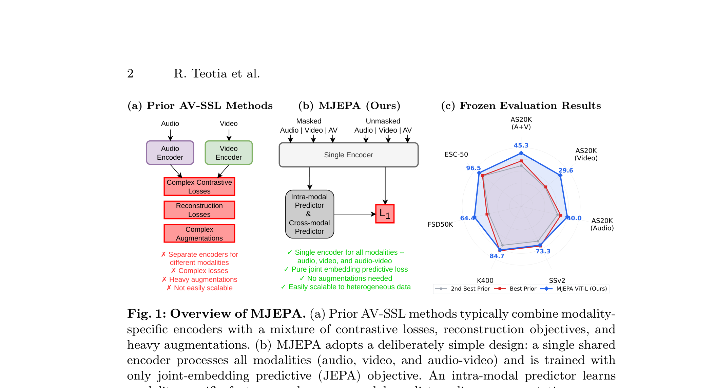
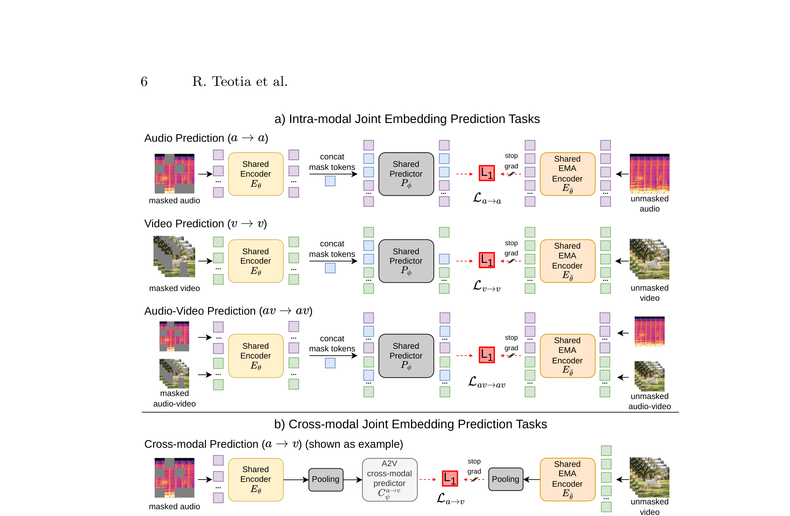
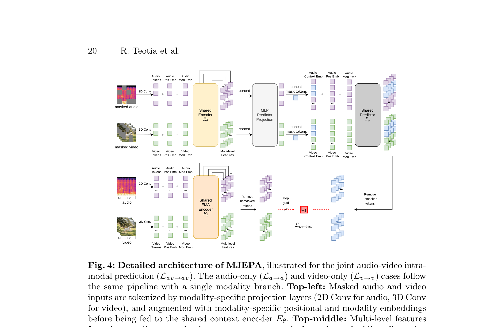

# Arquitectura MJEPA (Multimodal JEPA)

**MJEPA** es una arquitectura unificada y escalable para el aprendizaje auto-supervisado conjunto de **audio y video**. A diferencia de los enfoques multimodales tradicionales que utilizan encoders separados combinados con pérdidas contrastivas complejas, MJEPA utiliza un **único encoder compartido** y un **único predictor compartido** para resolver tareas tanto intra-modales como cross-modales de predicción de representaciones.

---

## 1. Diagramas de la Arquitectura

### Visión General vs Métodos Previos

### Arquitectura MJEPA (Intra y Cross-Modal)

### Diagrama Detallado de Flujo

---

## 2. Componentes del Sistema

### A. Shared Multimodal Encoder ($E_\theta$)
- **Backbone**: Vision Transformer (ViT-B, ViT-L, ViT-H) que recibe secuencias de parches de espectrogramas de audio ($A$) y parches espaciotemporales de video ($V$).
- **Parches Unificados**: Los datos de audio (espectrogramas 2D) y video (volúmenes 3D) se proyectan linealmente a una misma dimensión latente $D$.
- **Modality Embeddings**: Se suman embeddings de tipo de modalidad para distinguir origen.

### B. Shared Predictor ($P_\phi$)
- Transformer que toma tokens de contexto de una modalidad (o de ambas) y predice los embeddings objetivo correspondientes.

---

## 3. Esquema de Predicción y Pérdidas

MJEPA optimiza simultáneamente cuatro tareas predictivas:
1. **Audio Intra-modal ($\mathcal{L}_{a \to a}$)**: El contexto de audio predice parches de audio enmascarados.
2. **Video Intra-modal ($\mathcal{L}_{v \to v}$)**: El contexto de video predice parches de video enmascarados.
3. **Cross-Modal Audio-to-Video ($\mathcal{L}_{a \to v}$)**: El audio completo predice la representación del video completo.
4. **Cross-Modal Video-to-Audio ($\mathcal{L}_{v \to a}$)**: El video completo predice la representación del audio.

$$\mathcal{L}_{\text{MJEPA}} = \mathcal{L}_{a \to a} + \mathcal{L}_{v \to v} + \lambda_{\text{cross}} (\mathcal{L}_{a \to v} + \mathcal{L}_{v \to a})$$

---

## 4. Referencias Cruzadas
- **Paper**: [[2026_MJEPA]]
- **Entidad**: [[MJEPA]]
- **Relacionado**: [[2026_Music-JEPA]], [[2026_CHARM]]
