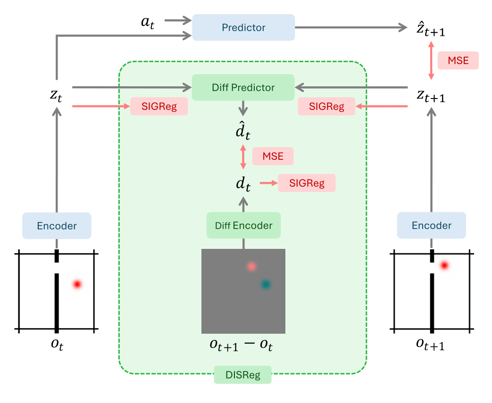
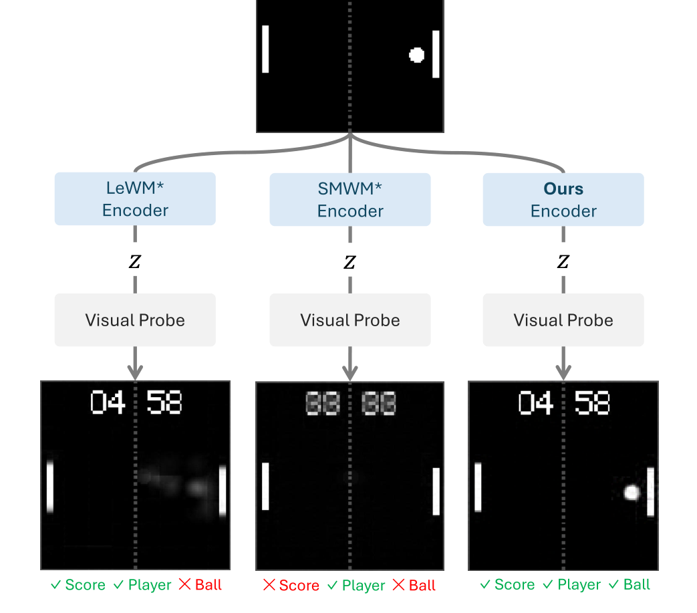
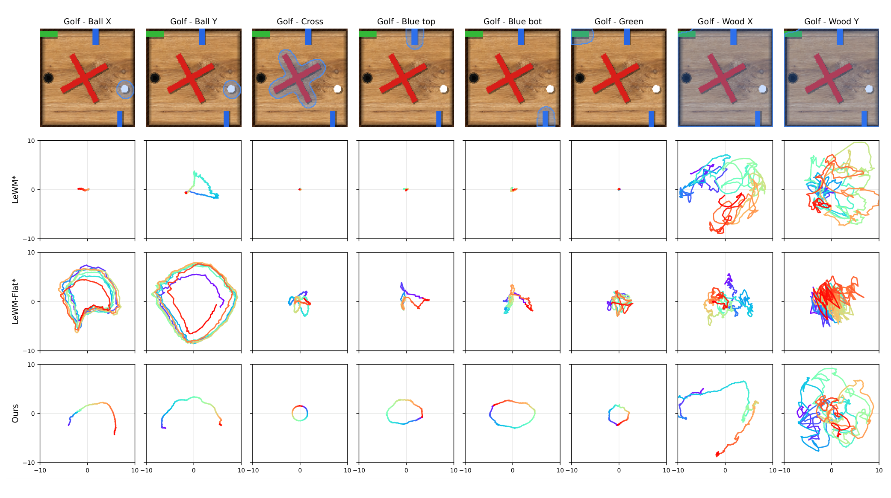
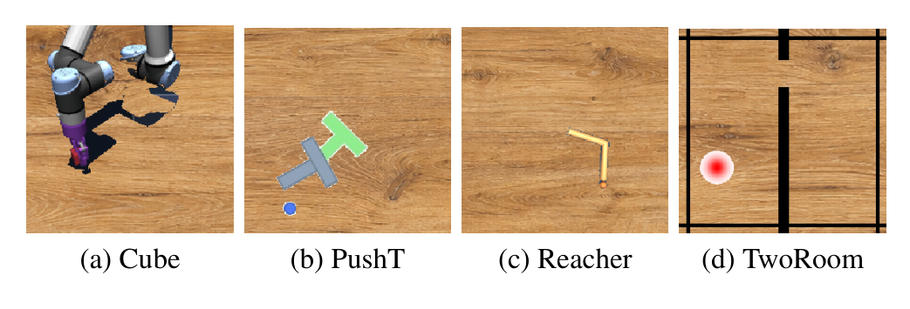

# Arquitectura MotionJEPA

**MotionJEPA** es una arquitectura de modelo de mundo basada en JEPA que aborda directamente la supresión de características dinámicas (*slow-feature bias*) integrando el regularizador **DISReg** (*Difference Image and Single image embedding Regularization*). Su diseño permite capturar dinámicas rápidas y cambios visuales en el espacio latente sin recurrir a reconstrucción de píxeles ni depender de etiquetas de acción supervisadas.

---

## 1. Diagramas de la Arquitectura

### Pipeline de Entrenamiento de MotionJEPA y DISReg
Estructura de cuatro módulos: encoder visual $e_\theta$, predictor de transición forward $p_\phi$, encoder de imagen de diferencias $\text{DiffEnc}_\alpha$, y predictor de diferencias latentes $\text{DiffPred}_\beta$.

### Fenómeno de Supresión de Características (*Feature Suppression*)
Comparativa entre JEPA estándar (colapso a características lentas/estáticas), JEPA con dinámica inversa (dependiente de acciones etiquetadas) y MotionJEPA (balance completo estático-dinámico sin acciones).

### Trayectorias Latentes y Rectitud (*Latent Path Straightness*)
Evolución de las trayectorias latentes proyectadas para factores dinámicos y distractores estáticos. MotionJEPA produce representaciones más desacopladas y rectas.

### Distractores Visuales Estáticos en Benchmarks LeWorldModel
Entornos de manipulación y control con fondos de textura de madera estáticos que provocan el colapso temporal en LeWM estándar.

---

## 2. Componentes del Sistema

### A. Encoder Visual de Estado ($e_\theta$)
- **Backbone**: Vision Transformer (ViT-Tiny) idéntico a [[LeWorldModel]].
- **Parches**: Parches espaciales de $14 \times 14$ píxeles.
- **Proyección Latente**: Extrae el token `[CLS]` de la última capa ($D_{\text{token}} = 192$), seguido de un proyector MLP de 1 capa con Batch Normalization, produciendo el vector latente de estado $z_t \in \mathbb{R}^{D_z}$ con $D_z = 192$.
- **Rol en Inferencia**: Permanece activo como el encoder perceptivo principal del agente.

### B. Predictor Forward de Transición ($p_\phi$)
- **Arquitectura**: Causal Transformer de 6 capas con 16 cabezas de atención y embeddings posicionales aprendidos.
- **Entrada**: Ventana de historia de estados latentes previos $z_{t-H+1:t}$ y acciones continuas $a_{t-H+1:t}$ (con $H$ longitud de contexto).
- **Salida**: Predicción determinista del siguiente embedding latente $\hat{z}_{t+1} \in \mathbb{R}^{D_z}$.
- **Objetivo**: Minimiza $\mathcal{L}_{\text{fwd}} = \|\hat{z}_{t+1} - z_{t+1}\|_2^2$.

### C. Encoder de Imágenes de Diferencia Temporal ($\text{DiffEnc}_\alpha$)
- **Entrada**: Imagen de diferencia temporal $o^{\text{diff}}_t = o_{t+1} - o_t \in \mathbb{R}^{3 \times H_{\text{obs}} \times W_{\text{obs}}}$.
- **Backbone**: Comparte la misma arquitectura ViT-Tiny que $e_\theta$, pero con pesos independientes $\alpha$.
- **Salida**: Embedding de cambio visual $d_t = \text{DiffEnc}_\alpha(o^{\text{diff}}_t) \in \mathbb{R}^{D_d}$ ($D_d = 192$).
- **Anti-colapso**: Regularizado directamente con $\mathcal{L}_d = \text{SIGReg}(d)$.

### D. Predictor de Cambio Latente ($\text{DiffPred}_\beta$)
- **Arquitectura**: MLP de 3 capas con capas ocultas de dimensión 512, LayerNorm y funciones de activación GELU en todas las capas intermedias.
- **Entrada**: Vector concatenado de dos estados latentes consecutivos $[z_t; z_{t+1}] \in \mathbb{R}^{2 D_z}$.
- **Salida**: Predicción del vector de cambio latente $\hat{d}_t = \text{DiffPred}_\beta(z_t, z_{t+1}) \in \mathbb{R}^{D_d}$.
- **Mecanismo de Gradiente**: Al entrenar con $\mathcal{L}_{\text{pred}} = \|d_t - \hat{d}_t\|_2^2$, el gradiente retropropaga a través de $\text{DiffPred}_\beta$ hacia $z_t$ y $z_{t+1}$, **forzando al encoder $e_\theta$ a retener en $z$ la información visual necesaria para reconstruir el cambio dinámico**.

---

## 3. Función de Pérdida Integrada DISReg

La formulación global de entrenamiento es:
$$\mathcal{L}_{\text{MotionJEPA}} = \underbrace{\lambda_z \text{SIGReg}(z)}_{\text{Preservación Estática}} + \underbrace{\lambda_d \text{SIGReg}(d)}_{\text{Anti-Colapso Dinámico}} + \underbrace{\lambda_{\text{pred}} \|d_t - \hat{d}_t\|_2^2}_{\text{Anclaje de Movimiento}} + \underbrace{\|\hat{z}_{t+1} - z_{t+1}\|_2^2}_{\text{Predicción Forward}}$$

Con hiperparámetros estables:
$$\lambda_z = 0.25, \quad \lambda_d = 2.0, \quad \lambda_{\text{pred}} = 0.5$$

---

## 4. Algoritmo de Inferencia y Planificación CEM

En tiempo de inferencia, $\text{DiffEnc}_\alpha$ y $\text{DiffPred}_\beta$ se descartan. Para tareas de control downstream:
1. Las observaciones visuales $o_t$ se codifican a $z_t = e_\theta(o_t)$.
2. Se ejecuta el optimizador de entropía cruzada (**Cross-Entropy Method / CEM**) simulando trayectorias puramente en el espacio latente con $p_\phi$:
   - 300 secuencias candidatas de acciones.
   - 30 élites por iteración.
   - Frame skip de 5 pasos.
   - Re-planificación a horizontes de 25 y 50 pasos.

---

## 5. Referencias Cruzadas
- **Paper**: [[2026_MotionJEPA]]
- **Concepto Matemático**: [[DISReg]], [[SIGReg]], [[LeWM_Loss]]
- **Entidad**: [[MotionJEPA]]
- **Modelos Relacionados**: [[LeWorldModel]], [[2026_Semigroup-JEPA]]
