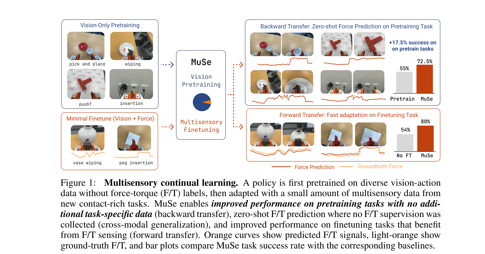
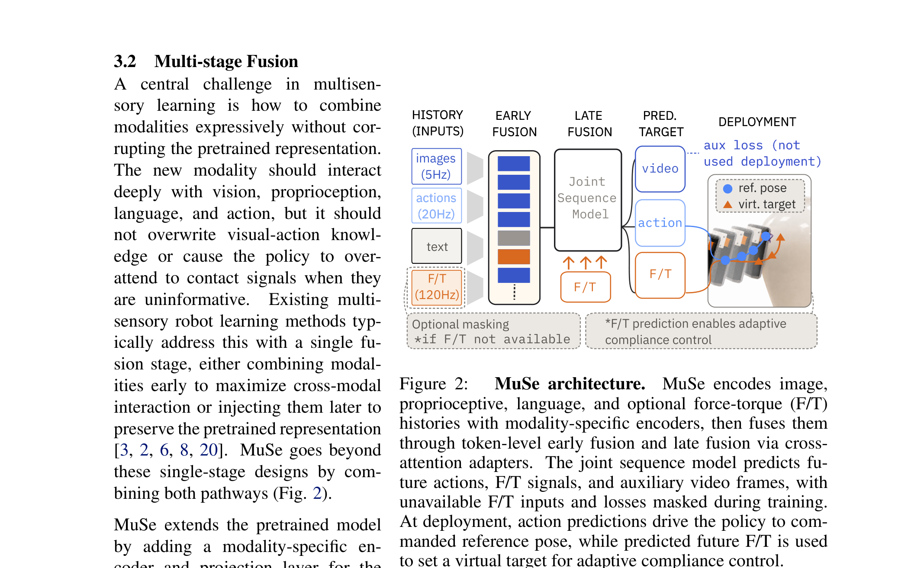

# Arquitectura MuSe (Multisensory Continual Learning)

**MuSe** es una arquitectura robótica diseñada para adaptar políticas visomotoras y modelos de mundo preentrenados a **nuevas modalidades sensoriales** (específicamente sensores de fuerza y par, **Force/Torque F/T**) mediante **Aprendizaje Continuo (Continual Learning)** sin olvidar las habilidades previas (*zero catastrophic forgetting*).

---

## 1. Diagramas de la Arquitectura

### Paradigma de Aprendizaje Continuo Multisensorial

### Arquitectura de Fusión y Predicción de MuSe

---

## 2. Módulos Arquitectónicos

### A. Encoders por Modalidad
- **Vision ($E_{\text{vis}}$)**: ViT o ResNet procesando historial de imágenes.
- **Proprioception ($E_{\text{prop}}$)**: MLP procesando estados articulares y posición del efector.
- **Language ($E_{\text{lang}}$)**: Transformer procesando la instrucción textual de la tarea.
- **Force/Torque ($E_{\text{F/T}}$)**: Red temporal (TCN/MLP) para señales de contacto físico $F_x, F_y, F_z, \tau_x, \tau_y, \tau_z$.

### B. Token-Level Cross-Attention Fusion
- Los tokens de todas las modalidades activas se alinean y fusionan en un espacio común mediante capas de atención cruzada token a token.

### C. Cabezales Predictivos Multi-Objetivo
- **Action Head**: Predice la siguiente acción del robot $a_t$.
- **World Model / Future State Head**: Predice la representación latente de las observaciones futuras en estilo JEPA.
- **Auxiliary Force Predictor**: Infiere las fuerzas de contacto esperadas incluso en tareas donde el sensor F/T no está físicamente presente.

---

## 3. Referencias Cruzadas
- **Paper**: [[2026_MuSe]]
- **Entidad**: [[MuSe]]
- **Relacionado**: [[2025_V-JEPA2]], [[2026_AdaJEPA]]
