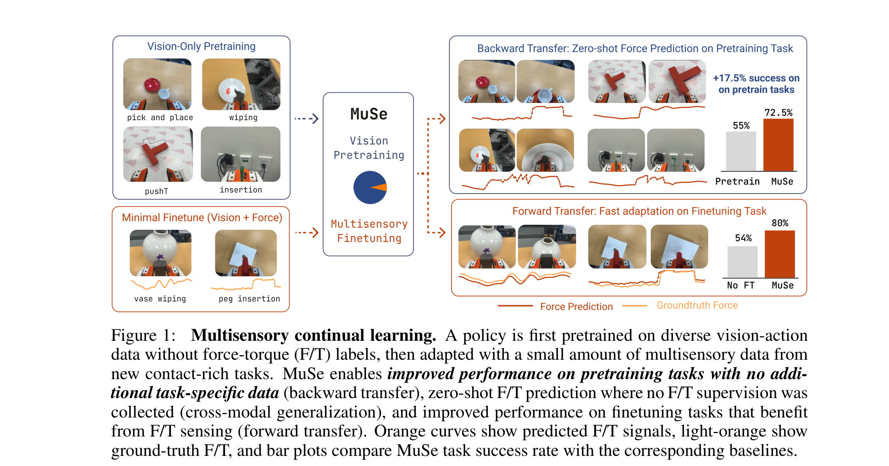
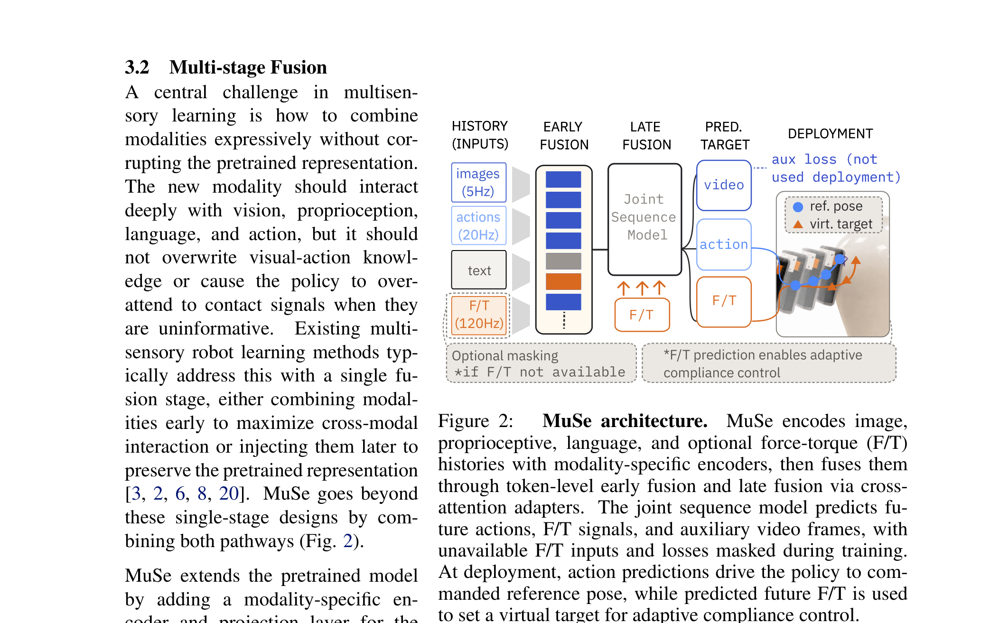

# Arquitectura MuSe (Multisensory Continual Learning)

**MuSe** es una arquitectura robótica diseñada para adaptar políticas visomotoras y modelos de mundo preentrenados a **nuevas modalidades sensoriales** (específicamente sensores de fuerza y par, **Force/Torque F/T**) mediante **Aprendizaje Continuo (Continual Learning)** sin olvidar las habilidades previas (*zero catastrophic forgetting*).

---

## 1. Diagramas de la Arquitectura

### Paradigma de Aprendizaje Continuo Multisensorial

### Arquitectura de Fusión y Predicción de MuSe

---

## 2. Módulos Arquitectónicos

### A. Encoders por Modalidad
- **Vision ($E_{\text{vis}}$)**: ViT o ResNet procesando historial de imágenes.
- **Proprioception ($E_{\text{prop}}$)**: MLP procesando estados articulares y posición del efector.
- **Language ($E_{\text{lang}}$)**: Transformer procesando la instrucción textual de la tarea.
- **Force/Torque ($E_{\text{F/T}}$)**: encoder **convolucional causal** sobre el historial de señales de contacto $F_x, F_y, F_z, \tau_x, \tau_y, \tau_z$ (p. 4).

### B. Fusión Multi-Etapa
- **Early fusion**: los tokens F/T se anteponen (*prepend*) a la secuencia de tokens preentrenada y comparten la auto-atención.
- **Late fusion**: las features F/T se inyectan mediante **adaptadores de cross-attention**.

### C. Cabezales Predictivos Multi-Objetivo
La base es el modelo **UVA (Unified Video-Action)**, que modela conjuntamente vídeo y acciones con un decoder de acciones desacoplado (p. 4, Fig. 2).
- **Action Head**: predice las acciones futuras (cabezal de difusión de UVA).
- **Predicción de vídeo futuro**: predice **frames de vídeo auxiliares**, no representaciones latentes de un target encoder. **No es una arquitectura JEPA**: no hay EMA, ni target encoder, ni pérdida en espacio de embeddings.
- **F/T Diffusion Head**: predice la trayectoria futura de fuerza/par, incluso en tareas sin supervisión F/T (generalización cross-modal). La predicción alimenta un controlador de admitancia para la *adaptive compliance*.
- Las entradas y pérdidas F/T no disponibles se **enmascaran** durante el *experience replay* de los datos de preentrenamiento.

---

## 3. Referencias Cruzadas
- **Paper**: [[2026_MuSe]]
- **Entidad**: [[MuSe]]
- **Relacionado**: [[2025_V-JEPA2]], [[2026_AdaJEPA]]
