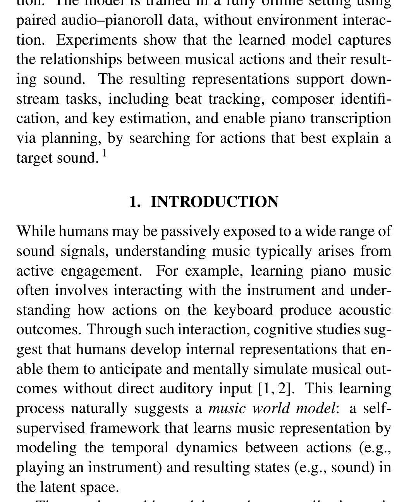

# Arquitectura Music-JEPA (Sound from Action)

**Music-JEPA** es la primera instanciación de un Modelo de Mundo acústico que vincula causalmente las **acciones mecánicas de ejecución instrumental** (representadas como matrices discretas *pianoroll* $a_t$) con las **señales de audio resultantes** (espectrogramas mel $s_t$), permitiendo síntesis condicionada por acciones y transcripción musical automática mediante **planificación inversa**.

---

## 1. Diagrama de la Arquitectura

---

## 2. Componentes del Sistema

Music-JEPA opera con cuatro redes especializadas conectadas en un espacio latente conjunto:

### A. State Encoder ($E_s$)
- **Entrada**: Espectrograma de audio $s_t \in \mathbb{R}^{F \times T}$.
- **Salida**: Representación latente acústica $z_t^s = E_s(s_t) \in \mathbb{R}^d$.

### B. Action Encoder ($E_a$)
- **Entrada**: Matriz de acciones instrumentales $a_t \in \{0, 1\}^{P \times T}$ (pulsación de notas, velocidad, pedal).
- **Salida**: Representación latente de acción $z_t^a = E_a(a_t) \in \mathbb{R}^d$.

### C. State Predictor ($f$)
- **Mecanismo Forward**: Predice el siguiente estado acústico latente condicionado por el audio previo y la acción ejecutada:
  $$\hat{z}_{t+1}^s = f(z_t^s, z_{t+1}^a)$$

### D. Action Predictor / Inverse Model ($g$)
- **Mecanismo Inverso**: Infiere la acción ejecutada observando la transición de estados acústicos:
  $$\hat{z}_{t+1}^a = g(z_t^s, z_{t+1}^s)$$

---

## 3. Transcripción Musical vía Planificación Inversa

Para transcribir un fragmento de audio a partitura/pianoroll, Music-JEPA resuelve un problema de optimización en el espacio de acciones latentes:

$$a_{1:T}^* = \arg\min_{a_{1:T}} \sum_{t=1}^T \| f(z_{t-1}^s, E_a(a_t)) - z_t^s \|_2^2$$

---

## 4. Referencias Cruzadas
- **Paper**: [[2026_Music-JEPA]]
- **Entidad**: [[Music-JEPA]]
- **Relacionado**: [[2026_MJEPA]], [[2026_LeWorldModel]]
