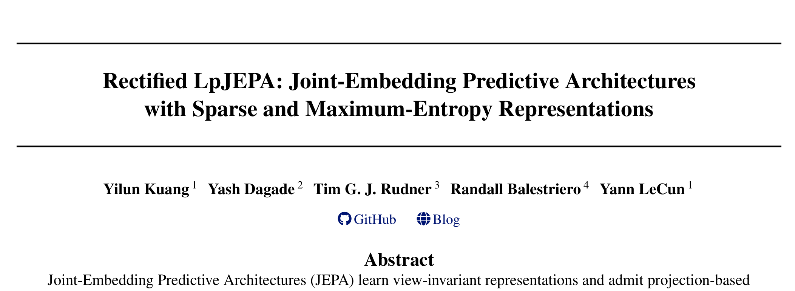
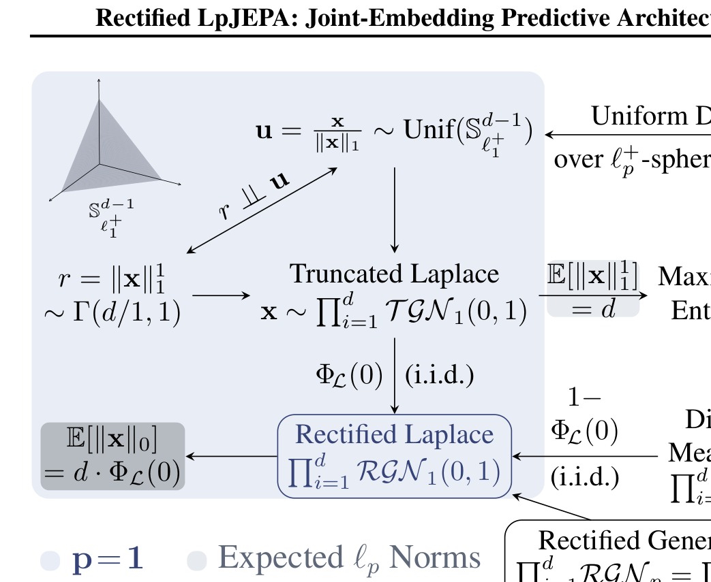

# Arquitectura Rectified LpJEPA

**Rectified LpJEPA** es una variante arquitectónica de JEPA que induce **representaciones latentes esparzas y de máxima entropía** mediante la combinación de rectificación no lineal ($\text{ReLU}$) y regularizadores basados en la distribución **Rectified Generalized Gaussian (RGG)**.

---

## 1. Diagramas de la Arquitectura

### Pipeline de Rectified LpJEPA

### Distribuciones Rectificadas Laplace y Gaussiana

---

## 2. Mecanismo de Rectificación y Dispersión

A diferencia de los modelos JEPA estándar donde el espacio latente es denso y no restringido:
1. Las salidas de los encoders pasan por una función de activación rectificadora $\tilde{z} = \text{ReLU}(z)$, forzando que una fracción controlada de neuronas sea exactamente $0$.
2. La función de regularización de máxima entropía RGG penaliza el colapso asegurando que las componentes activas conserven la máxima variabilidad informativa.

---

## 3. Función de Pérdida

$$\mathcal{L}_{\text{RectLp}}(\theta) = \mathbb{E}_{(x, x')} \left[ \| \text{ReLU}(E_\theta(x)) - \text{ReLU}(E_\theta(x')) \|_2^2 \right] + \lambda \, \mathcal{R}_{\text{RGG}}(\text{ReLU}(E_\theta(X)))$$

donde $\mathcal{R}_{\text{RGG}}$ ajusta la esparcidad empírica $\ell_0$ a un nivel objetivo predeterminado.

---

## 4. Referencias Cruzadas
- **Paper**: [[2026_Rectified_LpJEPA]]
- **Entidad**: [[Rectified_LpJEPA]]
- **Matemáticas**: [[SIGReg]]
