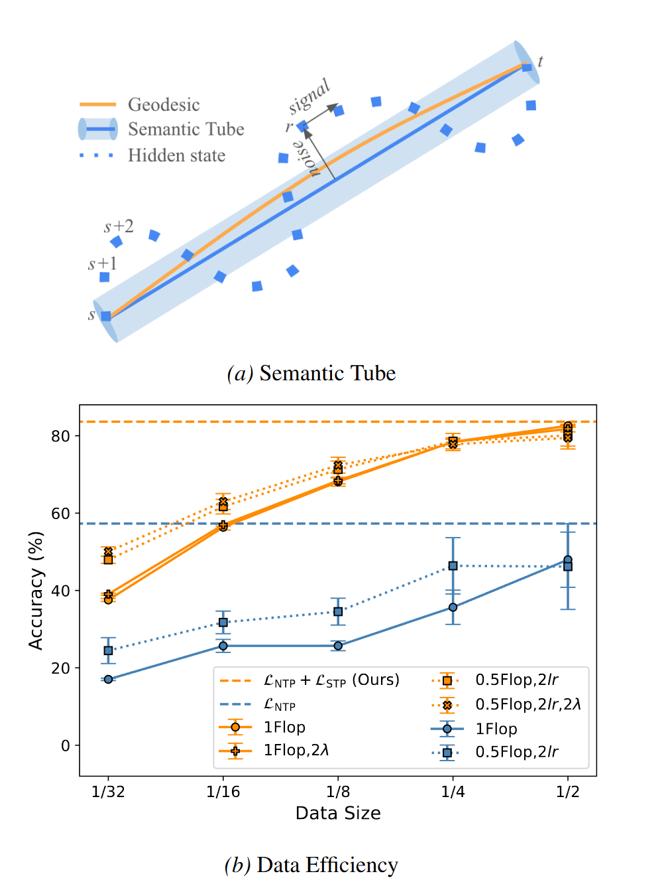
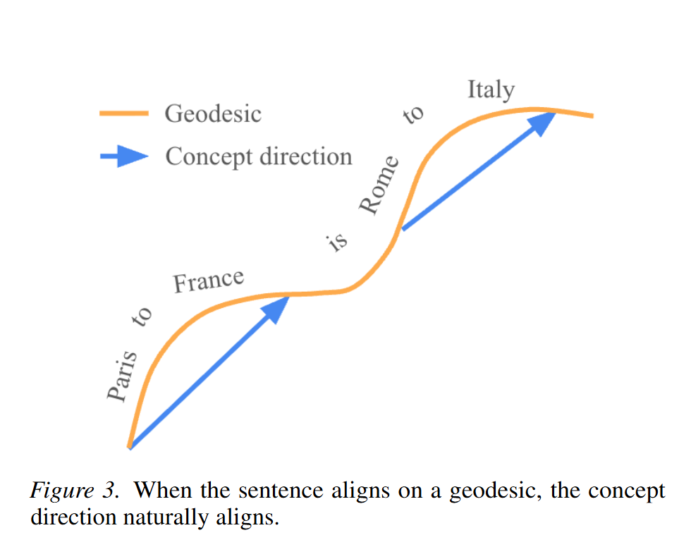

# Arquitectura Semantic Tube

**Semantic Tube** extiende los principios geométricos de JEPA a los **Modelos de Lenguaje (LLMs)**. Propone que la evolución temporal de los estados ocultos de un Transformer que procesa texto describe una trayectoria dentro de un "tubo semántico" geodésico, permitiendo un ajuste fino (*fine-tuning*) con una eficiencia de datos radicalmente superior al método estándar de predicción del siguiente token (Next Token Prediction, NTP).

---

## 1. Diagramas de la Arquitectura

### Comparativa: Next Token Prediction vs Tubo Semántico

### Alineación Geodésica de Conceptos

---

## 2. Formulación Geométrica

Para una secuencia de estados ocultos $h_1, \dots, h_T \in \mathbb{R}^d$ en la capa superior del LLM:

- **Hipótesis Geodésica**: En un modelo bien entrenado, las transiciones $h_{t-1} \to h_t \to h_{t+1}$ dentro de una misma idea deben formar trayectorias rectas en la variedad de Riemann latente.
- **Pérdida de Enderezamiento Semántico (Straightening Loss, $\mathcal{L}_{\text{STP}}$)**:
  $$
  \mathcal{L}_{\text{STP}} = 1 - \cos\left( h_t - h_r, h_r - h_s \right)

  $$

  donde $s < r < t$ son posiciones temporales dentro del contexto.

---

## 3. Función de Pérdida Total

$$
\mathcal{L}_{\text{Total}} = \mathcal{L}_{\text{NTP}} + \lambda \, \mathcal{L}_{\text{STP}}

$$

---

## 4. Referencias Cruzadas

- **Paper**: [[2026_Semantic_Tube]]
- **Entidad**: [[Semantic_Tube]]
- **Relacionado**: [[2026_LeJEPA_Identifiability]]
