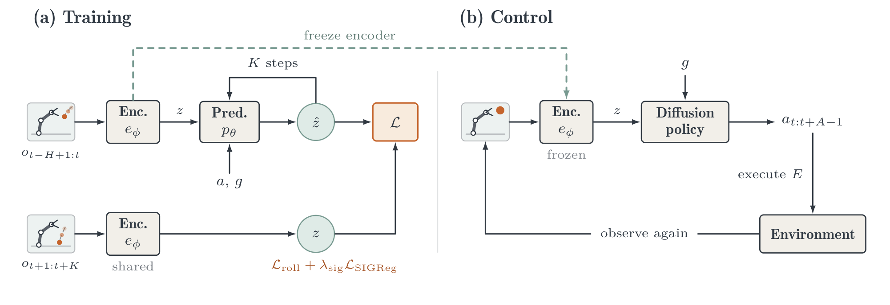
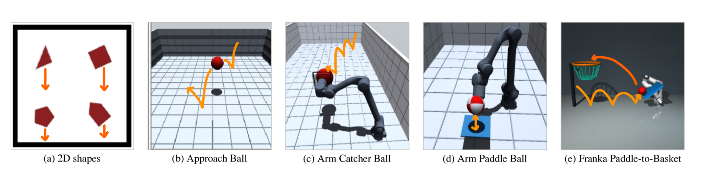
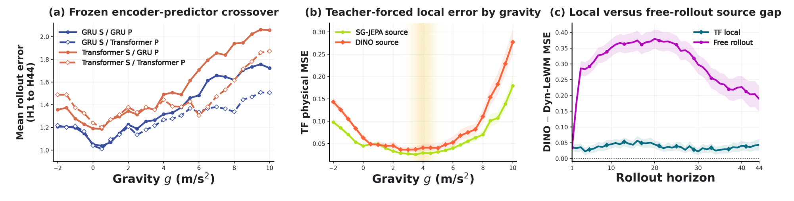
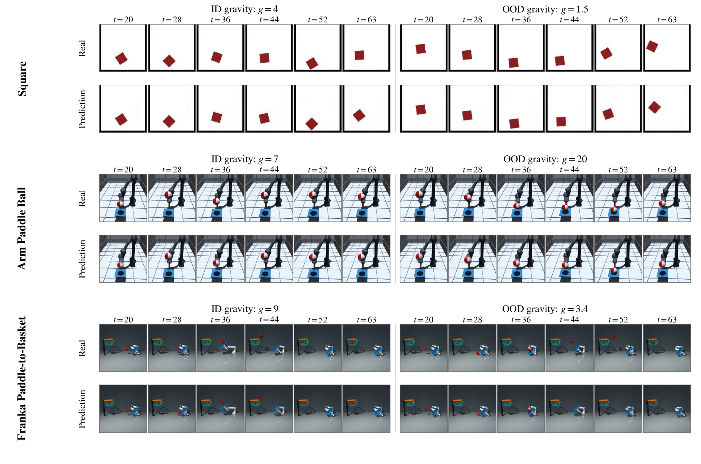

# Arquitectura SG-JEPA (Semigroup-JEPA)

**Semigroup-JEPA (SG-JEPA)** es una arquitectura de modelo de mundo basada en incrustaciones conjuntas ([[LeWorldModel]]) diseñada específicamente para **aprender dinámicas físicas consistentes y generalizables fuera de distribución (Zero-Shot Physics Generalization)**. Introduce el condicionamiento de parámetros físicos por el canal de acción y entrena conjuntamente el encoder visual y el predictor latente a través de un **rollout autorregresivo latente recursivo de $K$ pasos**, fundamentado en la teoría de semigrupos de evolución discreta y regularizado por [[SIGReg]].

---

## 1. Diagramas de la Arquitectura

### Esquema General de Entrenamiento y Control
El pipeline de SG-JEPA consta de dos fases principales: (a) entrenamiento conjunto del encoder y predictor condicionado por gravedad mediante rollout recursivo y regularización SIGReg, y (b) entrenamiento de políticas de difusión sobre las representaciones latentes congeladas para control robótico en bucle cerrado.

### Entornos Físicos de Evaluación
Validación en 8 entornos MuJoCo con dinámicas gobernadas por gravedad escalar $g$, desde dinámica de cuerpos rígidos 2D hasta manipulación robótica 3D con impacto y rebote continuo.

### Aislamiento Mecanicista y Análisis de Crossover
Experimento de cruce de componentes (*crossover*): al congelar el encoder entrenado con GRU y sustituir el predictor por uno nuevo, se demuestra que la ventaja OOD reside en las propiedades dinámicas de la representación aprendida por el encoder, y que la composición recursiva amplifica esta ventaja en horizontes largos.

### Rollouts Decodificados en Gravedades In-Distribution y Out-of-Distribution
Comparativa cualitativa de rollouts autorregresivos en el espacio latente bajo gravedades de entrenamiento y gravedades extremas OOD.

---

## 2. Componentes del Sistema

### A. Encoder Visual Online y Target Compartido ($e_\phi$)
- **Backbone**: Vision Transformer (ViT-Tiny) compuesto por 12 bloques Transformer con 3 cabezas de atención y dimensión oculta de 192.
  - Resolución $128 \times 128$: tamaño de parche $8 \times 8$ (256 tokens espaciales).
  - Resolución $256 \times 256$: tamaño de parche $16 \times 16$ (256 tokens espaciales).
- **Proyector Latente**: El token global `[CLS]` final $h_t \in \mathbb{R}^{192}$ pasa por un proyector MLP de 1 capa oculta para generar el embedding latente $z_t \in \mathbb{R}^{256}$.
- **Target Encoder Sin Stop-Gradient ni EMA**:
  A diferencia de I-JEPA o V-JEPA (que utilizan un Target Encoder actualizado por Media Móvil Exponencial / EMA y congelado por `stop-gradient`), SG-JEPA utiliza el **mismo encoder entrenable $e_\phi$ para generar tanto los estados latentes de contexto como los targets de predicción futura $z_{t+k}$**. El gradiente de la pérdida de rollout fluye directamente hacia el encoder, forzándolo a aprender un subespacio donde las dinámicas son consistentes bajo composición temporal. El colapso se evita gracias a la regularización isotrópica [[SIGReg]].

### B. Módulo de Condicionamiento Físico y Acciones ($q_\psi$)
La física del entorno se inyecta directamente a través del canal de control:
$$\tilde{a}_t = [u_t;\, g]$$
donde $u_t$ es la acción de control externa y $g$ es el escalar de gravedad normalizado (z-score respecto a la partición de entrenamiento). En tareas pasivas (caída libre, tiro parabólico sin actuador), $u_t$ es nulo y $\tilde{a}_t = [g]$.
- El encoder de acciones $q_\psi$ aplica una convolución temporal 1D seguida de un MLP con activaciones SiLU para emitir un embedding de acción $c_t \in \mathbb{R}^{256}$.

### C. Predictor Latente Condicionado ($p_\theta$)
El predictor procesa una ventana de historia de longitud $H = 20$ latentes junto con sus correspondientes embeddings de acción $c_{t-H+1:t}$ para predecir el siguiente estado latente $\hat{z}_{t+1} \in \mathbb{R}^{256}$:
$$\hat{z}_{t+1} = p_\theta(z_{t-H+1:t},\, c_{t-H+1:t})$$

Se analizan tres variantes de predictor:
1. **Residual GRU (Variante Predeterminada)**:
   - 3 bloques residuales con dimensión oculta 512.
   - En cada capa, el estado oculto se concatena con la proyección de $c_t$, se transforma con un MLP intermedio y entra a una celda GRU estándar.
2. **State-Space Model (SSM / Mamba-S6)**:
   - Idéntica profundidad (3 capas) y anchura (512), sustituyendo la celda recurrente por un bloque de espacio de estados selectivo S6.
3. **Causal Transformer**:
   - 6 capas Transformer y 16 cabezas de atención, donde las acciones y gravedad modulan cada bloque mediante Adaptive Layer Normalization (AdaLN), siguiendo el diseño original de [[LeWorldModel]].

---

## 3. Dinámica de Semigrupo y Rollout Autorregresivo

### Formulación de Semigrupo Discreto
Para trayectorias pasivas a gravedad constante $g$, el operador de transición latente $F_{\theta,g}: \mathcal{Z}^H \to \mathcal{Z}^H$ define un semigrupo discreto de transformaciones:
$$S_{\theta,g}(k) \triangleq F_{\theta,g}^{\circ k}$$
que satisface la ley de composición:
$$S_{\theta,g}(0) = I, \qquad S_{\theta,g}(k + \ell) = S_{\theta,g}(\ell) \circ S_{\theta,g}(k) \quad \forall k, \ell \in \mathbb{N}$$

### Rollout Recursivo de $K$ Pasos
Durante el entrenamiento, SG-JEPA ejecuta un rollout autorregresivo cerrado de $K = 5$ pasos. En cada paso $k \in \{1, \dots, K\}$, la predicción $\hat{z}_{t+k}$ se inserta al final de la ventana de historia para alimentar la predicción del paso siguiente:
$$z_s^{\text{roll}} = \begin{cases} z_s & \text{si } s \le t \\ \hat{z}_s & \text{si } s > t \end{cases}$$
$$\hat{z}_{t+k} = p_\theta\left(z^{\text{roll}}_{t+k-H:t+k-1},\, c_{t+k-H:t+k-1}\right)$$

### Función de Pérdida con Descuento Exponencial
La función de pérdida de rollout normalizada pondera cada paso mediante un factor de descuento $\gamma = 0.95$:
$$\mathcal{L}_{\text{roll}} = \sum_{k=1}^K w_k \|\hat{z}_{t+k} - z_{t+k}\|_2^2, \qquad w_k = \frac{\gamma^{k-1}}{\sum_{j=1}^K \gamma^{j-1}}$$
El descuento exponencial evita que los errores numéricos acumulados en los últimos pasos del rollout dominen la señal del gradiente durante las fases iniciales del entrenamiento.

### Regularización Anti-Colapso: [[SIGReg]]
Para evitar que el encoder $e_\phi$ colapse a una representación constante trivial (al no haber stop-gradient en el target), se aplica SIGReg exclusivamente sobre los estados latentes codificados $z_t$:
$$\mathcal{L}_{\text{SG-JEPA}} = \mathcal{L}_{\text{roll}} + \lambda_{\text{sig}} \mathcal{L}_{\text{SIGReg}}$$
donde $\mathcal{L}_{\text{SIGReg}}$ proyecta los vectores latentes sobre direcciones unidimensionales aleatorias y minimiza la discrepancia con una distribución normal estándar $\mathcal{N}(0, I)$ comparando la función característica empírica con $e^{-t^2/2}$ (forma Epps–Pulley; ver [[SIGReg]]; SG-JEPA Eq. 160).

---

## 4. Política de Control en Bucle Cerrado: Diffusion Policy

Para evaluar la utilidad de las representaciones en tareas de manipulación y contacto dinámico, se entrena una **Diffusion Policy** en bucle cerrado (Receding-Horizon) manteniendo el encoder visual $e_\phi$ completamente congelado:

1. **Compresión Temporal de Características**: Una GRU causal de 2 capas comprime los últimos $H=20$ vectores latentes en una representación compacta:
   $$\bar{h}_t = \text{LayerNorm}\left(\text{GRU}(z_{t-H+1:t})_\text{final}\right) \in \mathbb{R}^{256}$$
2. **Condicionamiento de la Política**: El vector de contexto de la política es $\xi = [\bar{h}_t;\, g_\text{pol}]$.
3. **Generación por Difusión**: Un U-Net 1D condicional genera secuencias de acción $u_{t:t+A-1}$ de longitud $A=16$ mediante 100 pasos de denoising con schedule coseno.
4. **Ejecución Recesiva (Receding Horizon)**: El agente ejecuta las primeras $E$ acciones ($E=8$ en Catcher y Franka Basket; $E=4$ en Paddle Ball) en el simulador, recibe nuevas observaciones visuales y vuelve a planificar.

---

## 5. Referencias Cruzadas
- **Paper**: [[2026_Semigroup-JEPA]]
- **Entidad**: [[SG-JEPA]]
- **Fundamento Matemático**: [[Semigroup_Rollout_Consistency]], [[Latent_Dynamics_Consistency]]
- **Pérdida Base y Regularizador**: [[LeWM_Loss]], [[SIGReg]]
- **Arquitecturas Relacionadas**: [[LeWorldModel]], [[DINO-WM]], [[2025_V-JEPA2]]
