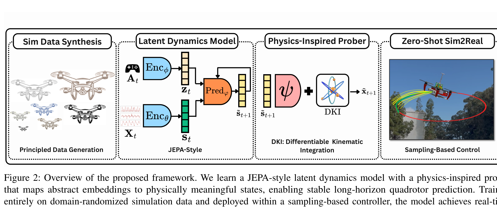
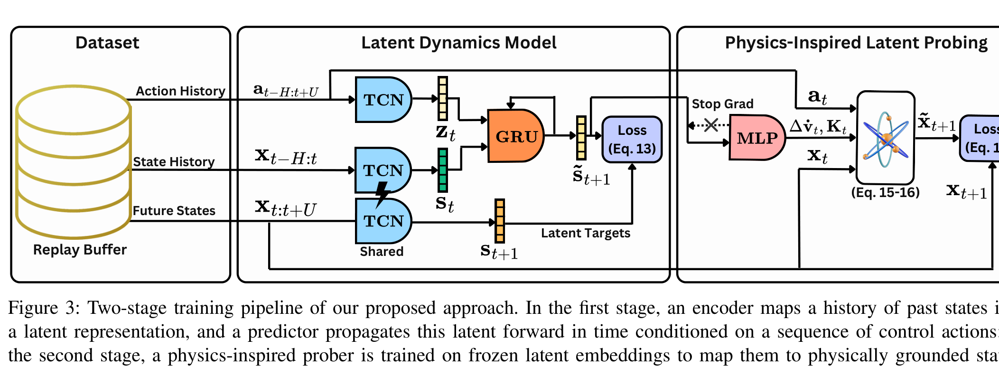

# Arquitectura SkyJEPA (Zero-Shot Control of Quadrotors)

**SkyJEPA** es una arquitectura de Modelo de Mundo Latente optimizada para el control en tiempo real y transferencia Sim-to-Real *zero-shot* de **vehículos aéreos no tripulados (cuadricópteros)**. Combina un predictor de dinámicas JEPA autoregresivo con un **Prober de Física Diferenciable (Physics-Inspired Prober)** y un optimizador **MPPI** ejecutado a 100 Hz sobre hardware embebido (NVIDIA Orin NX).

---

## 1. Diagramas del Sistema

### Visión General del Framework

### Pipeline de Entrenamiento en Dos Etapas

---

## 2. Estructura de Dos Etapas

### Etapa 1: Modelo de Dinámica Latente JEPA
- **Encoder ($E_\theta$)**: Codifica historiales de estados y observaciones sensoriales ruidosas $x_{t-H:t}$ en un espacio latente $z_t$.
- **Predictor ($P_\phi$)**: Propaga los estados latentes en el tiempo condicionado por comandos de empuje y velocidades angulares $u_t$:
  $$\hat{z}_{t+1} = P_\phi(\hat{z}_t, u_t)$$

### Etapa 2: Differentiable Physics Prober
- Decodifica de forma interpretable el vector abstracto $\hat{z}_t$ a variables físicas exactas: posición cartesiana $p_t \in \mathbb{R}^3$, velocidad lineal $v_t \in \mathbb{R}^3$, cuaternión de actitud $q_t \in \mathbb{H}$ y velocidad angular $\omega_t \in \mathbb{R}^3$.

---

## 3. Control Predictivo en Tiempo Real con MPPI

El algoritmo **Model Predictive Path Integral (MPPI)** muestrea $S = 2048$ trayectorias de control en paralelo sobre la GPU embebida, evaluando el coste de seguimiento de trayectoria en $< 10$ ms.

---

## 4. Referencias Cruzadas
- **Paper**: [[2026_SkyJEPA]]
- **Entidad**: [[SkyJEPA]]
- **Relacionado**: [[2026_LeWorldModel]], [[2026_AdaJEPA]]
