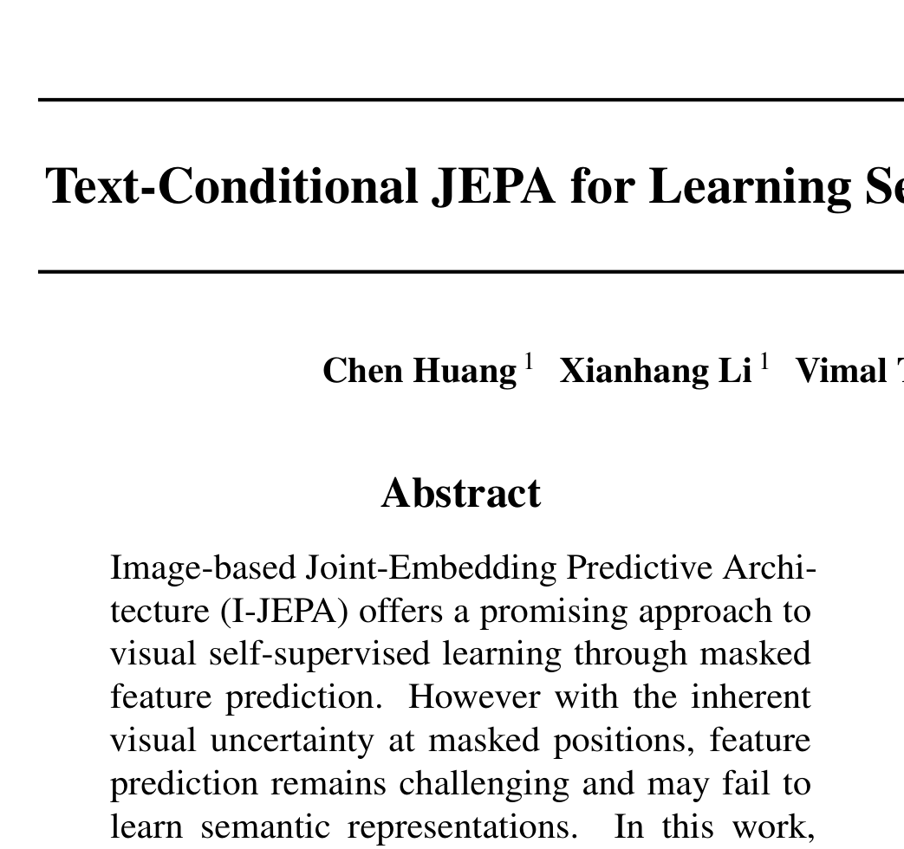
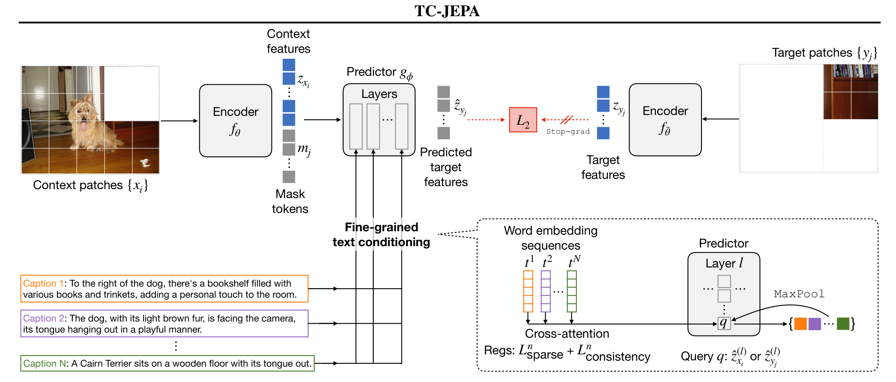

# Arquitectura TC-JEPA (Text-Conditional JEPA)

**TC-JEPA** enriquece la arquitectura I-JEPA incorporando **condicionamiento textual de grano fino**. Mediante capas de **Cross-Attention** en el predictor, el modelo aprende representaciones visuales que no solo codifican información semántica espacial, sino que capturan conceptos alineados con lenguaje natural sin necesidad de pérdidas contrastivas globales tipo CLIP.

---

## 1. Diagramas de la Arquitectura

### Visión General del Modelo

### Arquitectura Detallada del Predictor Condicionado

---

## 2. Componentes del Sistema

### A. Visual Context & Target Encoders ($E_\theta, E_{\bar{\theta}}$)
- ViT que procesa los parches de contexto $x_C$ y los parches target $x_T$ de la imagen de entrada.

### B. Fine-Grained Text Conditioner
- Un encoder de texto procesa descripciones sintéticas o reales asociadas a la imagen, generando una secuencia de tokens textuales $T = \{w_1, \dots, w_L\}$.

### C. Text-Conditioned Predictor ($P_\phi$)
- Transformer que fusiona las representaciones visuales de contexto con los tokens de texto mediante capas alternadas de Self-Attention y Cross-Attention:
  $$\hat{s}_T = P_\phi\left( s_C, p_T, T \right)$$

---

## 3. Función de Pérdida

$$\mathcal{L}_{\text{TC-JEPA}} = \frac{1}{|B_T|} \sum_{j \in B_T} \| \hat{s}_{T, j} - s_{T, j} \|_1$$

---

## 4. Referencias Cruzadas
- **Paper**: [[2026_TC-JEPA]]
- **Entidad**: [[TC-JEPA]]
- **Relacionado**: [[2023_I-JEPA]], [[2026_CHARM]]
