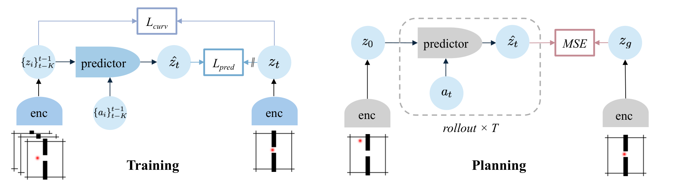
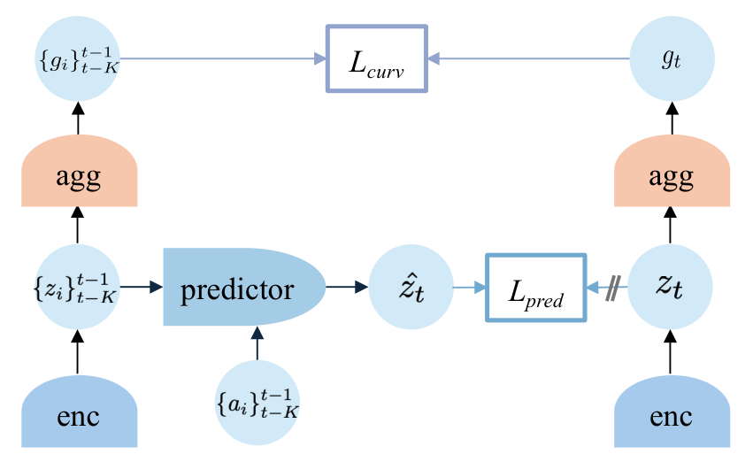
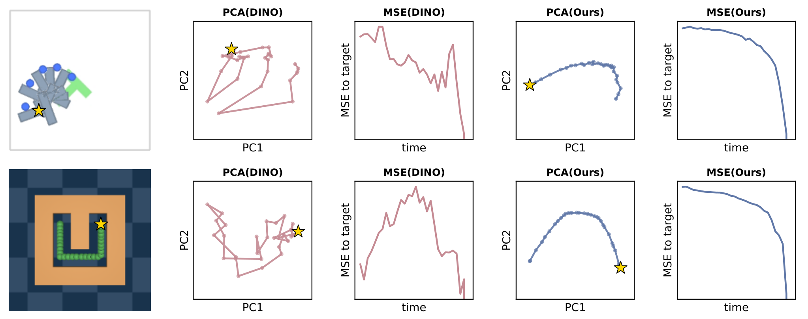
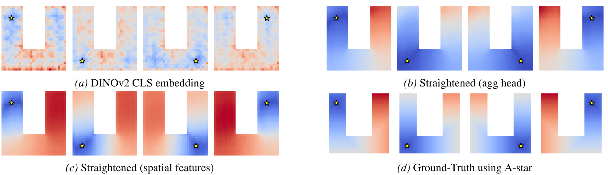
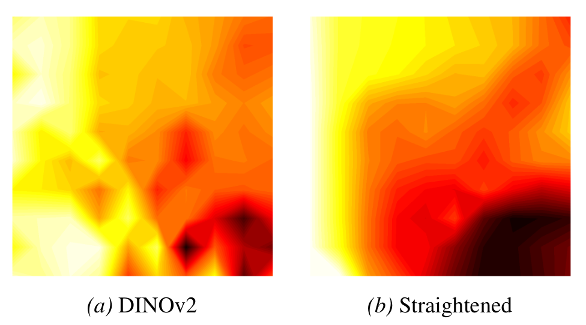
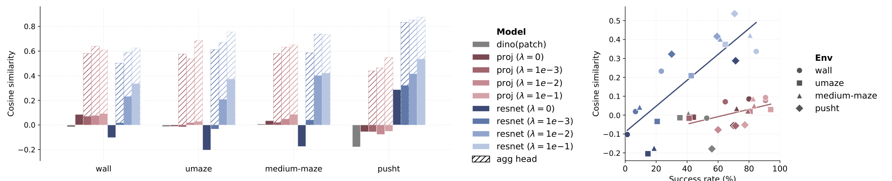

# Arquitectura Temporal Straightening

World model JEPA acción-condicionado de [[wiki/papers/2026_Temporal_Straightening|Temporal Straightening for Latent Planning]] (ICML 2026). Tiene la misma plantilla que [[DINO-WM]] (predictor ViT sobre features de parche, frameskip 5), con dos cambios: el espacio latente **se entrena** (proyector sobre DINOv2 congelado, o ResNet desde cero) y se añade un **regularizador de curvatura** que endereza las trayectorias latentes.

---

## 1. Diagramas

### Entrenamiento y planificación
Entrenamiento: $\mathcal L_{\text{pred}}$ entre $\hat z_t$ y $\mathrm{sg}(z_t)$, más $\mathcal L_{\text{curv}}$ sobre la curvatura local de los embeddings. Planificación: rollout de $T$ pasos con el predictor y minimización del MSE entre $\hat z_T$ y $z_g$ (Fig. 3).

### Cabeza de agregación (configuración principal)
$\mathcal L_{\text{pred}}$ actúa sobre las features espaciales $z_t$; $\mathcal L_{\text{curv}}$ actúa sobre las features agregadas $g_t=h_\phi(z_t)$ (App. B.6, Fig. 13).

### Trayectorias latentes antes y después
PCA de trayectorias y MSE al objetivo a lo largo del tiempo: DINOv2 (curvo, MSE no monótono) frente al modelo enderezado (suave, MSE decreciente) en PushT (arriba) y UMaze (abajo) (Fig. 2).

### Distancia latente frente a distancia geodésica
Distancia euclídea al objetivo (estrella) en PointMaze-UMaze: (a) DINOv2 CLS, (b) agregada enderezada, (c) espacial enderezada (ResNet, $z\in\mathbb R^{14\times14\times8}$), (d) geodésica A\* (Fig. 6).

### Paisaje de la pérdida en el espacio de acciones
PushT, horizonte 25: para cada primera acción $(a_x,a_y)$ se optimizan las restantes y se muestra la mínima pérdida alcanzable. Tras el straightening el paisaje es más cercano a convexo (Fig. 4).

### Curvatura y éxito
Coseno medio por parche (mayor = más recto) por encoder y $\lambda$, y su relación con el éxito GD open-loop (Fig. 5).

---

## 2. Componentes

| Componente | Definición | Detalle | Fuente |
|---|---|---|---|
| Sensory encoder $\mathcal E^s_\phi$ | $z_t=\mathcal E^s_\phi(o_t)$, $o_t\in\mathbb R^{n_o}$ | (i) DINOv2 congelado, $e_t\in\mathbb R^{M\times D}$ (196×384), + proyector CNN $\mathcal P_\phi$: $z^v_t\in\mathbb R^{m_v\times d_v}$, $m_v\le M$, $d_v\le D$; (ii) ResNet desde cero | Eq. 1, 13; §5.1 |
| Action encoder $\mathcal E^a_\psi$ | $\mathbb R^{n_a}\to\mathbb R^{d_a}$ | Se concatena a cada token visual | §3.1, §5.1 |
| Propiocepción $\mathcal E^p_\xi$ | $\mathbb R^{n_p}\to\mathbb R^{d_p}$ | Opcional, concatenada a cada feature espacial | §5.1 |
| Predictor $f_\theta$ | $\hat z_t=f_\theta(\{z_i\}_{t-K}^{t-1},\{\mathcal E^a_\psi(a_i)\}_{t-K}^{t-1})$ | ViT con máscara causal temporal (frame-level autoregressive); 3 frames de historia | Eq. 2; §5.1; Tab. 3 |
| Cabeza de agregación $h_\phi$ | $\mathbb R^{m_v\times d_v}\to\mathbb R^{d_h}$ | MLP, $d_h=128$; solo recibe $\mathcal L_{\text{curv}}$ | App. B.6 |
| Decoder (VAE) | — | Solo para interpretabilidad; latentes *detached* | §5.2 |

**Configuraciones evaluadas** (Tab. 1): global $1\times384$ y espacial $14\times14\times8$ (proyector de canal sobre DINOv2 o ResNet); baseline DINO-WM con CLS $1\times384$ o parches $14\times14\times384$.

## 3. Pérdidas

$$\mathcal L_{\text{total}}=\underbrace{\|\hat z_{t+1}-\mathrm{sg}(z_{t+1})\|_2^2}_{\mathcal L_{\text{pred}}}+\lambda\,\underbrace{\big(1-\cos(v_t,v_{t+1})\big)}_{\mathcal L_{\text{curv}}},\qquad v_t=z_{t+1}-z_t$$

Forma **aditiva**, $\lambda=0.1$ para las features espaciales (Eq. 5–7; Tab. 1). $\mathcal L_{\text{curv}}$ se aplica **solo a los latentes visuales** $z^v_t$ y se calcula sobre latentes codificados, no predichos (§3.2, §5.1). Variantes para features espaciales y demostraciones: [[Temporal_Straightening_Loss]].

**Anti-colapso:** stop-gradient en el target **sin EMA**. El regularizador es "ortogonal" a VICReg/SIGReg/contrastivo y combinable con ellos (§3.3); no se prueba esa combinación.

## 4. Entrenamiento (Tab. 3; App. A)

| Hiperparámetro | Valor |
|---|---|
| lr proyector/ResNet espacial | $10^{-5}$ ($10^{-6}$ sin straightening) |
| lr proyector/ResNet global | $10^{-6}$ |
| lr predictor, encoders de acción/propiocepción | $5\times10^{-4}$ |
| Batch, historia, frameskip | 32, 3, 5 |
| Datos | Wall: 1 920 trayectorias × 50 pasos, 20 épocas; UMaze: 2 000 trayectorias; PushT: 18 500 trayectorias (100–300 pasos), 2 épocas |

## 5. Inferencia / planificación (App. B.1; Tab. 4)

1. $z_0=\mathcal E^s_\phi(o_0)$, $z_g=\mathcal E^s_\phi(o_g)$.
2. Acciones inicializadas a cero (Tab. 4; el paso b de B.1 dice "Gaussian", inconsistencia interna menor).
3. Coste terminal $\mathcal L=\|\hat z_T-z_g\|_2^2$ con $\hat z_t=f_\theta(\hat z_{t-1},a_{t-1})$.
4. **Gradient descent**: Adam, lr 0.1, 100 pasos, horizonte 25 pasos del entorno ($H=5$ con frameskip 5).
5. Open-loop: se ejecutan las 25 acciones. MPC: se ejecuta el primer bloque de 5 y se replanifica, con coste ponderado sobre estados intermedios (salvo PushT dentro del horizonte, por dinámica con cambios de régimen) (§5.3).
6. Horizonte largo: $\mathcal L_{\text{plan}}=\mathcal L_{\text{spatial}}+0.1\,\mathcal L_{\text{agg}}$ (Tab. 2).

> [!important] Qué cambia respecto a DINO-WM
> DINO-WM planifica con CEM sobre DINOv2 congelado. Aquí el proyector aprende la geometría y se planifica con GD. La tesis del paper es que el cuello de botella de GD es la **geometría del espacio latente** (curvatura ⇒ mal condicionamiento), no el optimizador.

## Enlaces

- Paper: [[wiki/papers/2026_Temporal_Straightening|2026_Temporal_Straightening]] · Entidad: [[Temporal_Straightening]]
- Matemáticas: [[Temporal_Straightening_Loss]], [[Planning_Hessian_Conditioning]]
- Baseline: [[DINO-WM]] · Planificador GD compartido con [[AdaJEPA]]
