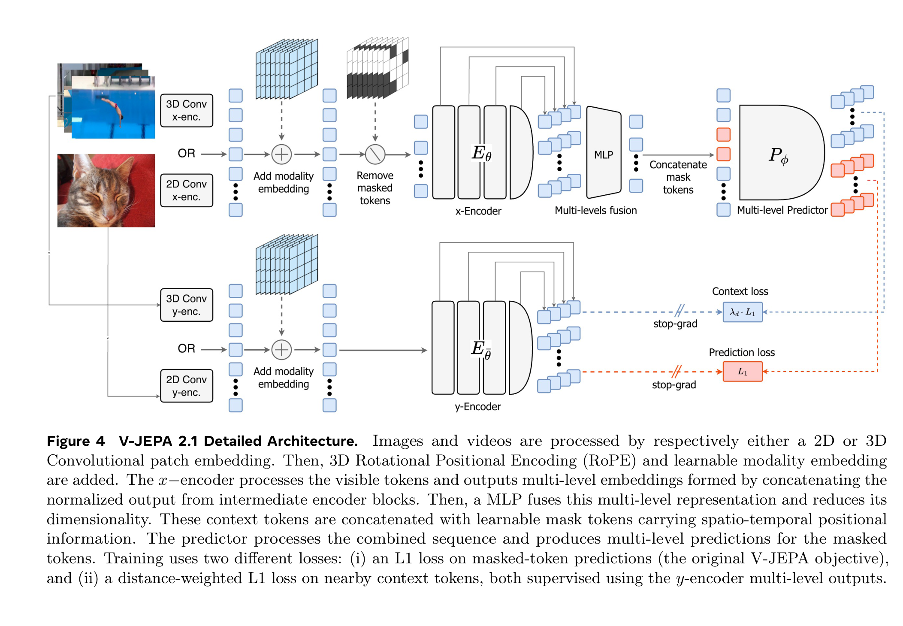
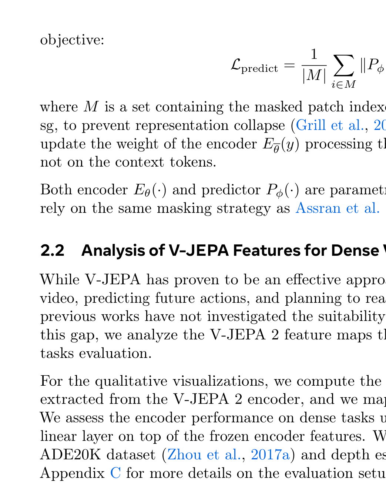

# Arquitectura V-JEPA 2.1 (Dense Features in Video SSL)

**V-JEPA 2.1** es una evolución arquitectónica mayor sobre V-JEPA 2 diseñada para **desbloquear características densas y de grano fino** en modelos de video. Elimina los artefactos de cuadrícula y la pérdida de detalle local en segmentación y profundidad mediante la introducción de **3D Rotary Position Embeddings (RoPE)** y una nueva **Pérdida de Contexto Ponderada ($\mathcal{L}_{\text{ctx}}$)**.

---

## 1. Diagramas de la Arquitectura

### Arquitectura Detallada de V-JEPA 2.1

### Impacto de la Pérdida de Contexto ($\mathcal{L}_{\text{ctx}}$)

---

## 2. Innovaciones Arquitectónicas Clave

### A. Embeddings Posicionales Rotacionales 3D (3D RoPE)
- Sustituye los embeddings posicionales aprendibles o sinusoidales fijos por rotaciones ortogonales aplicadas directamente a los vectores de Query y Key en cada capa de atención.
- Garantiza invarianza traslacional y generalización a videos de resolución y duración arbitraria.

### B. Pérdida de Contexto Ponderada por Distancia ($\mathcal{L}_{\text{ctx}}$)
- En V-JEPA 2 estándar, los tokens de contexto solo servían como entrada sin supervisión directa.
- En V-JEPA 2.1, el encoder también es supervisado para predecir representaciones de los parches de contexto visibles, ponderadas por su distancia relativa, evitando la degeneración de alta frecuencia.

---

## 3. Función de Pérdida Total

$$\mathcal{L}_{\text{V-JEPA 2.1}} = \mathcal{L}_{\text{pred}}(\text{targets}) + \gamma \, \mathcal{L}_{\text{ctx}}(\text{context})$$

---

## 4. Referencias Cruzadas
- **Paper**: [[2026_V-JEPA2.1]]
- **Entidad**: [[V-JEPA2.1]]
- **Matemáticas**: [[Dense_Predictive_Loss]]
- **Precursor**: [[2025_V-JEPA2]]
