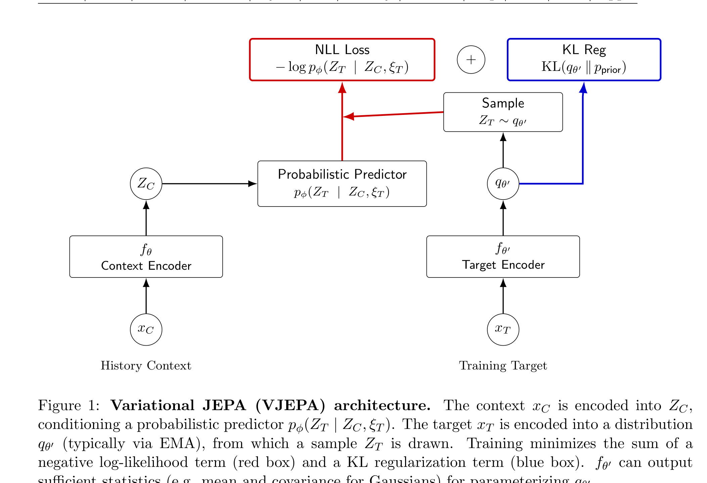
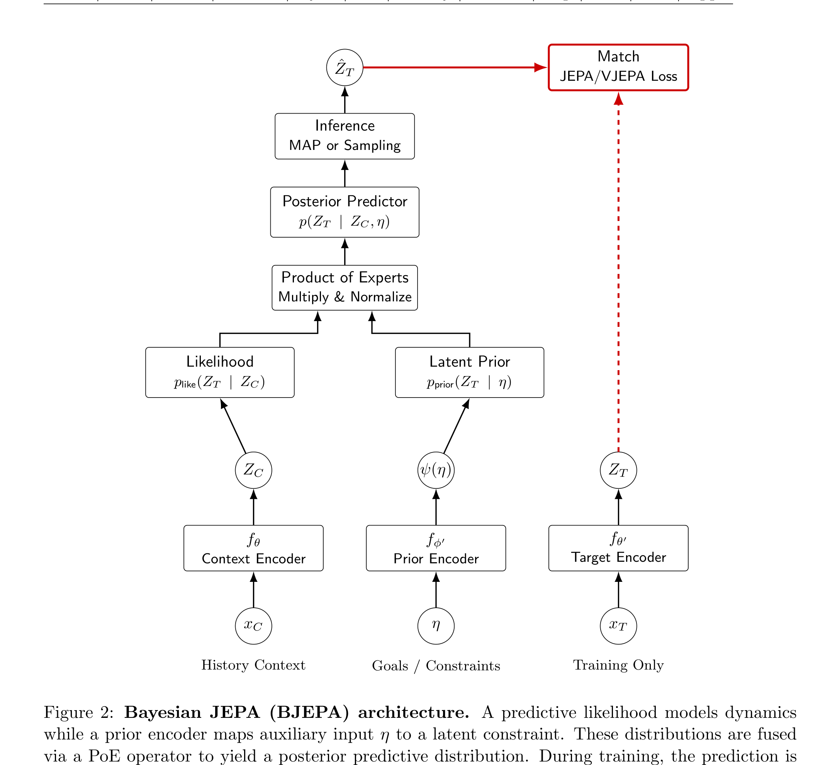

# Arquitecturas VJEPA y BJEPA (Probabilistic World Models)

**VJEPA (Variational JEPA)** y **BJEPA (Bayesian JEPA)** reformulan el paradigma JEPA determinista en un marco **probabilístico riguroso**. Permiten a los Modelos de Mundo cuantificar la incertidumbre aleatoria y epistémica, descartar ruido distractivo irrelevante y fusionar modularmente restricciones de tareas mediante el principio de **Product of Experts (PoE)**.

---

## 1. Diagramas de la Arquitectura

### Arquitectura Variational JEPA (VJEPA)

### Arquitectura Bayesian JEPA (BJEPA)

---

## 2. Componentes de VJEPA

### A. Context Encoder & Probabilistic Predictor
- El contexto $x_C$ se codifica en un vector $Z_C = E_\theta(x_C)$.
- El predictor probabilístico parametriza una distribución condicional sobre los targets:
  $$p_\phi(Z_T \mid Z_C, \xi_T) = \mathcal{N}\left( \mu_\phi(Z_C, \xi_T), \Sigma_\phi(Z_C, \xi_T) \right)$$
  donde $\xi_T$ es una variable latente estocástica que modela la ambigüedad en futuros multimodales.

### B. Target Distribution Encoder
- Mapea el bloque target $x_T$ a una distribución variacional $q_\psi(Z_T \mid x_T)$.

---

## 3. Componentes de BJEPA (Bayesian JEPA)

BJEPA introduce un prior modular sobre las restricciones físicas o de la tarea:
1. **Prior Encoder**: Mapea información auxiliar $\eta$ a un prior latente $p(\theta \mid \eta)$.
2. **Product of Experts (PoE)**: La distribución a posteriori se obtiene multiplicando las probabilidades del predictor de dinámica y del prior de tarea:
   $$p_{\text{joint}}(Z) \propto p_{\text{dynamics}}(Z \mid Z_{\text{past}}, a) \cdot p_{\text{prior}}(Z \mid \eta)$$

---

## 4. Función de Pérdida Variacional

$$\mathcal{L}_{\text{VJEPA}} = \mathbb{E}_{q_\psi} \left[ -\log p_\phi(Z_T \mid Z_C, \xi_T) \right] + \beta \, D_{\text{KL}}\left( q_\psi(Z_T \mid x_T) \,\|\, p(Z_T) \right)$$

---

## 5. Referencias Cruzadas
- **Paper**: [[2026_VJEPA]]
- **Entidades**: [[VJEPA]], [[BJEPA]]
- **Matemáticas**: [[VJEPA_Loss]]
