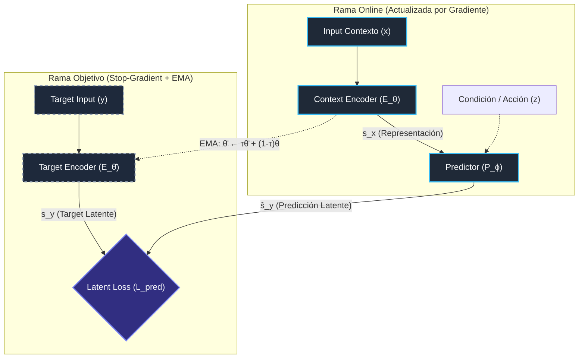

# Nota Maestra: Arquitectura JEPA & Modelos de Mundo Latentes

> [!ABSTRACT] Resumen "Antigravity": ¿Por qué el Espacio Latente sobre la Generación de Píxeles?
> Los modelos generativos clásicos (Autoencoders, Difusión, Autoregresivos como GPT-4V o Sora) sufren de la **maldición del detalle perceptual**: al optimizar una pérdida de reconstrucción en el espacio de píxeles ($\|x - \hat{x}\|_p$), el modelo se ve forzado a asignar la mayor parte de su capacidad computacional a modelar ruido aleatorio irrelevante y alta frecuencia entrópica (el movimiento caótico de las hojas de un árbol, la textura exacta del agua, el parpadeo de una sombra o ruido del sensor).
>
> La arquitectura **JEPA (Joint-Embedding Predictive Architecture)**, propuesta por Yann LeCun, descarta por completo la decodificación hacia el espacio sensorial crudo. En su lugar, proyecta el contexto y el objetivo a un **espacio latente abstracto invariantemente estructurado** y ejecuta la predicción exclusivamente allí ($s_x \xrightarrow{P_\phi(s_x, z)} \hat{s}_y$). Esto elimina la necesidad de predecir variables aleatorias no deterministas, colapsa la incertidumbre irrelevante y permite modelar dinámicas físicas y transiciones causales con una fracción del costo computacional, habilitando la verdadera planificación y razonamiento en agentes autónomos.

---

## 1. Arquitectura Visual (Flujo de Tensores)



---

## 2. Componentes Nucleares

> [!COMPONENTS] Dinámica de Operación y Prevención de Colapso
> - **Context Encoder ($E_\theta$):** Procesa la porción accesible o visible de la señal (parches no enmascarados de una imagen, historial de frames $o_{1:t}$). Se entrena vía descenso de gradiente directo $\nabla_\theta \mathcal{L}_{\text{pred}}$ para mapear la observación sensorial a un vector de estado representativo $s_x \in \mathbb{R}^{d_{\text{lat}}}$.
> - **Target Encoder ($E_{\bar{\theta}}$):** Procesa la porción complementaria u objetivo a predecir (bloques de parches enmascarados o transiciones futuras $o_{t+k}$). Para evitar el **colapso representacional** (donde todos los vectores colapsan trivialmente a una constante $s_x = s_y = \mathbf{c}$), el Target Encoder aplica **Stop-Gradient** ($\text{sg}[\cdot]$) y sus pesos se actualizan exclusivamente mediante una **Media Móvil Exponencial (EMA)** de los pesos de $E_\theta$:
>   $$\bar{\theta}_{t} \leftarrow \tau \bar{\theta}_{t-1} + (1 - \tau) \theta_t, \quad \tau \in [0.996, 1.0]$$
> - **Predictor ($P_\phi$):** Red neuronal habitualmente más ligera (Transformer no causal o MLP profundo) condicionado por una variable $z$ (posiciones relativas espaciales, vector de acción motora $a_t$, perturbación latente). Modela la transición $P_\phi(s_x, z) \mapsto \hat{s}_y$. Al absorber la asimetría y dificultad predictiva, aísla al Context Encoder de sobreajustar correlaciones espurias locales.

---

## 3. El Esqueleto Matemático en Código (PyTorch)

```python
import copy
import torch
import torch.nn as nn
import torch.nn.functional as F

class GenericJEPA(nn.Module):
    """
    Generic Joint-Embedding Predictive Architecture (JEPA).
    Implementación minimalista del paradigma no generativo en espacio latente.
    """
    def __init__(
        self,
        encoder_backbone: nn.Module,
        predictor_network: nn.Module,
        latent_dim: int = 512,
        ema_momentum: float = 0.996
    ):
        super().__init__()
        self.ema_decay = ema_momentum
        
        # 1. Rama Online: Context Encoder optimizado por gradiente directo
        self.context_encoder = encoder_backbone
        
        # 2. Rama Target: Inicializada como clon exacto de pesos
        self.target_encoder = copy.deepcopy(encoder_backbone)
        
        # # Evita el colapso mediante Stop-Gradient:
        # Los parámetros del Target Encoder se congelan de forma permanente para autograd.
        for param in self.target_encoder.parameters():
            param.requires_grad = False
            
        # 3. Predictor: Modela la dinámica latente condicionada (espacial o temporal)
        self.predictor = predictor_network

    @torch.no_grad()
    def update_target_encoder(self):
        """
        # Actualización asimétrica de pesos vía EMA (Exponential Moving Average):
        # theta_target <- tau * theta_target + (1 - tau) * theta_context
        # Produce un blanco 'móvil lento' que rompe el bucle de retroalimentación degenerativo.
        """
        for online_p, target_p in zip(self.context_encoder.parameters(), self.target_encoder.parameters()):
            target_p.data.mul_(self.ema_decay).add_(online_p.data, alpha=1.0 - self.ema_decay)

    def forward(
        self, 
        context_input: torch.Tensor, 
        target_input: torch.Tensor, 
        condition: torch.Tensor
    ) -> tuple[torch.Tensor, torch.Tensor, torch.Tensor]:
        """
        Args:
            context_input: Tensor x_C (e.g. patches visibles o frame t)
            target_input: Tensor x_T (e.g. patches objetivo o frame t+1)
            condition: Variable z (e.g. positional embeddings de parches objetivo o acción a_t)
        """
        # --- Rama 1: Inferencia del Contexto ---
        # Proyección al manifold latente con seguimiento de gradiente
        s_x = self.context_encoder(context_input)  # s_x in R^{B x d_lat}
        
        # --- Rama 2: Predicción Latente ---
        # Predicción no píxel-a-píxel: se predice directamente la representación semántica
        s_hat_y = self.predictor(s_x, condition)   # s_hat_y in R^{B x d_lat}
        
        # --- Rama 3: Extracción del Target (Stop-Gradient) ---
        # # Ningún gradiente fluye hacia el Target Encoder (aislamiento matemático)
        with torch.no_grad():
            s_y = self.target_encoder(target_input) # s_y in R^{B x d_lat}
            
        # --- Rama 4: Función de Pérdida en Espacio Latente ---
        # Distancia en espacio de embedding (Huber / L1 / L2):
        # L_JEPA = D(P_phi(s_x, z), s_y)
        loss = F.smooth_l1_loss(s_hat_y, s_y)
        
        return loss, s_hat_y, s_y
```

---

## 4. Visualización de la Dinámica Latente: La Escultura del Manifold

> [!TIP] La Analogía del Bloque de Mármol y la Entropía Aleatoria
> Imagina el espacio perceptual de píxeles ($256 \times 256 \times 3$) como un **bloque gigantesco de mármol de 196,608 dimensiones**, saturado de impurezas microscópicas, texturas caóticas y ruido térmico.
>
> - **Modelos Generativos (MAE / Difusión):** Intentan recrear químicamente cada átomo de polvo y veta invisible del mármol, desperdiciando energía colosal en detalles estocásticos impredecibles.
> - **JEPA:** Actúa como un **escultor cinético**. No añade material; martilla y cincela todas las dimensiones ortogonales irrelevantes (variaciones fotométricas, ruido gaussiano, micro-texturas). Al colapsar esas dimensiones innecesarias hacia cero, talla una **variedad riemanniana de baja dimensión** donde:
>   1. La geometría geodésica refleja **afinidad semántica y física causal real**.
>   2. Dos configuraciones con distinta textura pero idéntico significado físico ocupan el mismo hiperplano.
>   3. El predictor simplemente 'desliza' el estado a lo largo de las curvas de nivel del manifold.

---

## 5. Conexión con World Models: Imaginación Latente sin Renderizado

En la formulación de **Modelos de Mundo** (e.g., [[2026_LeWorldModel]], [[2025_PLDM]], [[2025_V-JEPA2]]):

$$\hat{s}_{t+1} = P_\phi(s_t, a_t)$$

Al sustituir el vector abstracto $z$ por un **vector de acción motora $a_t$**, el Predictor se convierte en un **Operador de Transición de Dinámica Hamiltoniana o Causal**.

### Ventajas Cruciales para la Planificación:
1. **Rollouts Ultrarrápidos en GPU:** Un agente no necesita invocar un decodificador pesado (de-convoluciones o UNet de difusión) para predecir el futuro. Puede proyectar $10,000$ trayectorias hipotéticas hacia adelante en un horizonte $H=50$ directamente en $\mathbb{R}^{d_{\text{lat}}}$ en milisegundos.
2. **Evaluación Energética Directa (MPC / CEM):**
   Dado un embedding de meta $s_{\text{goal}} = E_\theta(o_{\text{goal}})$, el coste de una secuencia de acciones $\{a_t\}_{t=1}^H$ es simplemente la energía en el espacio latente:
   $$J(a_{1:H}) = \sum_{t=1}^H \| \hat{s}_t - s_{\text{goal}} \|_2^2 + \lambda \| a_t \|_2^2$$
3. **Inmunidad a Alucinaciones Acumuladas:** Las simulaciones en píxeles degradan y difuminan la imagen a medida que el horizonte temporal $t$ crece (compounding errors). En JEPA, la invariancia semántica mantiene la trayectoria sobre la variedad física válida.

---

## 6. Consultas Dataview para la Bóveda

### DataviewJS: Búsqueda cruzada de variantes de Estabilización y Dinámica

```dataviewjs
let pages = dv.pages('"wiki/architecture"')
    .where(p => p.tags && (p.tags.includes("jepa") || p.tags.includes("world-models")));

dv.table(
    ["Nota de Arquitectura", "Mecanismo Clave / Tags", "Entidad Relacionada"],
    pages.map(p => [
        p.file.link,
        p.tags.filter(t => t !== "architecture" && t !== "jepa").join(", "),
        p.entity || "—"
    ])
);
```

---

## 7. Referencias Cruzadas en la Bóveda
- **Modelos Base:** [[2023_I-JEPA]], [[2025_V-JEPA2]], [[2025_LeJEPA]]
- **Estabilidad y Regulación:** [[2026_LeWorldModel]], [[SIGReg]], [[2026_EB-JEPA]], [[Linear_Identifiability]]
- **Planificación Latente & Dinámicas:** [[2025_PLDM]], [[2026_AdaJEPA]], [[2026_Semigroup-JEPA]], [[2026_LpWM]]
- **Guía General:** [[World_Models_PhD_Guide]]
