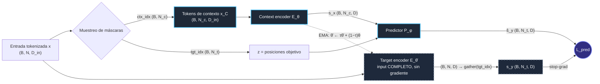
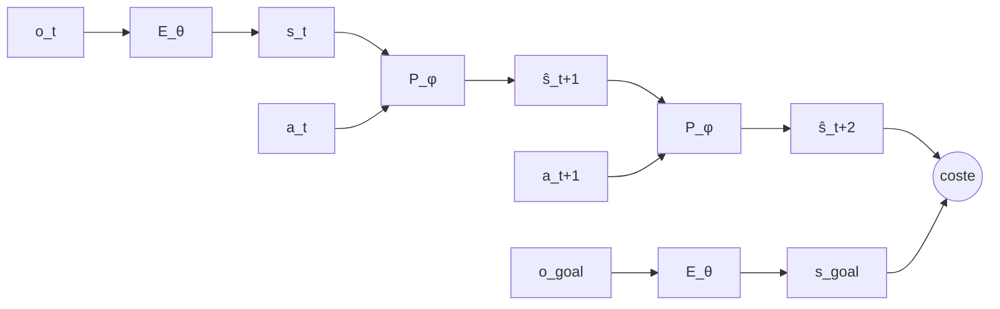

# Nota Maestra: JEPA y World Models Latentes

> [!abstract] TL;DR
> Una **JEPA (Joint-Embedding Predictive Architecture)** aprende representaciones prediciendo el **embedding** de una parte de la señal a partir del embedding de otra parte. No reconstruye la señal en el espacio de entrada (píxeles, muestras de audio, valores de sensor).
>
> - **Idea clave:** si el encoder puede *descartar* lo impredecible (la textura exacta del agua, el ruido de sensor), el predictor solo tiene que modelar lo predecible: estructura, dinámica, semántica.
> - **El precio:** como el encoder elige qué representar, existe una solución trivial que hace la pérdida cero: mapearlo todo a una constante. Toda la ingeniería de JEPA gira en torno a evitar ese **colapso representacional**. La bóveda documenta seis soluciones distintas (§5): EMA + stop-gradient, VICReg, SIGReg, RDMReg, KL variacional y encoder congelado.
> - **Extensión a world models:** si el predictor se condiciona en una acción $a_t$, se obtiene un modelo de transición $\hat s_{t+1} = P_\phi(s_t, a_t)$. Con él se puede **planificar en espacio latente** sin generar nunca una imagen (§6–7).

> [!info] Cómo se ha verificado esta nota
> Cada cifra y cada ecuación de las §4–§8 se ha contrastado con el PDF de `raw/` y lleva su fuente (`p.`, `Eq.`, `Tab.`). Cuando dos notas de la bóveda se contradecían, decidió el PDF. Esas decisiones están en la §14. Lo que el PDF no permite confirmar va marcado como *no verificado*.

**Ruta de lectura recomendada:** §1 (notación), §2 (el problema), §3 (qué es una JEPA), §4 (I-JEPA paso a paso), §5 (colapso), §6–7 (world models y planificación). La §8 es el mapa comparativo de los 26 papers de la bóveda y la §9 el código de referencia.

---

## 1. Notación y tipado dimensional

Es la notación canónica de la bóveda (`GEMINI.md` §5). Los papers usan otras letras; la tabla 1.1 da las equivalencias.

| Símbolo | Significado | Tipo / shape |
|---|---|---|
| $B$ | Nº de muestras sobre las que se estima una distribución (batch; $B\cdot N$ si se aplanan tokens) | $\mathbb{N}$ |
| $N$ | Nº total de tokens (parches, pasos temporales, nodos) | $\mathbb{N}$ |
| $N_c,\ N_t$ | Nº de tokens de contexto / objetivo | $N_c + N_t \le N$ |
| $D_{\text{in}},\ D$ | Dimensión del token de entrada / del embedding | $\mathbb{N}$ |
| $x$ | Observación completa tokenizada | $\mathbb{R}^{B \times N \times D_{\text{in}}}$ |
| $x_C,\ x_T$ | Subconjuntos de contexto / objetivo de $x$ | $\mathbb{R}^{B \times N_c \times D_{\text{in}}}$, $\mathbb{R}^{B \times N_t \times D_{\text{in}}}$ |
| $E_\theta$ | Context encoder (online, recibe gradiente) | $\mathbb{R}^{\cdot \times D_{\text{in}}} \to \mathbb{R}^{\cdot \times D}$ |
| $E_{\bar\theta}$ | Target encoder (EMA, sin gradiente), si existe | ídem |
| $P_\phi$ | Predictor | $(\mathbb{R}^{B \times N_c \times D}, z) \to \mathbb{R}^{B \times N_t \times D}$ |
| $s_x,\ s_y,\ \hat s_y$ | Embedding de contexto / target real / target predicho | $\mathbb{R}^{B \times N_c \times D}$, $\mathbb{R}^{B \times N_t \times D}$, $\mathbb{R}^{B \times N_t \times D}$ |
| $z$ | Variable condicionante: posiciones, acción o información estructural | depende del caso (§3.3) |
| $\operatorname{sg}[\cdot]$ | Stop-gradient: valor en forward, gradiente nulo en backward | operador |
| $\tau$ | Momentum de la EMA | $[0, 1]$ |
| $K$ | Nº de direcciones del sketch (slices) en SIGReg / RDMReg | $\mathbb{N}$ |
| $T$ | Nº de nodos de cuadratura en SIGReg | $\mathbb{N}$ |
| $V_g,\ V_l,\ V$ | Vistas globales, locales y totales ($V=V_g+V_l$) | $\mathbb{N}$ |
| $o_t,\ a_t$ | Observación y acción en el instante $t$ | $o_t \in \mathcal{O}$, $a_t \in \mathbb{R}^{d_a}$ |
| $s_t$ (o $z_t$) | Estado latente | $\mathbb{R}^{D}$ (o $\mathbb{R}^{N \times D}$ si es por tokens) |
| $H$ | Horizonte de planificación | $\mathbb{N}$ |
| $\lambda$ | Peso del regularizador. **Se indica siempre si es aditivo o convexo** (§5.3) | $\mathbb{R}_{>0}$ |

### 1.1 Equivalencias con la notación de los papers

| Paper | Batch | Dim. embedding | Direcciones | Estado latente |
|---|---|---|---|---|
| LeJEPA | $N$ | $K$ | $M$ ($\lvert\mathcal A\rvert$) | $z_{n,v}$ |
| LeVJEPA | $n$ | — | $M$ | $z_v$ |
| LeWM | $N$ | — | $M$ | $z_t$ |
| When Does LeJEPA… | — | $n$ (= dim. latente real) | — | $h(z)$ |
| SG-JEPA | $B$ | $d_z$ | — | $z_t$ |

> [!note] Convención
> Un embedding puede ser **global** ($\mathbb{R}^{B \times D}$, un vector por muestra) o **por tokens** ($\mathbb{R}^{B \times N \times D}$). I-JEPA, V-JEPA 2 y V-JEPA 2.1 trabajan por tokens. LeWM, MotionJEPA y SG-JEPA usan el token `[CLS]` de un ViT-Tiny ($D=192$; LeWM p. 4). C-JEPA usa un conjunto pequeño de *slots* por frame.

---

## 2. El problema: ¿por qué no predecir directamente la señal?

### 2.1 La regresión en espacio de entrada predice la media

Supongamos que queremos predecir una porción $y$ de la señal a partir de $x$ con un modelo determinista $\hat y = f(x)$ y pérdida cuadrática. Para cada $x$ fijo, el riesgo es:

$$
\mathcal{R}(\hat y) = \mathbb{E}_{y \sim p(y \mid x)}\!\left[\|y - \hat y\|_2^2\right]
= \mathbb{E}\!\left[y^\top y\right] - 2\,\hat y^\top \mathbb{E}[y \mid x] + \hat y^\top \hat y
$$

Derivando respecto a $\hat y$ e igualando a cero:

$$
\nabla_{\hat y}\mathcal{R} = -2\,\mathbb{E}[y \mid x] + 2\,\hat y = 0
\quad\Longrightarrow\quad
\hat y^{*} = \mathbb{E}[y \mid x]
$$

**Consecuencia:** si $p(y \mid x)$ es **multimodal** (la hoja puede moverse a la izquierda *o* a la derecha), el óptimo es el **promedio de los modos**, que no corresponde a ningún futuro posible: una imagen borrosa. Con pérdida $L_1$ el óptimo es la mediana condicional y el problema es el mismo.

### 2.2 La alternativa generativa es cara

Los modelos generativos (difusión, flow matching, autorregresivos sobre tokens visuales, VAEs) resuelven la multimodalidad modelando **toda** la distribución $p(y \mid x)$. El coste es que deben representar toda la entropía condicional $H(y \mid x)$, y en señales naturales la mayor parte de esa entropía es detalle de alta frecuencia irrelevante para entender o controlar el sistema.

En la bóveda, el representante de esta vía es **GeniWorld** ([[wiki/papers/2026_GeniWorld|2026_GeniWorld]]): flow matching sobre latentes de un VAE 3D con un DiT de 5B parámetros (Wan2.2-TI2V-5B), a unos 8 Hz con 5 pasos de muestreo. Sirve de contraste con las JEPA (§8.5).

Descomposición intuitiva de la señal objetivo:

$$
y = \big(\underbrace{y_{\text{pred}}}_{\text{estructura predecible desde } x},\ \underbrace{y_{\text{ruido}}}_{\text{impredecible e irrelevante}}\big)
$$

Un modelo en espacio de entrada **no puede ignorar** $y_{\text{ruido}}$, porque forma parte de la pérdida.

### 2.3 La propuesta JEPA

En lugar de predecir $y$, se predice su **representación** $s_y = E_{\bar\theta}(y)$. Si el encoder aprende a ser (aproximadamente) invariante a $y_{\text{ruido}}$, entonces $H(s_y \mid s_x)$ es pequeña y **basta un predictor determinista**. El modelo decide qué información merece la pena conservar.

> [!warning] ⚠️ El reverso de esa libertad: el colapso
> Si el encoder decide qué representar, la solución más barata es no representar nada:
>
> $$
> E_\theta(\cdot) = E_{\bar\theta}(\cdot) = \mathbf{c} \;\Rightarrow\; \hat s_y = \mathbf{c} = s_y \;\Rightarrow\; \mathcal{L}_{\text{pred}} = 0
> $$
>
> La pérdida de predicción **por sí sola es insuficiente**. Hace falta algo que obligue a las representaciones a ser informativas (§5).

> [!warning] Un segundo modo de fallo: el colapso *temporal*
> Aunque no haya colapso global, el encoder puede quedarse solo con los rasgos que cambian despacio. MotionJEPA lo documenta: con el fondo estático, $z_{\text{fondo},t+1} \approx z_{\text{fondo},t}$ ya da un error de predicción casi nulo, y el movimiento, que es la parte relevante para control, se pierde (§5.5).

---

## 3. Qué es una JEPA

### 3.1 Familias de self-supervised learning (SSL)

|  | Generativa / reconstructiva | Joint-embedding invariante | **JEPA con predictor** | **JEPA sin predictor** |
|---|---|---|---|---|
| Ejemplos | MAE, difusión, flow matching (GeniWorld) | SimCLR, BYOL, DINO, VICReg | I-JEPA, V-JEPA 2, V-JEPA 2.1, TC-JEPA, MJEPA, LeWM, PLDM | LeJEPA, LeVJEPA, Rectified LpJEPA |
| Qué se optimiza | Reconstruir $y$ en espacio de entrada | Que dos vistas aumentadas tengan embeddings iguales | Predecir $s_y$ desde $s_x$ (y $z$) en espacio latente | Invarianza multi-vista (al centroide de las vistas globales) + regularizador distribucional |
| Decoder a espacio de entrada | Sí | No | No | No |
| Dependencia de augmentations | Baja | **Alta** | Baja (la señal es el enmascarado o el tiempo) | **Media** (usa vistas globales y locales recortadas) |
| Riesgo principal | Gastar capacidad en detalle irrelevante | Colapso; invariancias sesgadas | Colapso | Colapso (lo evita el regularizador) |

**Resumen en una línea:** I-JEPA es "un MAE cuya pérdida se calcula sobre embeddings de un target encoder en lugar de sobre píxeles".

> [!important] ❗ "JEPA" sin predictor
> LeJEPA **no tiene red predictora**. Los autores lo ablacionan y recomiendan explícitamente "training without a predictor" (LeJEPA p. 14, Tab. 4). Lo mismo vale para LeVJEPA ("no predictor network is instantiated", p. 4) y para Rectified LpJEPA (la palabra "predictor" no aparece en el PDF). Son JEPA por linaje y por nombre ("Latent-Euclidean JEPA"). Técnicamente son objetivos *joint-embedding* de invarianza cuya estabilidad no depende de la asimetría de ramas, sino de un regularizador distribucional (§5.3–5.4).

### 3.2 Visión energy-based (la formulación de LeCun)

Una JEPA define una **función de energía** que mide la incompatibilidad entre $x$ e $y$:

$$
\mathcal{E}(x, y, z) = D\big(P_\phi(E_\theta(x), z),\; E_{\bar\theta}(y)\big),
\qquad
F(x, y) = \min_{z \in \mathcal{Z}} \mathcal{E}(x, y, z)
$$

donde $D$ es una distancia ($L_1$, $L_2$, $L_2^2$, Smooth-L1) y $F$ es la *free energy*. Entrenar consiste en dar **energía baja a los pares compatibles** $(x, y)$. El colapso equivale a una energía plana, baja en todas partes. Hay dos formas de evitarlo:

1. **Métodos contrastivos:** subir explícitamente la energía de pares incompatibles (negativos). Escalan mal con la dimensión porque hacen falta muchos negativos.
2. **Métodos regularizados:** limitar el "volumen" del espacio que puede tener energía baja, forzando varianza, decorrelación o una distribución concreta del embedding. Es la vía dominante en la JEPA moderna (§5).

La librería **EB-JEPA** ([[wiki/papers/2026_EB-JEPA|2026_EB-JEPA]]) implementa esta vista con $\mathcal E(x,y)=\|P(E(x))-E(y)\|_2^2$ y se centra explícitamente en la vía regularizada: "rather than stop-gradient techniques" (p. 2).

### 3.3 El papel de $z$

$z$ aparece en todos los diagramas, pero significa cosas distintas según la variante:

| Variante | Naturaleza de $z$ | Ejemplo en la bóveda |
|---|---|---|
| Enmascarado espacial | Determinista y conocida: **posiciones** de los tokens objetivo | I-JEPA: mask tokens + positional embeddings |
| Enmascarado espacio-temporal | Posiciones en $(t, h, w)$ | V-JEPA 2 (tubelets $2\times16\times16$), V-JEPA 2.1 (3D RoPE) |
| Enmascarado de objetos | Identidad del slot enmascarado + variables auxiliares | C-JEPA: *identity anchor* $\tilde z^i_\tau=\phi(z^i_{t_0})+e_\tau$ (Eq. 3) |
| Condicionamiento textual | Tokens de texto vía cross-attention | TC-JEPA (captions T5), CHARM (descripción de cada canal) |
| World model | **Acción** observada $a_t$ | LeWM (AdaLN), V-JEPA 2-AC, PLDM, SG-JEPA ($\tilde a_t=[u_t;g]$, gravedad incluida), Music-JEPA (pianoroll) |
| JEPA probabilística (VJEPA) | **Información estructural** $\xi_T$ del target (posición, índice temporal, patrón de máscara). No es una latente estocástica. | $p_\phi(Z_T\mid Z_C,\xi_T)$ (VJEPA Eq. 7, p. 11) |

> [!warning] ⚠️ Fuga de información por $z$
> Si $z$ fuera una latente **libre** y no se restringiera su contenido informativo, el predictor podría ignorar $s_x$ y codificar $y$ entero en $z$. Sería otra solución trivial. VJEPA **evita este riesgo por diseño**: su $\xi_T$ es información estructural conocida, y la incertidumbre se modela en la distribución de salida $p_\phi$. Además, el término KL regulariza $q_{\theta'}(Z_T\mid x_T)$, que solo ve $x_T$, frente a un prior fijo $p(Z_T)=\mathcal N(0,I)$ (Eqs. 10–11).

---

## 4. Arquitectura canónica: I-JEPA paso a paso

### 4.1 Flujo de tensores



> [!important] ❗ Detalle que suele malinterpretarse
> En I-JEPA el **target encoder procesa la entrada completa** y después se *seleccionan* los tokens objetivo de su salida. No codifica solo los parches enmascarados. Así cada $s_y$ tiene contexto global, y los targets son más semánticos. El paper lo ablaciona: enmascarar la **salida** da 67.3 frente a 56.1 si se enmascara la entrada (I-JEPA Tab. 11). El **context encoder**, en cambio, solo ve $x_C$.

### 4.2 Un paso de entrenamiento, con shapes

Todos los valores proceden de I-JEPA p. 4 y App. A.1.

1. **Tokenizar:** imagen → parches → $x \in \mathbb{R}^{B \times N \times D_{\text{in}}}$. Por ejemplo, un ViT con parches de $16\times16$ sobre $224\times224$ da $N = 196$.
2. **Muestrear máscaras (multi-block):**
   - **4 bloques target**, que pueden solaparse, con escala $(0.15, 0.2)$ y aspect ratio $(0.75, 1.5)$.
   - **1 bloque de contexto** con escala $(0.85, 1.0)$ y aspect ratio unitario, del que se **eliminan** las zonas solapadas con los targets.
   - Resultado: `ctx_idx` $\in \{0..N{-}1\}^{B \times N_c}$, `tgt_idx` $\in \{0..N{-}1\}^{B \times N_t}$.
3. **Target (sin gradiente):** $s_y = \operatorname{gather}\big(E_{\bar\theta}(x),\ \text{tgt\_idx}\big) \in \mathbb{R}^{B \times N_t \times D}$.
4. **Contexto:** $s_x = E_\theta(x_C) \in \mathbb{R}^{B \times N_c \times D}$.
5. **Predicción:** el predictor es un ViT **estrecho** de ancho 384, con tantas heads como el backbone y profundidad 6 (ViT-B), 12 (ViT-L/H) o 16 (ViT-G). Recibe $s_x$ más $N_t$ *mask tokens* aprendibles sumados a los positional embeddings de las posiciones objetivo, y devuelve $\hat s_y \in \mathbb{R}^{B \times N_t \times D}$.
6. **Pérdida** ($M = 4$ bloques $B_i$):
   $$
   \mathcal{L}_{\text{pred}} = \frac{1}{M}\sum_{i=1}^{M}\sum_{j\in B_i} \big\|\hat s_{y_j} - \operatorname{sg}[s_{y_j}]\big\|_2^2
   $$
   Es $L_2$ **al cuadrado**, sumada sobre los parches del bloque y promediada sobre bloques. El texto dice "average L2 distance", pero la fórmula es esta. V-JEPA 2 y V-JEPA 2.1 usan $L_1$ (V-JEPA 2 Eq. 1; V-JEPA 2.1 Eqs. 1–2).
7. **Backward + optimizer step:** solo sobre $(\theta, \phi)$.
8. **EMA:** actualizar $\bar\theta$ (§5.1), siempre **después** del optimizer step. En I-JEPA, $\tau$ sube linealmente de $0.996$ a $1.0$.

**Resultado de referencia:** linear probe en IN-1k de **79.3** con ViT-H/14 y 81.1 con ViT-H/16 a 448 px (I-JEPA Tab. 1). El ViT-H/14 se entrena en 16 A100 en menos de 72 h.

### 4.3 Por qué el predictor es necesario… en el régimen EMA

Si se eliminara el predictor y se compararan $s_x$ y $s_y$ directamente, el encoder tendría que hacer dos trabajos a la vez: representar y predecir. El predictor absorbe la parte "qué hay en la posición $j$ dado el contexto", y el encoder se dedica a producir buenas representaciones.

Además, en el régimen **EMA + stop-gradient**, la **asimetría** entre ramas (predictor solo en la rama online) es uno de los ingredientes que empíricamente evita el colapso. Por eso el predictor suele ser **más pequeño** que el encoder: si fuera demasiado potente, podría compensar representaciones pobres.

> [!note] El predictor deja de ser necesario con un regularizador distribucional
> LeJEPA muestra que, con SIGReg, se puede quitar tanto el predictor como el teacher-student **sin colapso** (p. 14, Tab. 4). El papel anti-colapso de la asimetría lo asume el regularizador. En world models el predictor sigue siendo imprescindible, pero por otra razón: **es** el modelo de transición.

### 4.4 Cómo se evalúa lo aprendido

No hay decoder, así que la calidad se mide **sobre las representaciones congeladas**:

- **Linear probing:** una capa lineal sobre $E_\theta$ congelado para una tarea downstream (clasificación, regresión de variables físicas). La teoría de identificabilidad (§6.3) justifica por qué es conceptualmente válido: si $h(z)=Qz$, una sonda lineal recupera el estado.
- **Attentive probing:** una pequeña capa de atención con query aprendible sobre los tokens congelados (estándar en V-JEPA 2).
- **World models:** tasa de éxito en planificación, error de rollout en latente, *probing* de magnitudes físicas (posición, velocidad) desde $s_t$.
- **Correlación pérdida-calidad:** en LeJEPA, la pérdida de entrenamiento correlaciona con la accuracy del linear probe (Spearman ≈ 85 %, hasta ≈ 99 % con un ajuste $\alpha\approx0.4$; LeJEPA p. 15). Es excepcional: en el régimen EMA la pérdida no es informativa (§5.7).
- **Visualización:** para "ver" qué codifica $s$, se entrena **a posteriori** un decoder separado sobre el encoder congelado. Nunca forma parte del entrenamiento JEPA.

---

## 5. El colapso y las familias de soluciones

Hay tres tipos de colapso a vigilar:

- **Colapso completo:** todos los embeddings iguales, $\operatorname{Var}(s) \to 0$.
- **Colapso dimensional:** los embeddings viven en un subespacio de dimensión $\ll D$; la matriz de covarianza tiene pocos autovalores no nulos. Es más sutil y más frecuente.
- **Colapso temporal:** el encoder codifica solo lo que cambia despacio (§5.5).

### 5.1 Asimetría: stop-gradient + EMA (I-JEPA, V-JEPA 2, V-JEPA 2.1, TC-JEPA, MJEPA, CHARM, HP-JEPA, Music-JEPA)

El target encoder no recibe gradiente, y sus pesos siguen a los del context encoder con una **media móvil exponencial**:

$$
\bar\theta_t = \tau\,\bar\theta_{t-1} + (1-\tau)\,\theta_t
$$

**Desarrollo de la recurrencia.** Sustituyendo recursivamente:

$$
\bar\theta_t = \tau^{t}\,\bar\theta_0 + (1-\tau)\sum_{k=0}^{t-1} \tau^{k}\,\theta_{t-k}
$$

Los pesos suman uno: $\tau^t + (1-\tau)\frac{1-\tau^t}{1-\tau} = 1$. El **retardo medio** del target respecto al encoder online es:

$$
\bar k = \sum_{k \ge 0} k\,(1-\tau)\,\tau^{k} = \frac{\tau}{1-\tau}
\qquad\Rightarrow\qquad
\tau = 0.996 \Rightarrow \bar k \approx 249;\quad \tau = 0.99925 \Rightarrow \bar k \approx 1332 \text{ pasos}
$$

El target es, por tanto, una versión **suavizada y retrasada** del encoder: un objetivo que se mueve despacio. Las variantes que aparecen en la bóveda son:

- **I-JEPA:** *schedule* lineal $0.996 \to 1.0$, de modo que el target se congela al final.
- **V-JEPA 2:** EMA **fija** $\tau=0.99925$ ("maintaining fixed teacher EMA … instead of using ramp-up schedule", Tab. 9, p. 33).
- **Music-JEPA:** $\tau=0.95$ (p. 4).
- **AdaJEPA:** una variante degenerada, stop-gradient **sin** EMA durante la adaptación (§6.3).

> [!caution] 🔥 Qué garantiza y qué no
> SG + EMA + predictor **no tiene garantía teórica general** de evitar el colapso. Funciona empíricamente y hay análisis parciales para casos lineales (la línea BYOL/SimSiam). Es sensible a hiperparámetros ($\tau$, tamaño del predictor, learning rate, weight decay). Esta fragilidad es precisamente la motivación de LeJEPA, LeVJEPA y LeWorldModel (§5.3).

### 5.2 Regularización de varianza y covarianza (PLDM, EB-JEPA)

Sobre un conjunto de embeddings $Z \in \mathbb{R}^{B \times D}$ con media $\bar z \in \mathbb{R}^{D}$ y covarianza

$$
C = \frac{1}{B-1}\sum_{b=1}^{B}(z_b - \bar z)(z_b - \bar z)^\top \in \mathbb{R}^{D \times D}
$$

se añaden dos términos:

$$
v(Z) = \frac{1}{D}\sum_{j=1}^{D}\max\!\big(0,\ \gamma - \sqrt{C_{jj} + \varepsilon}\big)
\qquad
c(Z) = \frac{1}{D}\sum_{i \ne j} C_{ij}^{2}
$$

- $v$ impide el **colapso completo**: cada dimensión debe tener desviación típica $\ge \gamma$.
- $c$ impide el **colapso dimensional**: decorrela dimensiones para que no sean copias unas de otras.

El coste es $\mathcal{O}(B D^2)$ por la covarianza.

**PLDM** usa el objetivo completo con siete términos (Eq. 3; App. D.1.1):

$$
\mathcal{L}_{\text{JEPA}} = \mathcal{L}_{\text{sim}} + \alpha\,\mathcal{L}_{\text{var}} + \beta\,\mathcal{L}_{\text{cov}} + \delta\,\mathcal{L}_{\text{time-sim}} + \omega\,\mathcal{L}_{\text{IDM}}
$$

Aquí $\mathcal{L}_{\text{sim}}$ es la predicción **multi-paso** del ensemble, $\mathcal{L}_{\text{time-sim}}=\sum_t\|Z_t-Z_{t+1}\|^2$ suaviza en el tiempo y $\mathcal{L}_{\text{IDM}}$ es un **modelo de dinámica inversa** que obliga a codificar lo que las acciones controlan. Dos matices del paper:

- El texto habla de aplicar la varianza "across the time dimension", pero la fórmula calcula $\operatorname{Var}(Z_{t,:,j})$ sobre el batch en cada $t$.
- En Two-Rooms, $\omega=0$.

**EB-JEPA** reproduce esta receta en su ejemplo con acciones y aísla la contribución del IDM: **sin IDM el éxito de planificación cae de 97 % a 1 %** (Tab. 4). Es la evidencia más fuerte de la bóveda de que la varianza y la covarianza por sí solas no bastan para que el latente capture lo *controlable*.

### 5.3 Regularización distribucional: SIGReg (LeJEPA, LeVJEPA, LeWM, SG-JEPA, SkyJEPA, MotionJEPA)

**Idea.** En lugar de heurísticas (EMA, stop-gradient, schedules), se fija explícitamente **qué distribución deben seguir los embeddings**. LeJEPA demuestra que la **Gaussiana isotrópica** $\mathcal{N}(0, I_D)$ minimiza el sesgo cuadrático integrado de sondas lineales, k-NN y kernel ([[Isotropic_Gaussian_Optimality]]). Para imponerla propone SIGReg (*Sketched Isotropic Gaussian Regularization*).

**Paso 1: reducir a 1D (Cramér–Wold).** Dos distribuciones en $\mathbb{R}^D$ son iguales si y solo si lo son todas sus proyecciones unidimensionales:

$$
P = Q \iff u^\top X \overset{d}{=} u^\top Y \quad \forall\, u \in \mathbb{S}^{D-1}
$$

Si $s \sim \mathcal{N}(0, I_D)$, entonces $u^\top s \sim \mathcal{N}(0, 1)$ para todo $u$ unitario. Basta con muestrear $K$ direcciones aleatorias (el *sketch*) y comprobar normalidad en cada una. LeJEPA sustituye el $\max_u$ del teorema por una **media** sobre direcciones "to avoid sparse gradient" (Def. 2, p. 7).

**Paso 2: test de normalidad diferenciable (Epps–Pulley).** Para la dirección $u$, la función característica empírica de las proyecciones es

$$
\hat\varphi_u(t) = \frac{1}{B}\sum_{b=1}^{B} e^{\,i\,t\,u^\top s_b},
\qquad t \in \mathbb{R},
$$

y la de $\mathcal{N}(0,1)$ es $\varphi(t) = e^{-t^2/2}$. El estadístico mide su discrepancia ponderada:

$$
T_u = B \int_{-\infty}^{\infty} \big|\hat\varphi_u(t) - \varphi(t)\big|^2\, w(t)\, dt,
\qquad w(t) = e^{-t^2/2}
$$

Descomponiendo $e^{i\theta} = \cos\theta + i\sin\theta$ y usando que $\varphi$ es real:

$$
\big|\hat\varphi_u(t) - \varphi(t)\big|^2 = \Big(\tfrac{1}{B}\textstyle\sum_b \cos(t\,u^\top s_b) - e^{-t^2/2}\Big)^2 + \Big(\tfrac{1}{B}\textstyle\sum_b \sin(t\,u^\top s_b)\Big)^2
$$

Esta expresión es diferenciable respecto a $s_b$, y sus gradientes están acotados: $|\partial T/\partial s_i|\le 4\sigma^2/B$ (LeJEPA Thm. 4). Los tests basados en momentos, en cambio, tienen gradientes que crecen polinómicamente.

> [!important] Detalles numéricos verificados en el PDF de LeJEPA
> - **Factor $B$:** es el batch **global** (`N = x.size(0) * world_size`, Algorithm 1).
> - **Cuadratura:** trapezoidal con **17 nodos en $[-5,5]$**.
> - **Peso:** el código usa $w(t)=e^{-t^2/2}$. El texto escribe $e^{-t^2/\sigma^2}$ con $\sigma=1$, lo que es una inconsistencia entre texto y código (p. 9).
> - **Direcciones:** se **remuestrean en cada paso**. El código usa 256 por defecto; el texto recomienda 1024 (p. 13). Con remuestreo, incluso $K=16$ supera a un conjunto fijo de miles (p. 11).
> - **Sesgo de minibatch:** $\mathcal O(1/B)$ (Thm. 6), "not a concern even for minibatches as small as 16".

**Paso 3: pérdida total de LeJEPA** (Eq. "LeJEPA", p. 12), en **forma convexa**:

$$
\mathcal{L}_{\text{LeJEPA}}=\frac{\lambda}{V}\sum_{v=1}^{V}\mathrm{SIGReg}\big(\{z_{n,v}\}_{n=1}^B\big)+\frac{1-\lambda}{B}\sum_{n=1}^{B}\underbrace{\frac1V\sum_{v'=1}^{V}\|\mu_n-z_{n,v'}\|_2^2}_{\text{todas las vistas}\to\text{centroide global}},\qquad \mu_n=\frac1{V_g}\sum_{v=1}^{V_g}z_{n,v}
$$

- **Vistas:** $V_g=2$ globales a $224^2$ y vistas locales a $96^2$. $\lambda=0.05$ por defecto, sin stop-gradient sobre $\mu_n$.
- **Nota sobre la derivación:** el paper presenta esta forma como igual a la forma "a pares" $\frac1{V_g}\sum_v\frac1V\sum_{v'}\|z_v-z_{v'}\|^2$. No lo es: difieren en la dispersión intra-globales (ver [[LeJEPA_Loss]]). El código implementa la forma centroide.

**Por qué escala:** el coste es $\mathcal{O}(BDK)$ para proyectar más $\mathcal{O}(BKT)$ para la ECF. Es **lineal** en batch y dimensión, sin matriz $D \times D$. En DDP basta un `all_reduce` de un tensor $2\times K\times T$.

**Una misma idea, tres implementaciones.** Los valores de $\lambda$ **no son comparables** entre papers:

| Paper | Forma | $\lambda$ | Cuadratura | Factor $B$ | Fuente |
|---|---|---|---|---|---|
| LeJEPA | convexa $\lambda\,\text{SIG}+(1-\lambda)\,\text{pred}$ | 0.05 | 17 en $[-5,5]$ | sí | pp. 12–13 |
| LeVJEPA | aditiva $\mathcal L_{\text{inv}}+\lambda\,\text{SIG}$ | 0.02 | 17 en $[0,3]$, $K=1024$ | no | Eq. 1–3, App. A |
| LeWM | aditiva $\mathcal L_{\text{pred}}+\lambda\,\text{SIG}$ | 0.1 (bisección) | $[0.2,4]$, $K=1024$ | no | p. 5, App. A |
| SG-JEPA | aditiva | 0.09–0.72 según tarea | 17 knots, $K=1024$ | sí | App. C, Eq. 160 |
| SkyJEPA | aditiva, sobre latentes **predichos** | 0.02 | 17 knots | — | §IV-B |

LeVJEPA dice fijar $\lambda=0.02$ "following Balestriero and LeCun". Es inconsistente con el $0.05$ de LeJEPA, que además está en forma convexa. En LeWM, la ablación da más de 80 % de éxito para $\lambda\in[0.01,0.2]$, un pico en torno a 0.09 y **colapso con $\lambda=0.5$** (Fig. 16). "Demasiada gaussianidad" también colapsa: When Does LeJEPA… lo observa igual con $\lambda=0.5$ (p. 6).

**Resumen por modelo:**
- **LeJEPA:** SIGReg para imagen, sin predictor. Escala hasta 1.8B parámetros (ViT-g, Fig. 1). Probado en unas 50 arquitecturas timm pequeñas (<20M) con 91.5–95 % top-1 en ImageNet-10 (p. 14).
- **LeVJEPA:** la receta llevada a vídeo, con block-causal attention y **token dropping del 95 %**. IN-1k pasa de 33.9 a 47.6 gracias al dropping. Iguala o supera a V-JEPA 2 con **5.6–20.8× menos cómputo** (4.8 frente a 36.4 ExaFLOPs en ViT-B; p. 7).
- **LeWorldModel:** world model JEPA entrenado **end-to-end desde píxeles** con predicción del siguiente embedding más SIGReg, sin encoder preentrenado, sin EMA y sin stop-gradient. Pasa de 6 a **1** hiperparámetro de pérdida frente a PLDM.

### 5.4 Más allá de la Gaussiana: representaciones dispersas (RDMReg)

**Origen.** RDMReg (*Rectified Distribution Matching Regularization*) lo **introduce Rectified LpJEPA** (ICML 2026; Eqs. 14–16). **LpWM** lo reutiliza en world models citándolo (LpWM p. 3).

**Distribución objetivo.** Una **Gaussiana generalizada rectificada** (RGG), $y\sim\prod_{i=1}^{D}\mathrm{ReLU}(\mathcal{GN}_p(\mu,\sigma))$. Es una mezcla de una Dirac en 0 con masa $\Phi_{\mathcal{GN}_p(0,1)}(-\mu/\sigma)$ y una Gaussiana generalizada truncada en $(0,\infty)$ (Rectified LpJEPA Def. 3.4). Por defecto, LpWM usa $\mu=0$, $\sigma=\sqrt{1/2}$ y $p=1$, que es la **Laplace rectificada**. Con $\mu=0$, $\sigma=1$, $p=2$ y sin ReLU se recupera la Gaussiana densa de LeWM (LpWM p. 3).

**Distancia.** Es **sliced 2-Wasserstein *two-sample***. La RGG no es cerrada bajo proyecciones lineales, así que no se puede usar un test *one-sample* como Epps–Pulley (Rectified LpJEPA p. 6):

$$
\mathcal R(Z)=\mathbb E_{c\sim\mathrm{Unif}(\mathbb S^{D-1})}\Big[\tfrac1B\big\|(Zc)_\uparrow-(Yc)_\uparrow\big\|_2^2\Big]
$$

Aquí $(\cdot)_\uparrow$ ordena de forma ascendente e $Y$ es una muestra de la RGG. Se usan 8192 proyecciones en ImageNet-100.

**Rectificación.** Rectified LpJEPA usa un **ReLU plano**. LpWM usa $\mathrm{RepReLU}(x)=\mathrm{sg}(\mathrm{ReLU}(x))+\mathrm{GeLU}(x)-\mathrm{sg}(\mathrm{GeLU}(x))$: da ceros exactos en el forward y deja pasar gradiente por la GeLU. Es una salvaguarda contra neuronas muertas, "not … an essential component of the method" (LpWM p. 3).

**Resultados.**
- **Rectified LpJEPA:** en ImageNet-100, $\mathcal{RGN}_{1.0}$ obtiene 84.72 / 80.40 (encoder / projector) con **69 % de ceros**, frente a 84.80 / 79.52 de LeJEPA, que es densa (Tab. 1). El rendimiento solo cae en picado con ~95 % de ceros.
- **LpWM:** en PushT, "up to 57 %" más éxito que LeWM **con predictores de capacidad intermedia**. El 57 % corresponde a MLP∘LTI(k); el rango es 24–57 %, y con el predictor DiT de LeWM no hay ventaja significativa (p. 6). El PDF no aclara si son puntos absolutos o una mejora relativa.
- **Temporal Jaccard** (LpWM, opcional): la pérdida $\frac{1}{B(T-1)}\sum_{b,t}\big(1-J_S(z_{b,t},z_{b,t+1})\big)$ con Jaccard suave estabiliza el soporte. En OGBench-Cube eleva la correlación con el movimiento del cubo de 0.26 a 0.80 sin cambiar el éxito de planificación. El soporte actúa como **detector de contactos** (Fig. 4).

**Motivación teórica** (LpWM): los sistemas de control Lipschitz sobre compactos admiten codificaciones *one-hot* finitas con dinámica latente **exactamente lineal**. La dispersión es su relajación diferenciable. El soporte (ceros frente a no ceros) codifica el régimen dinámico discreto y las magnitudes codifican el estado intra-régimen.

### 5.5 Colapso temporal y DISReg (MotionJEPA)

**El fallo.** Aunque no haya colapso global, la mayor parte del frame no cambia entre $t$ y $t+1$. Un encoder que solo codifique la apariencia estática ya predice bien el siguiente embedding y descarta el movimiento. MotionJEPA lo llama *temporal feature collapse*. Es relevante para cualquier serie temporal en la que la señal cambia despacio respecto a la frecuencia de muestreo.

**La corrección** (MotionJEPA Eqs. 1–6, Alg. 1):

$$
d_t=\mathrm{DiffEnc}_\alpha(o_{t+1}-o_t),\qquad \hat d_t=\mathrm{DiffPred}_\beta(z_t,z_{t+1})
$$

$$
\mathcal L_{\text{MotionJEPA}}=\underbrace{0.25\,\mathrm{SIGReg}(z)+2\,\mathrm{SIGReg}(d)+0.5\,\|d_t-\hat d_t\|_2^2}_{\mathcal L_{\text{DISReg}}}+\|\hat z_{t+1}-z_{t+1}\|_2^2
$$

- **Qué fuerza:** el par $(z_t,z_{t+1})$ tiene que permitir predecir el embedding de la **imagen diferencia**, así que el cambio visual queda en el latente.
- **Acciones:** la rama DISReg **no usa acciones**, pero el predictor forward $\hat z_{t+1}=\mathrm{Pred}(z_{t-H+1:t},a_{t-H+1:t})$ **sí** está condicionado por acción.
- **Coste en inferencia:** DiffEnc y DiffPred se descartan tras el entrenamiento.

**Planificación con distractor de fondo estático** (Tab. 3, media de Cube, PushT, Reacher y TwoRoom):

| Método | 25 pasos | 50 pasos |
|---|---|---|
| LeWM | 20.4 | 11.8 |
| IDM | 77.2 | 59.3 |
| MotionJEPA | 81.8 | 70.3 |
| MotionJEPA + IDM | 86.4 | 71.6 |

En PushT a 25 pasos, el IDM solo supera a MotionJEPA (83.6 frente a 78.4).

### 5.6 Resumen comparativo

| Mecanismo | Modelos (bóveda) | Qué evita | Ventajas | Limitaciones |
|---|---|---|---|---|
| SG + EMA + predictor | I-JEPA, V-JEPA 2/2.1, TC-JEPA, MJEPA, CHARM, HP-JEPA, Music-JEPA | Colapso (empíricamente) | Probado a gran escala (hasta 2B en V-JEPA 2.1) | Sin garantía; sensible a $\tau$ y al predictor |
| Stop-grad sin EMA | AdaJEPA (TTA) | Colapso durante la adaptación | Simple, online | Solo se ha validado como estabilizador en adaptación de pocos pasos |
| Encoder congelado | C-JEPA (DINOv2 + VideoSAUR) | Colapso, por construcción | Nada que regularizar | El encoder no se adapta a la dinámica |
| Varianza + covarianza (+ IDM) | PLDM, EB-JEPA | Completo y dimensional | Explícito, interpretable | $\mathcal{O}(BD^2)$; hasta 7 pesos; depende del IDM |
| SIGReg | LeJEPA, LeVJEPA, LeWM, SG-JEPA, SkyJEPA, MotionJEPA | Fuerza $\mathcal{N}(0, I)$ | Lineal en $B$ y $D$; 1 hiperparámetro; con garantías (§6.3) | Impone una forma concreta; $\lambda$ excesivo colapsa |
| RDMReg (RGG) | Rectified LpJEPA, LpWM | Colapso + densidad excesiva | Soporte interpretable, dinámica más lineal | Two-sample: necesita muestrear de la RGG; más reciente |
| KL variacional | VJEPA (+ EMA) | Colapso de $q$ hacia un punto | Incertidumbre explícita | Solo validado en un toy lineal |
| Ninguno (predictor identidad) | Semantic Tube (LLMs) | No aplica: es un regularizador auxiliar sumado a la NTP | Coste casi nulo | No es un objetivo SSL autónomo |

### 5.7 Cómo detectar colapso en la práctica

Monitorizar en cada época, sobre embeddings de validación $Z \in \mathbb{R}^{B \times D}$:

1. **Desviación típica media por dimensión:** $\frac{1}{D}\sum_j \sqrt{C_{jj}}$. Si tiende a 0, hay colapso completo.
2. **Rango efectivo (RankMe):** con los valores singulares $\sigma_i$ de $Z$ centrada y $p_i = \sigma_i / \sum_k \sigma_k$,
   $$
   \operatorname{erank}(Z) = \exp\Big(-\sum_i p_i \log p_i\Big) \in [1, \min(B, D)]
   $$
   Si es $\ll D$, hay colapso dimensional.
3. **Pérdida de predicción que cae muy rápido a ~0** al principio del entrenamiento: sospechar de una solución trivial.
4. **Para colapso temporal:** medir cuánto del error de predicción viene de las regiones que cambian. Una prueba barata es el NMSE de probes de variables dinámicas (posición, velocidad) frente a estáticas. MotionJEPA reporta, en el juego Golf, 0.061 frente a 0.763 de LeWM.
5. **Con SIGReg:** el propio estadístico sirve de monitor. Un valor medio de $T_u$ alto indica que los embeddings se alejan de la isotropía.

---

## 6. De representaciones a World Models

### 6.1 Formulación

Un **world model** es un modelo de cómo evoluciona el entorno en respuesta a las acciones. En su versión JEPA:

$$
s_t = E_\theta(o_t),
\qquad
\hat s_{t+1} = P_\phi(s_t, a_t),
\qquad
\mathcal{L}_{\text{1-step}} = D\big(\hat s_{t+1},\ \operatorname{sg}[E_{\bar\theta}(o_{t+1})]\big)
$$

Es la plantilla de §3 con $x = o_t$, $y = o_{t+1}$ y $z = a_t$. El predictor pasa a ser un **operador de transición** en espacio latente. El $\operatorname{sg}[E_{\bar\theta}]$ corresponde al régimen EMA. En el régimen SIGReg (LeWM, SG-JEPA) el target es $E_\theta(o_{t+1})$ **con gradiente**.



Hay tres formas de obtener el encoder.

**1. Preentrenado y congelado.**
- **V-JEPA 2-AC:** encoder ViT-g preentrenado con **más de 1M de horas de vídeo y 1M de imágenes**. Después se entrena un predictor de ~300M parámetros (24 capas, block-causal), condicionado por acciones, con **menos de 62 h** de vídeo de robot sin etiquetar de Droid (23k trayectorias, éxitos y fallos incluidos). Fuentes: V-JEPA 2, abstract, §3.1 y App. B.1. El §3.1 dice una vez "approximately 62 hours".
  - La pérdida es $L_1$ con teacher forcing ($T=15$) más rollout ($T=2$).
  - Consigue manipulación **zero-shot** en Franka con objetivos dados como imagen: Reach 100 %, Pick-&-Place 80 % (taza) y 65 % (caja) (Tab. 2).
- **C-JEPA** (slots sobre DINOv2 congelado) y **DINO-WM** (baseline, [[DINO-WM]]) siguen el mismo esquema.

**2. End-to-end.** Encoder y predictor se entrenan juntos sobre datos de interacción: PLDM (VICReg + IDM), LeWM, SG-JEPA, MotionJEPA (SIGReg), LpWM (RDMReg). Hace falta un mecanismo anti-colapso robusto, porque el encoder puede "hacerse fácil de predecir" ignorando la observación.
- **LeWM:** ViT-Tiny (~5M) más un predictor transformer de 6 capas con AdaLN (~10M). En total son **15M** parámetros, entrenables en una GPU en pocas horas (pp. 4–5).

**3. Sobre estado, no sobre píxeles.**
- **SkyJEPA** codifica historias de estado y acción con TCN y usa un predictor GRU de ~9K parámetros para controlar un cuadricóptero.
- Un *Physics-Inspired Prober* entrenado en una segunda etapa, con stop-gradient sobre los latentes, traduce $\tilde s$ a correcciones residuales de un integrador cinemático diferenciable en $SO(3)$.

### 6.2 Error acumulado en rollouts (no hay inmunidad)

Planificar exige encadenar el predictor $k$ pasos. Supongamos que el error de un paso está acotado por $\varepsilon$ y que $P_\phi(\cdot, a)$ es $L$-Lipschitz en $s$. Sea $e_k = \|\hat s_{t+k} - s_{t+k}\|$ con $e_0 = 0$:

$$
e_{k+1} = \big\|P_\phi(\hat s_{t+k}, a) - s_{t+k+1}\big\|
\le \underbrace{\big\|P_\phi(\hat s_{t+k}, a) - P_\phi(s_{t+k}, a)\big\|}_{\le\, L\, e_k}
+ \underbrace{\big\|P_\phi(s_{t+k}, a) - s_{t+k+1}\big\|}_{\le\, \varepsilon}
$$

Desenrollando $e_{k+1} \le L\,e_k + \varepsilon$:

$$
e_k \le \varepsilon \sum_{j=0}^{k-1} L^{j} = \varepsilon\,\frac{L^{k} - 1}{L - 1} \quad (L \ne 1)
$$

Si $L > 1$, el error crece **exponencialmente** con el horizonte. Trabajar en latente reduce $\varepsilon$, porque no hay que predecir detalle, pero **no elimina el compounding error**. SG-JEPA da la versión exacta para dinámica latente afín, $e_h=\sum_{j=0}^{h-1}\hat A(g)^{h-1-j}[\delta_j(g)+W\xi_{j+1}]$ (Eq. 8).

**Mitigaciones que aparecen en la bóveda:**

- **Pérdida multi-paso** (entrenar con el propio rollout):
  $$
  \mathcal{L}_{\text{roll}} = \sum_{k=1}^{K} w_k\, D\big(P_\phi^{(k)}(s_t, a_{t:t+k-1}),\ s_{t+k}\big)
  $$
  - **V-JEPA 2-AC:** teacher forcing más rollout de 2 pasos, $L_1$.
  - **PLDM:** horizonte $H$ (16 en Two-Rooms), ensemble de $K$ predictores.
  - **SkyJEPA:** $T=20$ pasos (1 s a 20 Hz), con SIGReg aplicado **a los latentes predichos**.
  - **EB-JEPA:** multistep rollout en su ejemplo de vídeo.
  - **SG-JEPA:** $K=5$ con **descuento geométrico** $w_k=\gamma^{k-1}/\sum_j\gamma^{j-1}$, $\gamma=0.95$, y target $z_{t+k}$ del mismo encoder **sin stop-gradient** (Eq. 3; App. C).
- **Consistencia de semigrupo (SG-JEPA).** Hay un matiz importante: **no existe una pérdida explícita de composición.** Para trayectorias sin acción y gravedad fija, las actualizaciones repetidas del predictor compartido forman un semigrupo discreto *por construcción*, $S(k+\ell)=S(\ell)\circ S(k)$ ("By construction, a composition law emerges…", p. 4). Lo que aporta el paper es:
  - El **rollout con descuento** como objetivo de entrenamiento.
  - Una **teoría del defecto de clausura**: $\|\delta_t(g^\star)\|_2\le\sqrt{L_{\text{law}}(g^\star)}\,(B_z\epsilon_{\text{op}}+B_\phi\epsilon_{\text{cl}})$ (Eq. 7, Thm H.4). En vuelo libre, $L_{\text{law}}(g)=1+(g^\star-\mu_{\text{tr}})^2/\sigma^2_{\text{tr}}$: el error a una gravedad no vista crece con la distancia al rango de entrenamiento. Además, "gravity conditioning alone does not guarantee transfer" (Thm H.9).
  - El **teorema de inversión de ranking** (Thm H.15): el modelo preferido a un paso puede ser el peor en rollout, en concreto para $\gamma>0.39969$, lo que incluye $\gamma=0.95$. Es el argumento formal para entrenar con rollout y no con teacher forcing.
  - Resultados: con $g\sim\mathcal N(4,0.5^2)$ en entrenamiento, reduce el error de posición en Approach Ball un 34 % frente a DINO-WM y un 50 % frente a LeWM. En control con Diffusion Policy: Arm Catcher 9.5 → 23.3 %, Franka 27.4 → 30.5 %, Arm Paddle 17.7 → 23.8 %.
  - Hay una contradicción interna: la p. 2 atribuye la ganancia al predictor, mientras que el abstract y la §4 la atribuyen al **encoder** (experimento de crossover).
- **Largo horizonte con estado de baja dimensión (SkyJEPA).** No es un modelo jerárquico: el PDF no contiene "hierarch". Combina el rollout multi-paso con un prober físico para que MPPI pueda imponer restricciones. En vuelo real obtiene un RMSE de posición de 0.24–0.45 m frente a 0.39–0.61 m del MPPI predictivo sin prober (Tab. IV).
- **Predicción probabilística (VJEPA).** Representa la incertidumbre en vez de comprometerse con un único futuro. **Evidencia empírica limitada:** en su único experimento (un sistema lineal "Noisy TV"), el JEPA **determinista** obtiene el mejor $R^2$: 0.930 frente a 0.870 de VJEPA y 0.841 de BJEPA (Tab. 4). VJEPA y BJEPA solo destacan en estabilidad entre semillas.

### 6.3 Estructura del estado latente

Un vector global mezcla todo. Estas son las líneas de la bóveda que imponen estructura o la garantizan.

**Object-level (C-JEPA).**
- Enmascara la **trayectoria completa** de un objeto salvo un *identity anchor* en $t_0$, sobre slots de VideoSAUR/DINOv2 **congelados**.
- El predictor es un transformer **bidireccional** enmascarado, no autorregresivo (p. 4).
- La pérdida es $L_2^2$ sobre los slots enmascarados (Eq. 5).
- Resultados: +21.13 puntos en contrafactuales de CLEVRER (68.81 frente a 47.68; Tab. 1). En Push-T, 88.67 % frente a 91.33 % de DINO-WM, con el **1.02 %** de los tokens y una planificación **>8× más rápida** (673 s frente a 5 763 s).

**Identificabilidad** ([[Linear_Identifiability]], [[wiki/papers/2026_LeJEPA_Identifiability|When Does LeJEPA Learn a World Model?]]).
- **Hipótesis (p. 3):** componentes independientes, estacionariedad, ruido aditivo y un mundo gaussiano $z\sim\mathcal N(0,I_n)$ con transición Ornstein–Uhlenbeck $z'=\rho z+\sqrt{1-\rho^2}\,\eta$, $\rho\in(0,1)$. Se modela SIGReg como **exitoso**, es decir, $h(z)\sim\mathcal N(0,I_n)$ exacto, con $h=f\circ g$ medible y $m=n$.
- **Thm 1:** $L(h)\ge 2(1-\rho)n$, con igualdad **si y solo si** $h(z)=Qz$ con $Q\in O(n)$. La prueba descompone en polinomios de Hermite (fórmula de Mehler): los grados $d\ge2$ se atenúan como $\rho^d$.
- **Thm 2 (unicidad):** si todo minimizador con $\mathrm{Cov}=I$ es lineal, entonces $z$ es gaussiana.
- **Thm 3 (aproximado):** si $L(h)\le 2(1-\rho)\,\mathrm{tr}\,\mathrm{Cov}(h)+\delta$ y $\|\mathrm{Cov}(h)-I\|_F\le\varepsilon$, con $D=\delta/(2\rho(1-\rho))$, existe $Q\in O(n)$ tal que $\mathbb E\|h(z)-Qz\|^2\le D+(\varepsilon+D)^2$.
- **Thm 4 (planificación):** con costes **invariantes bajo $O(n)$**, el plan latente coincide con el óptimo real. **Thm 5** (App. E): la misma conclusión vía energía de Dirichlet para difeomorfismos $C^1$.
- **Verificación formal:** los cinco teoremas están verificados en Lean 4, *módulo* axiomas de fondo como Hermite/Mehler, Mazur–Ulam, Jensen y el pushforward (App. G).
- **Límite:** el resultado cubre el encoder, **no** la dinámica condicionada por acciones (App. D.2).

**Dispersión (LpWM).** El soporte binario codifica el régimen dinámico (contacto frente a movimiento libre) y las magnitudes el estado fino (§5.4).

**Adaptación (AdaJEPA).** Es *test-time adaptation* dentro del bucle MPC: planificar, actuar, adaptar y replanificar.
- **Qué se adapta:** solo el **último stage del encoder** (el projection head) y el **último bloque del predictor**.
- **Cómo:** **1 paso de gradiente** por replanificación, con los learning rates de entrenamiento ($5\cdot10^{-4}$ el predictor, $10^{-5}$ el encoder). Usa un buffer de las **5** transiciones más recientes y stop-gradient en el target:
  $$\mathcal L_{\text{ada}}=\frac{1}{|\mathcal B|}\sum_{i}\ell\big(f(z_i,E^a(a_i)),\ \mathrm{sg}(z_{i+1})\big)$$
- **Resultados:** con pocos datos, 28.1 → 60.8 % (p. 10). En layouts no vistos, +25.3 puntos con GD. Añade 0.01–0.03 s por replanificación.

---

## 7. Planificación en espacio latente (MPC)

### 7.1 Coste

Dado un objetivo expresado como observación, $s_{\text{goal}} = E_\theta(o_{\text{goal}})$, y una secuencia de acciones $a_{1:H} \in \mathbb{R}^{H \times d_a}$, la forma genérica del coste es:

$$
J(a_{1:H}) = \sum_{h=1}^{H} \big\|\hat s_{t+h} - s_{\text{goal}}\big\|_2^2 + \lambda_a \sum_{h=1}^{H}\|a_h\|_2^2,
\qquad
\hat s_{t+h} = P_\phi(\hat s_{t+h-1}, a_h),\ \hat s_t = s_t
$$

Cada paper usa **una variante distinta**, y la elección importa para la teoría (Thm 4 exige invarianza bajo $O(n)$):

| Modelo | Coste | Planificador | Parámetros | Fuente |
|---|---|---|---|---|
| V-JEPA 2-AC | $\|P(\hat a_{1:T};s_k,z_k)-z_g\|_1$ (solo terminal) | CEM | 800 muestras, 10 iters, top-10, **horizonte 1**; 16 s por acción | Eq. 5; App. B.2 |
| LeWM | $\|\hat z_H-z_g\|_2^2$ (terminal) | CEM + MPC | 300 muestras, 30 élites, 30 iters (PushT) / 10; $H=5$ (= 25 pasos) | p. 6; App. B, D |
| LpWM | $\|\hat z_T-z_g\|_2$ (sin cuadrado; el App. D dice "MSE") | CEM | 300 / 30 / 30, $H=5$ | p. 3; App. D |
| C-JEPA | $\|\hat S_{t+H}-S_g\|_2^2$ | CEM + MPC | — | Eq. 7 |
| MotionJEPA | config. LeWM | CEM | 300 / 30, frame-skip 5 | p. 8 |
| PLDM | $C_{\text{goal}}+\beta\,C_{\text{unc}}$ (varianza del ensemble) | **MPPI** | 500 muestras, $\sigma=5$, $\lambda=0.005$; $K=5$, $\beta=10^{-4}$ | Eqs. 5–7 |
| EB-JEPA | $\sum_{t}\|f_\theta(x_g)-\hat z_t\|_2$ | MPPI (97 %) / CEM (96 %) | — | Eq. 14; Tab. 4 |
| SkyJEPA | coste de seguimiento sobre el estado físico del prober | **MPPI** en C++/TensorRT, Jetson Orin NX | $S=512$, $T=15$, $\lambda=10^{-4}$ (Tab. II; el texto elige $U=20$ para caber en 10 ms) | §V |
| AdaJEPA | $\sum_k\alpha_k\,d(\hat z_k,z_g)$, $d$ ≈ $L_2^2$ | GD (Adam, lr 0.1, 100 pasos) o CEM (200 muestras, 10 pasos) | + TTA | Eq. 3; Tab. 4 |
| SG-JEPA | **no planifica sobre el modelo** | Diffusion Policy sobre el encoder congelado | $A=16$, $E=8/4$ | pp. 5–6 |
| Music-JEPA | $\sum_t\|f(s_t,a_{t+1})-s_{t+1}\|^2+\|g(a_t)-a_{t+1}\|^2$ | **Inverso amortizado** $h(s_t,s_{t+1},a_t)$ | transcripción como planificación | Eq. 5 |

> [!important] ❗ Coste y teoría
> El Theorem 4 de identificabilidad garantiza que el plan latente es óptimo solo si el coste es **invariante por rotación**. El $L_2$ y el $L_2^2$ lo son; la energía $L_1$ de V-JEPA 2-AC **no** lo es. Esto es una observación de la bóveda, no de los papers: con $L_1$, el plan depende de la base arbitraria $Q$ que elija el encoder.

### 7.2 Optimización con CEM (Cross-Entropy Method)

1. Inicializar una Gaussiana sobre secuencias de acciones: $\mu \in \mathbb{R}^{H \times d_a}$, $\sigma \in \mathbb{R}^{H \times d_a}_{>0}$.
2. Muestrear $S$ secuencias $a^{(i)} = \mu + \sigma \odot \epsilon^{(i)}$, con $\epsilon^{(i)} \sim \mathcal{N}(0, I)$.
3. Hacer el rollout latente de las $S$ secuencias **en paralelo** (un batch de tamaño $S$) y calcular $J(a^{(i)})$.
4. Quedarse con las $E$ secuencias de menor coste (*élites*) y reajustar $\mu, \sigma$ a ellas.
5. Repetir los pasos 2–4 unas pocas iteraciones.
6. Ejecutar la primera acción, o un bloque de acciones, observar y replanificar (*receding horizon*). LeWM ejecuta la secuencia optimizada entera antes de replanificar (App. D).

MPPI sustituye la selección de élites por una media ponderada $w_i\propto\exp(-J(a^{(i)})/\lambda)$ de todas las muestras.

### 7.3 Por qué es más barato que planificar en píxeles

Cada evaluación de $J$ son $H$ llamadas a un predictor ligero sobre vectores de dimensión $D$, sin decodificar imágenes. Eso permite evaluar cientos de trayectorias por paso de control. Las cifras verificadas:

- **LeWM:** planificación completa en **0.98 s frente a 47 s de DINO-WM** ("48×", Fig. 3; el caption dice "∼50×"), con ~200× menos tokens. Frente a PLDM la velocidad es similar.
- **C-JEPA:** 673 s frente a 5 763 s (>8×).
- **V-JEPA 2-AC:** 16 s por acción frente a 4 min de Cosmos (Tab. 3).
- **SkyJEPA:** MPPI por debajo de 10 ms en hardware embebido.

> [!caution] 🔥 Limitaciones de la planificación latente
> - El objetivo debe poder expresarse como **observación** (o como embedding). SG-JEPA evita CEM precisamente porque requeriría "a future target frame" (p. 6).
> - El planificador **explota los errores del modelo**: busca acciones que el predictor cree buenas aunque no lo sean. Los horizontes largos lo agravan (§6.2; SG-JEPA Thm H.15).
> - La distancia euclídea en latente solo es un buen coste si la geometría del espacio refleja la del problema. No está garantizado: depende del regularizador y de los datos. Con SIGReg, bajo las hipótesis de §6.3, sí lo está.

---

## 8. Mapa de la literatura en la bóveda

> [!info] Cómo leer estas tablas
> La clasificación es por **eje principal de contribución**. Todos los datos vienen del frontmatter verificado de `wiki/papers/` (el mismo que alimenta `wiki/brain-map.html`). **AC** = mecanismo anti-colapso; **Pred.** = ¿hay red predictora?

### 8.1 Fundacionales: representaciones visuales

| Paper | Año | AC | Pred. | Contribución verificada |
|---|---|---|---|---|
| [[wiki/papers/2023_I-JEPA\|I-JEPA]] | 2023 | EMA-SG | sí | Plantilla canónica: multi-block masking, $L_2^2$ en latente, sin augmentations hand-crafted. 79.3 con ViT-H/14 |
| [[wiki/papers/2025_V-JEPA2\|V-JEPA 2]] | 2025 | EMA-SG | sí | Vídeo a escala (>1M h), $L_1$, EMA fija 0.99925; la variante 2-AC (<62 h de Droid) planifica zero-shot con CEM. SSv2 77.3 |
| [[wiki/papers/2026_V-JEPA2.1\|V-JEPA 2.1]] | 2026 | EMA-SG | sí | *Dense features*: pérdida también sobre el contexto con peso $\lambda_i=\lambda/\sqrt{d_{\min}(i,M)}$, deep self-supervision en 4 niveles, hasta 2B. ADE20K 22.2 → 33.9 mIoU con la context loss; +20 % en grasping |
| [[wiki/papers/2026_TC-JEPA\|TC-JEPA]] | 2026 | EMA-SG | sí | Predictor con cross-attention a captions y pérdida $\ell_2$ **sin cuadrado**; sparsity $\ell_1$ en las similitudes parche-palabra. 80.4 frente a 79.3 de I-JEPA (ViT-H/14) |

### 8.2 Estabilidad, anti-colapso y teoría

| Paper | Año | AC | Pred. | Contribución verificada |
|---|---|---|---|---|
| [[wiki/papers/2025_LeJEPA\|LeJEPA]] | 2025 | SIGReg | **no** | Optimalidad de $\mathcal N(0,I)$ y SIGReg (Epps–Pulley); forma convexa con $\lambda=0.05$; sin EMA, SG ni predictor |
| [[wiki/papers/2026_LeVJEPA\|LeVJEPA]] | 2026 | SIGReg | **no** | LeJEPA en vídeo: block-causal, token dropping del 95 %, solo `[cls]`; 5.6–20.8× menos cómputo que V-JEPA 2 |
| [[wiki/papers/2026_LeJEPA_Identifiability\|When Does LeJEPA…]] | 2026 | SIGReg | no | 5 teoremas (identificabilidad lineal $Q\in O(n)$, unicidad gaussiana, versión aproximada, planificación, Dirichlet), verificados en Lean 4 módulo axiomas |
| [[wiki/papers/2026_Rectified_LpJEPA\|Rectified LpJEPA]] | 2026 | RDMReg | **no** | Introduce RDMReg (sliced $W_2$ two-sample a la RGG) con ReLU; 69 % de ceros sin perder accuracy (ICML 2026) |
| [[wiki/papers/2026_LpWM\|LpWM]] | 2026 | RDMReg | sí | RDMReg en world models con RepReLU; hasta +57 % en PushT con predictores intermedios; el soporte detecta contactos |
| [[wiki/papers/2026_MotionJEPA\|MotionJEPA]] | 2026 | DISReg + SIGReg | sí | *Temporal feature collapse* y DISReg (imagen diferencia); 81.8 frente a 20.4 de LeWM con distractor |
| [[wiki/papers/2026_EB-JEPA\|EB-JEPA]] | 2026 | VICReg / SIGReg | sí | **Librería** educativa (ICLR 2026 WS); vista EBM; demuestra que el IDM es imprescindible (97 → 1 %) |
| [[wiki/papers/2026_VJEPA\|VJEPA / BJEPA]] | 2026 | EMA + KL | sí | Distribución predictiva sobre embeddings; BJEPA como producto de expertos. Solo un toy lineal |

### 8.3 World models y planificación

| Paper | Año | AC | Planificador | Contribución verificada |
|---|---|---|---|---|
| [[wiki/papers/2025_PLDM\|PLDM]] | 2025 | VICReg + IDM | MPPI | Planificar con dinámica latente frente a RL offline sin recompensa: el único competitivo en todos los settings (NeurIPS 2025) |
| [[wiki/papers/2026_LeWorldModel\|LeWorldModel]] | 2026 | SIGReg | CEM | Primer JEPA end-to-end estable desde píxeles; 15M parámetros; 48× más rápido que DINO-WM |
| [[wiki/papers/2026_Causal-JEPA\|Causal-JEPA]] | 2026 | encoder congelado | CEM | Enmascarado de objetos (slots) con predictor bidireccional; +21 puntos en contrafactuales de CLEVRER (ICML 2026) |
| [[wiki/papers/2026_AdaJEPA\|AdaJEPA]] | 2026 | SG (sin EMA) | GD / CEM + TTA | Adaptación en test dentro de MPC: últimas capas, 1 paso, buffer de 5 |
| [[wiki/papers/2026_Semigroup-JEPA\|Semigroup-JEPA]] | 2026 | SIGReg | Diffusion Policy | Rollout con descuento sin SG; teoría del defecto de clausura e inversión de ranking; generalización a gravedad OOD |
| [[wiki/papers/2026_SkyJEPA\|SkyJEPA]] | 2026 | SIGReg | MPPI | Cuadricóptero desde estado, prober físico en $SO(3)$, sim-to-real zero-shot, <10 ms en Orin NX |

### 8.4 Otras modalidades

| Paper | Modalidad | AC | Contribución verificada |
|---|---|---|---|
| [[wiki/papers/2026_CHARM\|CHARM]] | Series temporales + texto | EMA | *Channel-Aware Representation Model*: encoder equivariante al orden de canales, condicionado por la descripción de cada canal; $\ell_1$ multirresolución; ~7.1M parámetros (ICML 2026) |
| [[wiki/papers/2026_HP-JEPA\|HP-JEPA]] | Grafos | EMA-SG | Particionado de grueso a fino ($K_\ell=2^\ell$), target escalar en el hiperboloide de Lorentz, Smooth-L1, cota oráculo $\mathcal O(\sqrt{\log L/N})$; gana en 6 de 8 benchmarks |
| [[wiki/papers/2026_Music-JEPA\|Music-JEPA]] | Audio (acción = pianoroll) | EMA ($\tau=0.95$) | World model de sonido con prior de acción $g(a_t)\to a_{t+1}$ y un inverso $h$ para transcribir; 19M parámetros (encoder de 6M, el 7 % de MERT) |
| [[wiki/papers/2026_MJEPA\|MJEPA]] | Audio + vídeo | EMA-SG | Encoder compartido; predictor intra-modal ViT y 6 MLPs cross-modales; 9 términos $L_1$; ViT-g (1B); +6.8 mAP en AudioSet-20K |
| [[wiki/papers/2026_Semantic_Tube\|Semantic Tube]] | Lenguaje (LLMs) | — (predictor identidad) | $\mathcal L_{\text{STP}}=1-\cos(h_t-h_r,h_r-h_s)$ sumado a la NTP; iguala al baseline con **16× menos datos** (épocas escaladas) en NL-RX-SYNTH |

### 8.5 Contraste y fuera del núcleo JEPA

| Nota | Por qué está aquí |
|---|---|
| [[wiki/papers/2026_GeniWorld\|GeniWorld]] | **Generativo**: flow matching autorregresivo sobre Wan2.2-TI2V-5B con "acciones visuales" renderizadas desde el URDF. Sirve de contraste con la predicción latente. Éxito de $\pi_0$ 40.8 → 69.0 % con datos sintéticos |
| [[wiki/papers/2026_MuSe\|MuSe]] | **jepa-adjacent**: política generativa (UVA + cabeza de difusión F/T) con aprendizaje continuo y replay. La palabra "JEPA" no aparece en el PDF |
| [[wiki/papers/2026_DL_Predictive_Maintenance\|DL Predictive Maintenance]] | **Revisión conceptual de procedencia dudosa**: se atribuye a LeCun como autor único, los metadatos dicen `python-docx` y tiene bibliografía de relleno. Sin experimentos ni ecuaciones. Sirve solo como contexto aplicado de series temporales industriales |

---

## 9. Código de referencia (PyTorch)

> [!warning] Estado de verificación del código
> Los tests de §9.4 no se han podido ejecutar en este entorno porque PyTorch falla al cargar `shm.dll`. El código se ha revisado a mano contra las fórmulas de §4–§7. Ejecutar `pytest` antes de reutilizarlo.

Es una implementación didáctica de I-JEPA sobre tokens genéricos: sirve para parches, pasos temporales o nodos. Contrato de módulos:

- `encoder(tokens: (B, N', D_in), pos_idx: (B, N')) -> (B, N', D)`
- `predictor(s_x: (B, N_c, D), ctx_idx: (B, N_c), tgt_idx: (B, N_t)) -> (B, N_t, D)`

```python
"""Implementación de referencia didáctica de I-JEPA sobre tokens genéricos."""

from __future__ import annotations

import copy
import logging
from dataclasses import dataclass

import torch
import torch.nn as nn
import torch.nn.functional as F

logger = logging.getLogger(__name__)


def gather_tokens(x: torch.Tensor, idx: torch.Tensor) -> torch.Tensor:
    """Selecciona tokens por índice a lo largo del eje de secuencia.

    Args:
        x: Tokens, shape (B, N, D).
        idx: Índices long, shape (B, K), valores en [0, N).

    Returns:
        Tokens seleccionados, shape (B, K, D).

    Raises:
        ValueError: Si las shapes no son compatibles.
    """
    if x.dim() != 3 or idx.dim() != 2 or x.size(0) != idx.size(0):
        raise ValueError(f"Shapes incompatibles: x={tuple(x.shape)}, idx={tuple(idx.shape)}")
    return torch.gather(x, 1, idx.unsqueeze(-1).expand(-1, -1, x.size(-1)))


def sample_random_masks(
    batch_size: int, num_tokens: int, num_ctx: int, num_tgt: int
) -> tuple[torch.Tensor, torch.Tensor]:
    """Muestrea índices disjuntos de contexto y objetivo (versión simple, no multi-block).

    I-JEPA usa 4 bloques 2D contiguos de escala (0.15, 0.2) y un contexto de escala
    (0.85, 1.0); aquí se muestrea uniformemente para no atar el ejemplo a una geometría.

    Args:
        batch_size: B.
        num_tokens: N.
        num_ctx: N_c.
        num_tgt: N_t.

    Returns:
        Tupla (ctx_idx (B, N_c), tgt_idx (B, N_t)), dtype long, disjuntos por fila.

    Raises:
        ValueError: Si N_c + N_t > N o algún tamaño es no positivo.
    """
    if min(batch_size, num_ctx, num_tgt) <= 0 or num_ctx + num_tgt > num_tokens:
        raise ValueError(f"Máscaras inválidas: N={num_tokens}, N_c={num_ctx}, N_t={num_tgt}")
    perm = torch.rand(batch_size, num_tokens).argsort(dim=1)
    return perm[:, :num_ctx], perm[:, num_ctx : num_ctx + num_tgt]


@dataclass(frozen=True)
class JEPAOutput:
    """Salida de un forward de JEPA.

    Attributes:
        loss: Pérdida escalar, shape ().
        pred: Predicción ŝ_y, shape (B, N_t, D).
        target: Target s_y (sin gradiente), shape (B, N_t, D).
    """

    loss: torch.Tensor
    pred: torch.Tensor
    target: torch.Tensor


class IJEPA(nn.Module):
    """I-JEPA con target encoder por EMA y stop-gradient.

    Args:
        encoder: Context encoder E_θ. Se clona para crear el target encoder E_θ̄.
        predictor: Predictor P_φ.
        tau_start: Momentum EMA inicial (I-JEPA: 0.996).
        tau_end: Momentum EMA final (I-JEPA: 1.0, schedule lineal).
        normalize_target: Si True, aplica LayerNorm sin parámetros a la salida del target.

    Raises:
        ValueError: Si no se cumple 0 <= tau_start <= tau_end <= 1.
    """

    def __init__(
        self,
        encoder: nn.Module,
        predictor: nn.Module,
        tau_start: float = 0.996,
        tau_end: float = 1.0,
        normalize_target: bool = True,
    ) -> None:
        super().__init__()
        if not 0.0 <= tau_start <= tau_end <= 1.0:
            raise ValueError(f"Schedule EMA inválido: {tau_start=} {tau_end=}")
        self.context_encoder = encoder
        self.target_encoder = copy.deepcopy(encoder)
        self.target_encoder.requires_grad_(False)  # stop-gradient permanente
        self.predictor = predictor
        self.tau_start = tau_start
        self.tau_end = tau_end
        self.normalize_target = normalize_target

    def forward(
        self, tokens: torch.Tensor, ctx_idx: torch.Tensor, tgt_idx: torch.Tensor
    ) -> JEPAOutput:
        """Calcula la pérdida de predicción latente.

        Args:
            tokens: Entrada completa, shape (B, N, D_in).
            ctx_idx: Índices de contexto, shape (B, N_c).
            tgt_idx: Índices objetivo, shape (B, N_t).

        Returns:
            JEPAOutput con pérdida, predicción y target.

        Raises:
            ValueError: Si la predicción y el target no tienen la misma shape.
        """
        batch_size, num_tokens, _ = tokens.shape

        # Rama target: input COMPLETO, sin grafo de autograd (I-JEPA Tab. 11).
        with torch.no_grad():
            full_idx = torch.arange(num_tokens, device=tokens.device).expand(batch_size, -1)
            s_full = self.target_encoder(tokens, full_idx)  # (B, N, D)
            if self.normalize_target:
                s_full = F.layer_norm(s_full, (s_full.size(-1),))
            s_y = gather_tokens(s_full, tgt_idx)  # (B, N_t, D)

        # Rama online: solo ve el contexto.
        x_ctx = gather_tokens(tokens, ctx_idx)  # (B, N_c, D_in)
        s_x = self.context_encoder(x_ctx, ctx_idx)  # (B, N_c, D)
        s_hat_y = self.predictor(s_x, ctx_idx, tgt_idx)  # (B, N_t, D)

        if s_hat_y.shape != s_y.shape:
            raise ValueError(f"pred {tuple(s_hat_y.shape)} != target {tuple(s_y.shape)}")

        # I-JEPA (paper): L2 al cuadrado. V-JEPA 2: L1. Smooth-L1 como compromiso robusto
        # para el ejemplo; cámbiese a F.mse_loss para reproducir I-JEPA.
        loss = F.smooth_l1_loss(s_hat_y, s_y)
        return JEPAOutput(loss=loss, pred=s_hat_y, target=s_y)

    def momentum(self, step: int, total_steps: int) -> float:
        """Momentum EMA con schedule lineal tau_start -> tau_end.

        Args:
            step: Paso actual (>= 0).
            total_steps: Pasos totales (> 0).

        Returns:
            τ para este paso.
        """
        frac = min(max(step, 0) / max(total_steps, 1), 1.0)
        return self.tau_start + (self.tau_end - self.tau_start) * frac

    @torch.no_grad()
    def update_target(self, step: int, total_steps: int) -> float:
        """Actualiza θ̄ ← τ θ̄ + (1 − τ) θ. Llamar DESPUÉS de optimizer.step().

        Args:
            step: Paso actual.
            total_steps: Pasos totales.

        Returns:
            τ utilizado.
        """
        tau = self.momentum(step, total_steps)
        for p_online, p_target in zip(
            self.context_encoder.parameters(), self.target_encoder.parameters(), strict=True
        ):
            p_target.lerp_(p_online, 1.0 - tau)  # τ·p_t + (1−τ)·p_o
        # Buffers (p. ej. BatchNorm running stats) se copian, no se promedian.
        for b_online, b_target in zip(
            self.context_encoder.buffers(), self.target_encoder.buffers(), strict=True
        ):
            b_target.copy_(b_online)
        logger.debug("ema_update", extra={"step": step, "tau": tau})
        return tau


@torch.no_grad()
def collapse_metrics(s: torch.Tensor, eps: float = 1e-7) -> dict[str, float]:
    """Métricas de colapso sobre un conjunto de embeddings.

    Args:
        s: Embeddings, shape (B, D). Aplanar (B, N, D) -> (B·N, D) antes de llamar.
        eps: Estabilidad numérica.

    Returns:
        Diccionario con 'std_mean' (media de la std por dimensión) y
        'effective_rank' (RankMe sobre la matriz centrada), en [1, min(B, D)].

    Raises:
        ValueError: Si s no es 2D o tiene menos de 2 muestras.
    """
    if s.dim() != 2 or s.size(0) < 2:
        raise ValueError(f"Se esperaba (B>=2, D), recibido {tuple(s.shape)}")
    s = s.float()
    centered = s - s.mean(dim=0, keepdim=True)
    sv = torch.linalg.svdvals(centered)
    p = sv / (sv.sum() + eps)
    erank = torch.exp(-(p * torch.log(p + eps)).sum())
    return {"std_mean": s.std(dim=0).mean().item(), "effective_rank": erank.item()}


def train_step(
    model: IJEPA,
    optimizer: torch.optim.Optimizer,
    tokens: torch.Tensor,
    ctx_idx: torch.Tensor,
    tgt_idx: torch.Tensor,
    step: int,
    total_steps: int,
) -> dict[str, float]:
    """Un paso de entrenamiento: forward, backward, step y EMA (en ese orden).

    El optimizer debe construirse SOLO con parámetros entrenables:
    ``AdamW(p for p in model.parameters() if p.requires_grad)``.

    Args:
        model: Modelo IJEPA.
        optimizer: Optimizador de (θ, φ).
        tokens: (B, N, D_in).
        ctx_idx: (B, N_c).
        tgt_idx: (B, N_t).
        step: Paso actual.
        total_steps: Pasos totales.

    Returns:
        Métricas del paso.

    Raises:
        FloatingPointError: Si la pérdida no es finita.
    """
    model.train()
    out = model(tokens, ctx_idx, tgt_idx)
    if not torch.isfinite(out.loss):
        logger.error("non_finite_loss", extra={"step": step})
        raise FloatingPointError(f"Pérdida no finita en step {step}")
    optimizer.zero_grad(set_to_none=True)
    out.loss.backward()
    optimizer.step()
    tau = model.update_target(step, total_steps)
    metrics = {
        "loss": out.loss.item(),
        "tau": tau,
        **collapse_metrics(out.pred.detach().flatten(0, 1)),
    }
    logger.info("train_step", extra={"step": step, **metrics})
    return metrics
```

### 9.1 Módulos de juguete (para tests y experimentos rápidos)

En I-JEPA real, el encoder es un ViT y el predictor un ViT estrecho (ancho 384) que atiende a los tokens de contexto con mask tokens posicionales. Aquí se usan MLPs para que el ejemplo sea autocontenido.

```python
class ToyTokenEncoder(nn.Module):
    """Encoder por token: proyección + positional embedding + bloque MLP residual.

    Args:
        d_in: D_in.
        d_model: D.
        max_tokens: N máximo (tamaño de la tabla posicional).
    """

    def __init__(self, d_in: int, d_model: int, max_tokens: int) -> None:
        super().__init__()
        self.proj = nn.Linear(d_in, d_model)
        self.pos = nn.Embedding(max_tokens, d_model)
        self.mlp = nn.Sequential(
            nn.LayerNorm(d_model), nn.Linear(d_model, d_model), nn.GELU(), nn.Linear(d_model, d_model)
        )

    def forward(self, tokens: torch.Tensor, pos_idx: torch.Tensor) -> torch.Tensor:
        """(B, N', D_in), (B, N') -> (B, N', D)."""
        h = self.proj(tokens) + self.pos(pos_idx)
        return h + self.mlp(h)


class ToyPredictor(nn.Module):
    """Predictor: contexto agregado + query posicional por token objetivo.

    Args:
        d_model: D.
        max_tokens: N máximo.
    """

    def __init__(self, d_model: int, max_tokens: int) -> None:
        super().__init__()
        self.pos = nn.Embedding(max_tokens, d_model)
        self.mlp = nn.Sequential(
            nn.LayerNorm(d_model), nn.Linear(d_model, d_model), nn.GELU(), nn.Linear(d_model, d_model)
        )

    def forward(
        self, s_x: torch.Tensor, ctx_idx: torch.Tensor, tgt_idx: torch.Tensor
    ) -> torch.Tensor:
        """(B, N_c, D), (B, N_c), (B, N_t) -> (B, N_t, D)."""
        context = s_x.mean(dim=1, keepdim=True)  # (B, 1, D)
        queries = self.pos(tgt_idx) + context  # (B, N_t, D)
        return self.mlp(queries)
```

### 9.2 SIGReg y pérdida LeJEPA (esbozo didáctico)

Es una traducción directa de §5.3 con los valores de LeJEPA Algorithm 1: $w(t)=e^{-t^2/2}$, 17 nodos en $[-5,5]$, factor $B$ y direcciones nuevas en cada llamada. **No es la implementación oficial.** La oficial explota la simetría del integrando y sincroniza las direcciones y el $B$ global entre GPUs.

```python
def sigreg_epps_pulley(
    z: torch.Tensor, num_directions: int = 1024, num_t: int = 17, t_max: float = 5.0
) -> torch.Tensor:
    """SIGReg: estadístico de Epps–Pulley medio sobre proyecciones aleatorias.

    Args:
        z: Embeddings, shape (B, D). No estandarizar antes: el objetivo es que
            el propio encoder produzca N(0, I).
        num_directions: K direcciones del sketch (remuestreadas en cada llamada).
        num_t: T nodos de cuadratura trapezoidal.
        t_max: Semiancho de la rejilla en t (LeJEPA: 5).

    Returns:
        Escalar, shape (). Cero si las proyecciones son exactamente N(0, 1).

    Raises:
        ValueError: Si z no es 2D o tiene menos de 2 muestras.
    """
    if z.dim() != 2 or z.size(0) < 2:
        raise ValueError(f"Se esperaba (B>=2, D), recibido {tuple(z.shape)}")
    b, d = z.shape
    dirs = F.normalize(torch.randn(d, num_directions, device=z.device, dtype=z.dtype), dim=0)  # (D, K)
    proj = z @ dirs  # (B, K)
    t = torch.linspace(-t_max, t_max, num_t, device=z.device, dtype=z.dtype)  # (T,)
    arg = proj.unsqueeze(-1) * t  # (B, K, T)
    ecf_re = torch.cos(arg).mean(dim=0)  # (K, T)
    ecf_im = torch.sin(arg).mean(dim=0)  # (K, T)
    gauss = torch.exp(-0.5 * t**2)  # φ(t) = w(t), (T,)
    err = (ecf_re - gauss) ** 2 + ecf_im**2  # (K, T)
    stat = b * torch.trapezoid(err * gauss, t, dim=-1)  # (K,)  factor B (LeJEPA Alg. 1)
    return stat.mean()


def lejepa_loss(views: torch.Tensor, num_global: int, lam: float = 0.05) -> torch.Tensor:
    """Pérdida LeJEPA en forma convexa (LeJEPA p. 12, forma centroide = código oficial).

    L = λ · mean_v SIGReg(z_{·,v}) + (1 − λ) · mean_{n,v'} ||μ_n − z_{n,v'}||²,
    con μ_n la media de las V_g vistas globales. Sin predictor, sin EMA, sin stop-gradient.

    Args:
        views: Embeddings de todas las vistas, shape (V, B, D); las primeras
            `num_global` son las vistas globales.
        num_global: V_g (1 <= V_g <= V).
        lam: λ en [0, 1] (forma convexa; default recomendado 0.05).

    Returns:
        Escalar, shape ().

    Raises:
        ValueError: Si las shapes o λ son inválidos.
    """
    if views.dim() != 3 or not 1 <= num_global <= views.size(0):
        raise ValueError(f"views debe ser (V, B, D) con 1 <= V_g <= V; {tuple(views.shape)=} {num_global=}")
    if not 0.0 <= lam <= 1.0:
        raise ValueError(f"λ debe estar en [0, 1] (forma convexa), recibido {lam}")
    centers = views[:num_global].mean(dim=0)  # (B, D) = μ_n, CON gradiente
    pred = (centers.unsqueeze(0) - views).square().sum(dim=-1).mean()  # media sobre (V, B)
    sig = torch.stack([sigreg_epps_pulley(v) for v in views]).mean()  # SIGReg por vista
    return (1.0 - lam) * pred + lam * sig
```

> [!note] Uso en world models
> En el régimen LeWM, la forma es **aditiva**: `loss = F.mse_loss(z_hat_next, z_next) + 0.1 * sigreg_epps_pulley(z)`. El target `z_next` sale **del mismo encoder y con gradiente**, sin EMA ni stop-gradient. LeWM aplica SIGReg paso a paso (Alg. 3). No mezclar los $\lambda$ de ambas formas (§5.3).

### 9.3 Planificación con CEM

```python
@torch.no_grad()
def cem_plan(
    encoder: nn.Module,
    dynamics: nn.Module,
    obs: torch.Tensor,
    goal_obs: torch.Tensor,
    horizon: int,
    action_dim: int,
    num_samples: int = 300,
    num_elites: int = 30,
    num_iters: int = 30,
    action_cost: float = 0.0,
) -> torch.Tensor:
    """Planificación MPC en espacio latente con Cross-Entropy Method.

    Defaults = configuración LeWM en PushT (300 muestras, 30 élites, 30 iteraciones).
    Coste: suma de ||ŝ_h − s_goal||² por paso (+ λ_a ||a||²); LeWM usa solo el término final.

    Args:
        encoder: o (1, ...) -> s (1, D).
        dynamics: (s (S, D), a (S, d_a)) -> s' (S, D).
        obs: Observación actual, batch 1.
        goal_obs: Observación objetivo, batch 1.
        horizon: H.
        action_dim: d_a.
        num_samples: S secuencias por iteración.
        num_elites: E élites (E <= S).
        num_iters: Iteraciones de CEM.
        action_cost: λ_a.

    Returns:
        Primera acción del plan, shape (d_a,).

    Raises:
        ValueError: Si los tamaños son inválidos.
    """
    if not 0 < num_elites <= num_samples or horizon <= 0:
        raise ValueError(f"Parámetros CEM inválidos: {num_elites=} {num_samples=} {horizon=}")
    s0 = encoder(obs)  # (1, D)
    s_goal = encoder(goal_obs)  # (1, D)
    mu = torch.zeros(horizon, action_dim, device=s0.device)  # (H, d_a)
    std = torch.ones_like(mu)
    for _ in range(num_iters):
        actions = mu + std * torch.randn(num_samples, horizon, action_dim, device=s0.device)  # (S, H, d_a)
        s = s0.expand(num_samples, -1)  # (S, D)
        cost = torch.zeros(num_samples, device=s0.device)  # (S,)
        for h in range(horizon):
            s = dynamics(s, actions[:, h])
            cost += ((s - s_goal) ** 2).sum(dim=-1) + action_cost * (actions[:, h] ** 2).sum(dim=-1)
        elites = actions[cost.topk(num_elites, largest=False).indices]  # (E, H, d_a)
        mu, std = elites.mean(dim=0), elites.std(dim=0) + 1e-6
    return mu[0]
```

### 9.4 Tests (pytest)

```python
import torch
import torch.nn as nn

from jepa_reference import (
    IJEPA, ToyPredictor, ToyTokenEncoder, cem_plan, collapse_metrics,
    lejepa_loss, sample_random_masks, sigreg_epps_pulley,
)

B, N, D_IN, D = 4, 16, 8, 32


def _model() -> IJEPA:
    return IJEPA(ToyTokenEncoder(D_IN, D, N), ToyPredictor(D, N))


def test_shapes() -> None:
    model = _model()
    ctx, tgt = sample_random_masks(B, N, 10, 4)
    out = model(torch.randn(B, N, D_IN), ctx, tgt)
    assert out.pred.shape == out.target.shape == (B, 4, D)
    assert out.loss.dim() == 0


def test_masks_disjoint() -> None:
    ctx, tgt = sample_random_masks(B, N, 10, 4)
    for c, t in zip(ctx, tgt):
        assert set(c.tolist()).isdisjoint(t.tolist())


def test_no_gradient_reaches_target() -> None:
    model = _model()
    ctx, tgt = sample_random_masks(B, N, 10, 4)
    model(torch.randn(B, N, D_IN), ctx, tgt).loss.backward()
    assert all(p.grad is None for p in model.target_encoder.parameters())
    assert any(p.grad is not None for p in model.context_encoder.parameters())


def test_ema_matches_formula() -> None:
    model = _model()
    with torch.no_grad():
        for p in model.context_encoder.parameters():
            p.add_(1.0)
    before = [p.clone() for p in model.target_encoder.parameters()]
    online = [p.clone() for p in model.context_encoder.parameters()]
    tau = model.update_target(step=0, total_steps=100)
    for b, o, t in zip(before, online, model.target_encoder.parameters()):
        torch.testing.assert_close(t, tau * b + (1 - tau) * o)


def test_collapse_metrics_detects_constant() -> None:
    collapsed = collapse_metrics(torch.ones(64, D))
    healthy = collapse_metrics(torch.randn(256, D))
    assert collapsed["std_mean"] < 1e-6 and collapsed["effective_rank"] <= 1.0 + 1e-3
    assert healthy["effective_rank"] > D / 2


def test_sigreg_prefers_gaussian() -> None:
    torch.manual_seed(0)
    assert sigreg_epps_pulley(torch.randn(512, D)) < sigreg_epps_pulley(torch.full((512, D), 3.0))


def test_lejepa_pred_term_zero_when_views_identical() -> None:
    z = torch.randn(1, 64, D).expand(6, -1, -1).clone()  # 6 vistas idénticas
    assert torch.isclose(lejepa_loss(z, num_global=2, lam=0.0), torch.tensor(0.0), atol=1e-6)


def test_lejepa_gradient_flows_through_centroid() -> None:
    z = torch.randn(4, 32, D, requires_grad=True)
    lejepa_loss(z, num_global=2).backward()
    assert z.grad is not None and z.grad[:2].abs().sum() > 0  # sin stop-gradient en μ_n


def test_cem_moves_toward_goal() -> None:
    torch.manual_seed(0)

    class Additive(nn.Module):
        def forward(self, s: torch.Tensor, a: torch.Tensor) -> torch.Tensor:
            return s + a

    a0 = cem_plan(nn.Identity(), Additive(), torch.zeros(1, 2), torch.ones(1, 2),
                  horizon=3, action_dim=2, num_samples=256, num_elites=32, num_iters=10)
    assert (a0 > 0).all()
```

---

## 10. Errores conceptuales frecuentes

- **"JEPA es un autoencoder sin decoder."** No. Un autoencoder reconstruye su propia entrada; una JEPA predice la representación de *otra* parte de la señal o de otro instante. Sin esa asimetría entre contexto y objetivo no hay tarea predictiva.
- **"Toda JEPA tiene predictor."** LeJEPA, LeVJEPA y Rectified LpJEPA **no lo tienen** (§3.1). En ellas la "predicción" es invarianza al centroide de las vistas globales.
- **"JEPA elimina la incertidumbre."** La reduce descartando lo impredecible en el encoder. Lo que es incierto *y* relevante sigue ahí. Para modelarlo hace falta un predictor probabilístico como VJEPA, que por ahora solo está validado en un toy lineal (§6.2).
- **"VJEPA es un CVAE con latente $z\sim q(z\mid x,y)$."** No. $q_{\theta'}(Z_T\mid x_T)$ es una distribución sobre el **embedding objetivo** que solo ve $x_T$. $\xi_T$ es información estructural y el KL es contra un prior fijo (§3.3).
- **"El stop-gradient evita el colapso."** Por sí solo, no. La combinación SG + EMA + predictor asimétrico funciona empíricamente, sin garantía general. SIGReg, VICReg y RDMReg actúan directamente sobre la distribución del embedding.
- **"SIGReg regulariza media, varianza y kurtosis"** o **"es un test de Cramér–von Mises".** Ninguna de las dos cosas. Es Epps–Pulley sobre la función característica empírica y rechaza explícitamente los tests de momentos (§5.3).
- **"El $\lambda$ de SIGReg es 0.05."** Solo en LeJEPA, y en forma convexa. LeVJEPA usa 0.02, LeWM 0.1 y SG-JEPA entre 0.09 y 0.72, todos en forma aditiva.
- **"Semigroup-JEPA añade una pérdida de consistencia de composición."** No. Entrena con un rollout con descuento y la composición se cumple por construcción (§6.2).
- **"Planificar en latente no acumula error."** Sí lo acumula (§6.2); lo que cambia es que parte de un error por paso menor.
- **"La distancia en latente es semántica por construcción."** Depende del regularizador, de los datos y de la norma del coste (§7.1). Con SIGReg y bajo las hipótesis de §6.3 hay garantía. En general hay que verificarlo con probing o midiendo si el coste latente correlaciona con el progreso real hacia la meta.
- **"La pérdida de JEPA mide la calidad."** En el régimen EMA, una pérdida baja puede ser colapso: la calidad se mide con probes downstream y métricas de rango (§5.7). Con SIGReg (LeJEPA), la pérdida sí correlaciona con la accuracy.
- **"Todo world model de la bóveda es una JEPA."** GeniWorld es generativo y MuSe es una política generativa (§8.5).

---

## 11. Preguntas abiertas

- **¿Qué distribución objetivo es la adecuada para world models, Gaussiana densa o dispersa?** La evidencia es parcial. LpWM gana con predictores de capacidad intermedia pero no con el DiT de LeWM. La unicidad gaussiana de When Does LeJEPA… vale para mundos OU gaussianos, no para regímenes con contacto. → [[wiki/papers/2026_LpWM|LpWM]], [[wiki/papers/2026_Rectified_LpJEPA|Rectified LpJEPA]], [[Linear_Identifiability]].
- **¿Cómo extender la identificabilidad a la dinámica condicionada por acciones?** Es la limitación declarada en App. D.2 de When Does LeJEPA…. → [[Latent_Dynamics_Consistency]] (SG-JEPA) da cotas de error, no identificabilidad.
- **¿Qué captura el latente de lo que es *controlable*?** Sin IDM, PLDM y EB-JEPA pierden casi todo el rendimiento, y MotionJEPA + IDM es la mejor configuración. → [[wiki/papers/2026_EB-JEPA|EB-JEPA]], [[DISReg]].
- **¿Cómo planificar a largo horizonte sin que el planificador explote los errores del modelo?** Entre las opciones están el rollout con descuento (SG-JEPA, Thm H.15), el prober físico con restricciones (SkyJEPA) y la adaptación online (AdaJEPA). → [[wiki/papers/2026_Semigroup-JEPA|SG-JEPA]], [[wiki/papers/2026_SkyJEPA|SkyJEPA]], [[wiki/papers/2026_AdaJEPA|AdaJEPA]].
- **¿Tienen valor empírico las JEPA probabilísticas a escala?** VJEPA no supera al JEPA determinista en su único experimento. → [[wiki/papers/2026_VJEPA|VJEPA]].
- **¿Cómo trasladar la receta de visión a series temporales multivariantes, grafos y señales físicas con muestreo irregular?** CHARM (canales heterogéneos + texto) y HP-JEPA (multirresolución) son los precedentes. El colapso temporal (§5.5) es especialmente probable en señales que cambian despacio. → [[wiki/papers/2026_CHARM|CHARM]], [[wiki/papers/2026_HP-JEPA|HP-JEPA]], [[wiki/papers/2026_MotionJEPA|MotionJEPA]].

---

## 12. Consultas Dataview

La matriz de papers se genera a partir del frontmatter verificado (`GEMINI.md` §3). La versión interactiva está en `wiki/brain-map.html`.

```dataview
TABLE WITHOUT ID
  file.link AS "Paper",
  year AS "Año",
  family AS "Familia",
  join(modality, ", ") AS "Modalidad",
  join(anti_collapse, ", ") AS "Anti-colapso",
  choice(predictor, "sí", "no") AS "Predictor",
  join(planner, ", ") AS "Planificador"
FROM "wiki/papers"
SORT year ASC, file.name ASC
```

```dataviewjs
// Papers agrupados por mecanismo anti-colapso (un paper puede aparecer en varios grupos).
const papers = dv.pages('"wiki/papers"').where((p) => p.anti_collapse);
const groups = {};
for (const p of papers) {
  for (const ac of Array.from(p.anti_collapse)) (groups[ac] ??= []).push(p);
}
for (const [ac, list] of Object.entries(groups).sort()) {
  dv.header(4, `${ac} (${list.length})`);
  dv.list(list.sort((p) => p.year).map((p) => `${p.file.link} · ${p.year}`));
}
```

---

## 13. Referencias cruzadas

- **Hub y guías:** [[JEPA]], [[World_Models_PhD_Guide]], síntesis previa [[JEPA-World-Models-Synthesis]] (reemplazada por esta nota).
- **Fundacionales:** [[wiki/papers/2023_I-JEPA|2023_I-JEPA]], [[wiki/papers/2025_V-JEPA2|2025_V-JEPA2]], [[wiki/papers/2026_V-JEPA2.1|2026_V-JEPA2.1]], [[wiki/papers/2026_TC-JEPA|2026_TC-JEPA]].
- **Estabilidad y regularización:** [[wiki/papers/2025_LeJEPA|2025_LeJEPA]], [[wiki/papers/2026_LeVJEPA|2026_LeVJEPA]], [[wiki/papers/2026_Rectified_LpJEPA|2026_Rectified_LpJEPA]], [[wiki/papers/2026_LpWM|2026_LpWM]], [[wiki/papers/2026_MotionJEPA|2026_MotionJEPA]], [[wiki/papers/2026_EB-JEPA|2026_EB-JEPA]], [[wiki/papers/2026_VJEPA|2026_VJEPA]].
- **Matemáticas:** [[SIGReg]], [[LeJEPA_Loss]], [[Isotropic_Gaussian_Optimality]], [[Invariance_Loss]], [[LeWM_Loss]], [[RDMReg]], [[DISReg]], [[Dense_Predictive_Loss]], [[VJEPA_Loss]], [[Semigroup_Rollout_Consistency]], [[Latent_Dynamics_Consistency]], [[Visual_Action_Flow_Matching]].
- **Teoría:** [[wiki/papers/2026_LeJEPA_Identifiability|2026_LeJEPA_Identifiability]], [[Linear_Identifiability]].
- **World models y planificación:** [[wiki/papers/2025_PLDM|2025_PLDM]], [[wiki/papers/2026_LeWorldModel|2026_LeWorldModel]], [[wiki/papers/2026_Causal-JEPA|2026_Causal-JEPA]], [[wiki/papers/2026_AdaJEPA|2026_AdaJEPA]], [[wiki/papers/2026_Semigroup-JEPA|2026_Semigroup-JEPA]], [[wiki/papers/2026_SkyJEPA|2026_SkyJEPA]].
- **Otras modalidades:** [[wiki/papers/2026_CHARM|2026_CHARM]], [[wiki/papers/2026_HP-JEPA|2026_HP-JEPA]], [[wiki/papers/2026_Music-JEPA|2026_Music-JEPA]], [[wiki/papers/2026_MJEPA|2026_MJEPA]], [[wiki/papers/2026_Semantic_Tube|2026_Semantic_Tube]].
- **Contraste:** [[wiki/papers/2026_GeniWorld|2026_GeniWorld]], [[wiki/papers/2026_MuSe|2026_MuSe]], [[wiki/papers/2026_DL_Predictive_Maintenance|2026_DL_Predictive_Maintenance]], baselines [[DINO-WM]] y [[Ctrl-World]].

---

## 14. Decisiones de arbitraje (2026-09-24)

Estas son las contradicciones entre notas de la bóveda o entre las notas y los PDFs, cómo se resolvieron y con qué fuente. Las notas afectadas se corrigieron con ediciones quirúrgicas.

| # | Contradicción | Resolución | Fuente |
|---|---|---|---|
| 1 | LeJEPA con o sin predictor | **Sin predictor**; invarianza al centroide | LeJEPA p. 14, Tab. 4 |
| 2 | Igualdad "a pares = centroide" en [[LeJEPA_Loss]] | Falsa en general: difieren en $\sigma^2_{g}$. Se adopta la forma centroide, que es la del código | LeJEPA Eqs. 5–7, Alg. 1 |
| 3 | SIGReg como Cramér–von Mises ([[DISReg]], SG-JEPA) o como momentos (arquitectura de LeWM) | **Epps–Pulley** sobre la ECF | LeJEPA §4.2.3; LeWM App. A; MotionJEPA p. 3 |
| 4 | $\lambda$ "único y universal" | Tres valores y dos formas (0.05 convexa; 0.02 y 0.1 aditivas) | LeJEPA p. 13; LeVJEPA p. 4; LeWM p. 5 |
| 5 | Complejidad de SIGReg $O(MKT)$ | $O(BDK+BKT)$ | LeJEPA p. 2, p. 10 |
| 6 | Semigroup-JEPA con pérdida de composición | Rollout con descuento; composición por construcción | SG-JEPA p. 4, Eq. 3 |
| 7 | SkyJEPA "jerárquico" | Falso: "hierarch" no aparece en el PDF | búsqueda en el PDF |
| 8 | SkyJEPA "garantiza anisotropía" | "promotes diversity and **isotropy**" | SkyJEPA p. 4 |
| 9 | VJEPA como CVAE, $\xi_T$ estocástica | $\xi_T$ es información estructural; $q(Z_T\mid x_T)$; prior fijo | VJEPA Eqs. 7, 10–11 |
| 10 | GeniWorld como world model JEPA | Generativo (flow matching, Wan2.2) | GeniWorld p. 3, p. 10 |
| 11 | Quién introduce RDMReg ([[RDMReg]] decía que LpWM) | **Rectified LpJEPA**; LpWM lo cita | LpWM p. 3; Rectified LpJEPA p. 1 |
| 12 | Encoder de LeWM ("CNN o ViT", $d_{\text{lat}}\in[16,64]$) | ViT-Tiny, `[CLS]`, $D=192$ | LeWM p. 4 |
| 13 | Planificador de PLDM ("CEM o MPPI") | **MPPI** con coste de incertidumbre del ensemble | PLDM p. 5, Eqs. 5–7 |
| 14 | Predictor de C-JEPA: causal o bidireccional | **Bidireccional**; encoder congelado | C-JEPA p. 3–4 |
| 15 | Acrónimo de CHARM | *Channel-Aware Representation Model* | CHARM p. 1 |
| 16 | Pérdida de HP-JEPA: $L_2^2$ | **Smooth-L1** sobre target Lorentz 1-D; sin suma entre resoluciones | HP-JEPA p. 6 |
| 17 | $g$ de Music-JEPA como modelo inverso | **Prior de acción**; el inverso es $h$ | Music-JEPA Eq. 1, 3 |
| 18 | Predictores de MJEPA; "1 billón" | ViT compartido + 6 MLPs; 1B = 1.000 millones | MJEPA p. 10, p. 19 |
| 19 | Pérdida de TC-JEPA: $L_1$ | $\ell_2$ sin cuadrado; $\ell_1$ solo en sparsity | TC-JEPA Eq. 1, 3 |
| 20 | "4 teoremas" frente a "5 resultados en Lean" | 5 teoremas (incluye Thm 5, Dirichlet), módulo axiomas | When Does… App. E, G |
| 21 | V-JEPA 2-AC "<62 h" | Confirmado: "less than 62 hours" (abstract, B.1); una vez "approximately" | V-JEPA 2 abstract, §3.1 |
| 22 | EB-JEPA con EMA encoder (diagrama) | Sin EMA ni stop-gradient; VICReg o SIGReg | EB-JEPA p. 2 |
| 23 | "Inmunidad a alucinaciones acumuladas" ([[JEPA-World-Models-Synthesis]]) | Falso: hay error acumulado (§6.2) | SG-JEPA Eq. 8, Thm H.15 |
| 24 | LaTeX corrupto en MotionJEPA y [[Semigroup_Rollout_Consistency]] | Reparado (`\t`, `\a`, `\b`, `\f` convertidos en caracteres de control) | lint |

**Inconsistencias internas de los propios papers** (se señalan en las notas, no se "resuelven"):
- **LeJEPA:** $w(t)$ en el texto frente al código; 256 frente a 1024 slices; $V_l=8$ frente a $V=8$; el 79 % de ViT-H/14 del abstract no aparece en las tablas del cuerpo.
- **LeWM:** "ViT-S" frente a 6 capas y 16 heads; 30 frente a 10 iteraciones de CEM.
- **LpWM:** $\|\cdot\|_2$ en la ecuación frente a "MSE" en el App. D.
- **SkyJEPA:** $T=15$ en la Tab. II frente a $U=20$ en el texto.
- **SG-JEPA:** la ganancia se atribuye al predictor en p. 2 y al encoder en §4.
- **Music-JEPA:** $g$ "reconstruct $a_t$" en el texto frente a $a_{t+1}$ en la ecuación.
- **PLDM:** varianza "across time" en el texto frente a la varianza sobre el batch de la fórmula.
